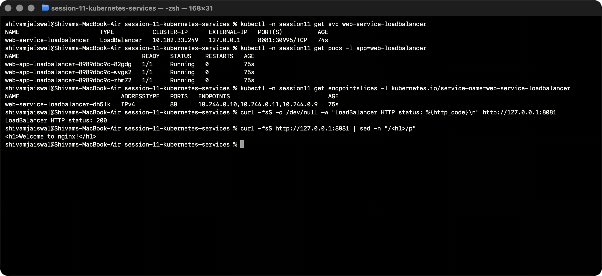

# LoadBalancer hands-on lab

The Service forwards port 8081 to Nginx port 80 on three replicas. Minikube tunnel provides an assigned local address and a successful host HTTP request. Port 8081 avoids privileged host ports.

## Manifests

- [app-deployment.yaml](app-deployment.yaml)
- [service.yaml](service.yaml)

## Run and verify

Run from the Session 11 folder after creating `namespace.yaml`:

```bash
kubectl -n session11 apply -f 03-loadbalancer/
kubectl -n session11 get svc web-service-loadbalancer
```

See the [LoadBalancer section in the complete submission](../README.md) for rollout, DNS, endpoint and connectivity commands, observations, environment setup and cleanup.



[Actual terminal transcript](../Output/logs/03-loadbalancer.txt).
