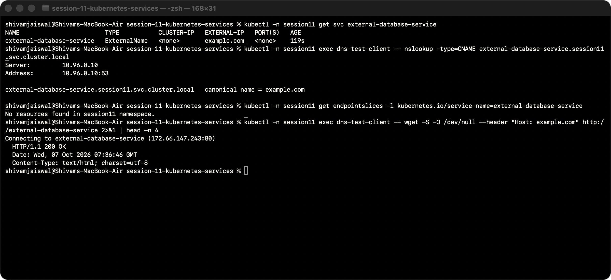

# ExternalName hands-on lab

This DNS alias points to example.com. It has no virtual IP, selector or EndpointSlice. The BusyBox client verifies the CNAME and connects through the alias with the target HTTP Host header.

## Manifests

- [client-pod.yaml](client-pod.yaml)
- [service.yaml](service.yaml)

## Run and verify

Run from the Session 11 folder after creating `namespace.yaml`:

```bash
kubectl -n session11 apply -f 04-externalname/
kubectl -n session11 get svc external-database-service
```

See the [ExternalName section in the complete submission](../README.md) for rollout, DNS, endpoint and connectivity commands, observations, environment setup and cleanup.



[Actual terminal transcript](../Output/logs/04-externalname.txt).
