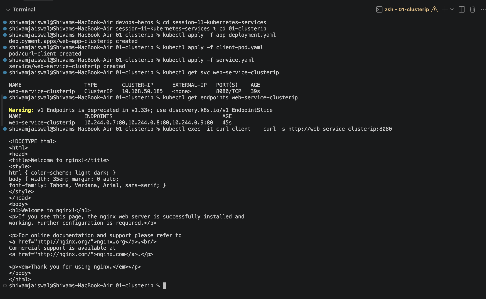
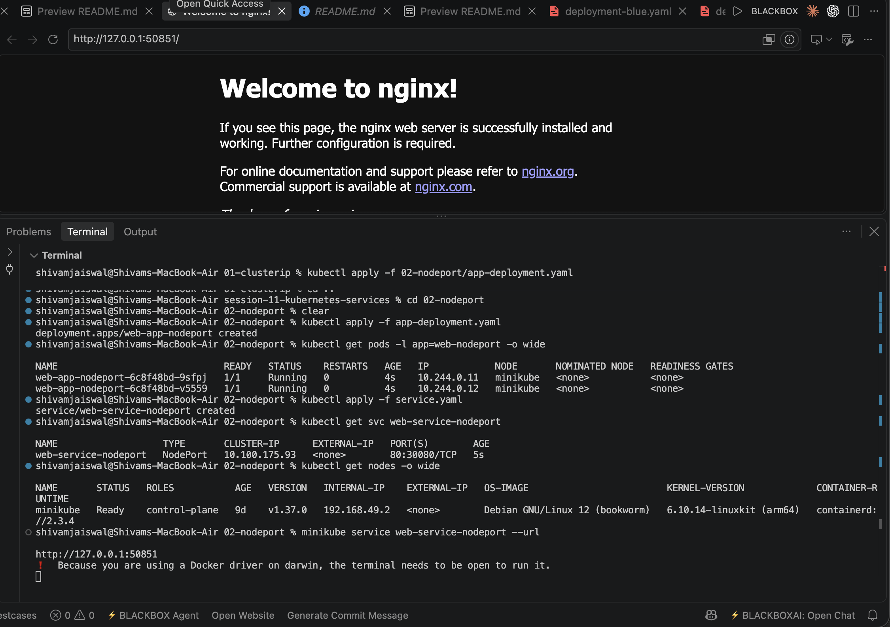
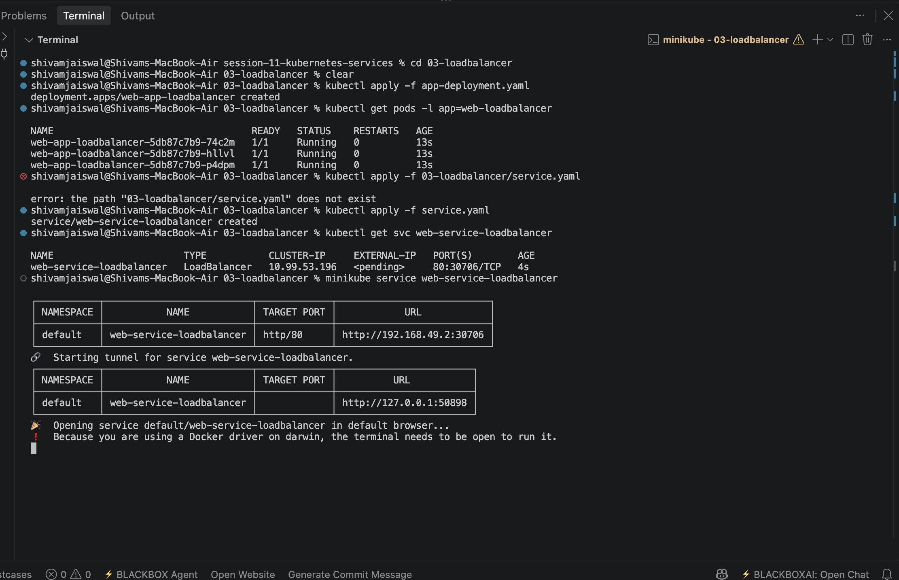
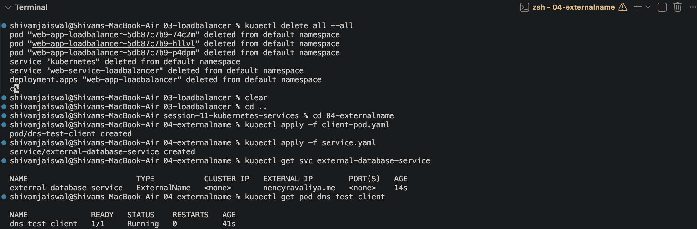
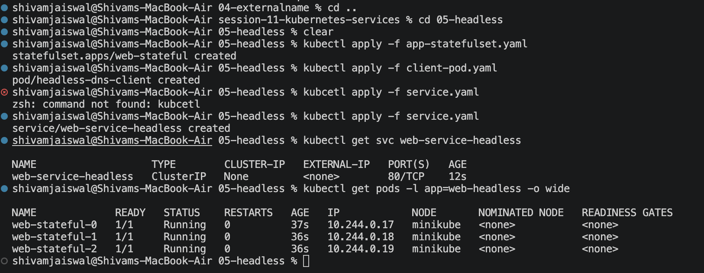

# Session 11: Kubernetes Services

This session covers the main Kubernetes Service types used to expose and discover applications inside and outside a cluster.

## Topics Covered

| No. | Topic | Description |
| --- | --- | --- |
| 01 | [ClusterIP](./01-clusterip) | Default internal service type for stable pod-to-pod communication inside the cluster. |
| 02 | [NodePort](./02-nodeport) | Exposes an application on a static port across worker nodes for external access. |
| 03 | [LoadBalancer](./03-loadbalancer) | Uses a cloud provider load balancer to expose applications publicly. |
| 04 | [ExternalName](./04-externalname) | Creates an internal DNS alias for an external service or domain. |
| 05 | [Headless Service](./05-headless) | Disables ClusterIP and returns individual pod DNS records for direct pod discovery. |

## Output Screenshots

### 01. ClusterIP

### 02. NodePort

### 03. LoadBalancer

### 04. ExternalName

### 05. Headless Service

