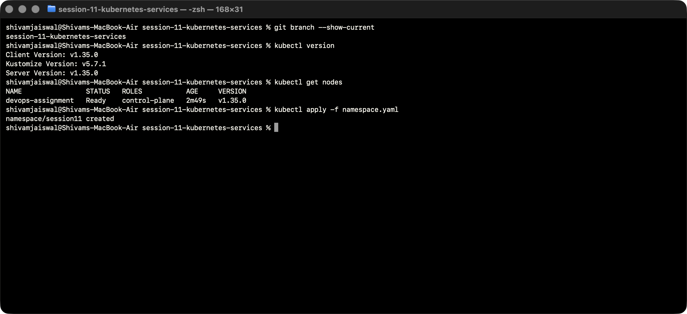
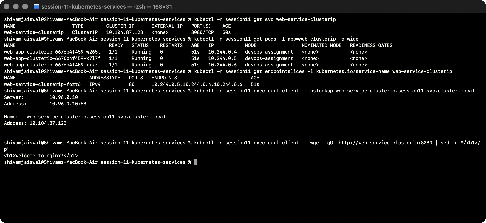
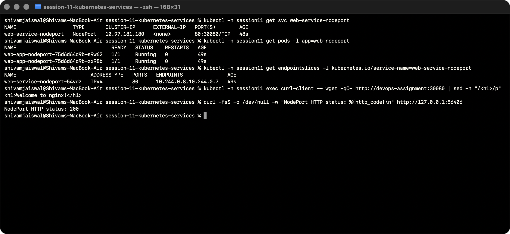
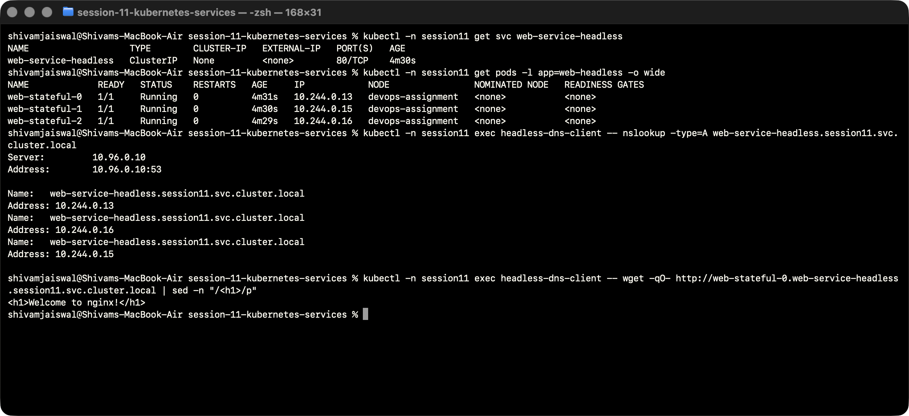
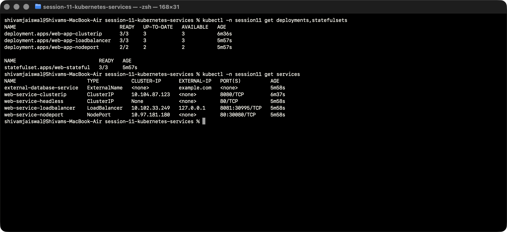
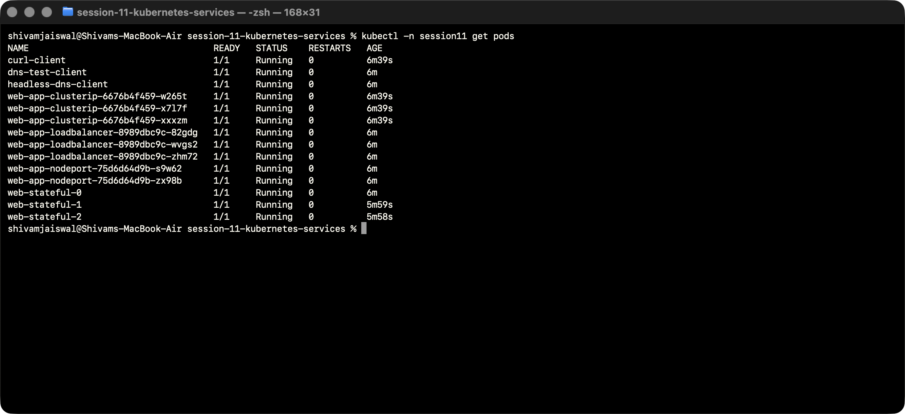

# Session 11: Kubernetes Networking & Services

This submission demonstrates ClusterIP, NodePort, LoadBalancer, ExternalName, and Headless Services with live Kubernetes resources, DNS lookups, and HTTP requests. It also compares workload objects and documents FQDNs and CoreDNS.

## Environment and setup

- Branch: `session-11-kubernetes-services`
- Run date: 7 October 2026
- Host: macOS on Apple Silicon; Docker Desktop
- Minikube profile/context: `devops-assignment`
- Kubernetes and kubectl: v1.35.0
- Lab namespace: `session11`
- Applications: `nginx:1.28-alpine`; diagnostic Pods: `busybox:1.37`

Run commands from this folder. The diagnostic Pod is named `curl-client` for compatibility with the supplied files; its image is BusyBox and the HTTP client used is `wget`.

```bash
minikube start -p devops-assignment --driver=docker --cpus=2 --memory=3072 --kubernetes-version=v1.35.0
kubectl config use-context devops-assignment
kubectl version
kubectl get nodes
kubectl apply -f namespace.yaml
./run-lab.sh
```

Use a kubectl version supported by the server. On this Mac, the matched client downloaded by Minikube is at `~/.minikube/cache/darwin/arm64/v1.35.0/kubectl`.



[Actual setup transcript](Output/logs/00-cluster-setup.txt).

## Task 1: All five Service demonstrations

Kubernetes has four values for `spec.type`: ClusterIP, NodePort, LoadBalancer, and ExternalName. A Headless Service is a ClusterIP Service configured with `clusterIP: None`; the assignment counts it as the fifth demonstration.

| Demonstration | Manifest folder | Service | Verification observed |
| --- | --- | --- | --- |
| ClusterIP | [01-clusterip](01-clusterip/README.md) | `web-service-clusterip:8080` | Three ready replicas, three endpoint addresses, FQDN resolves to the ClusterIP, Nginx responds. |
| NodePort | [02-nodeport](02-nodeport/README.md) | `web-service-nodeport`, node port `30080` | Two ready replicas; a request through the node port and a request from the Mac both succeed. |
| LoadBalancer | [03-loadbalancer](03-loadbalancer/README.md) | `web-service-loadbalancer:8081` | Minikube tunnel assigns `127.0.0.1`; host request returns HTTP 200 and Nginx HTML. |
| ExternalName | [04-externalname](04-externalname/README.md) | `external-database-service` | CNAME points to `example.com`; no EndpointSlice; HTTP request through the alias returns 200 with the target Host header. |
| Headless | [05-headless](05-headless/README.md) | `web-service-headless:80` | No virtual IP; DNS returns three Pod addresses; the named StatefulSet Pod responds directly. |

### ClusterIP

```bash
kubectl -n session11 apply -f 01-clusterip/
kubectl -n session11 rollout status deployment/web-app-clusterip
kubectl -n session11 wait --for=condition=Ready pod/curl-client --timeout=180s
kubectl -n session11 get svc web-service-clusterip
kubectl -n session11 get pods -l app=web-clusterip -o wide
kubectl -n session11 get endpointslices -l kubernetes.io/service-name=web-service-clusterip
kubectl -n session11 exec curl-client -- nslookup web-service-clusterip.session11.svc.cluster.local
kubectl -n session11 exec curl-client -- wget -qO- http://web-service-clusterip:8080
```

The Service listens on port 8080 and forwards to port 80 on Pods labelled `app=web-clusterip`. The endpoint addresses match the running Pods; the DNS result is the Service IP. The screenshot filters the HTML to its heading for readability.



[Actual transcript](Output/logs/01-clusterip.txt).

### NodePort

```bash
kubectl -n session11 apply -f 02-nodeport/
kubectl -n session11 rollout status deployment/web-app-nodeport
kubectl -n session11 get svc web-service-nodeport
kubectl -n session11 get endpointslices -l kubernetes.io/service-name=web-service-nodeport
kubectl -n session11 exec curl-client -- wget -qO- http://devops-assignment:30080
minikube -p devops-assignment service web-service-nodeport -n session11 --url
```

The node port forwards to the Service's port 80 and the Pod's port 80. On macOS with the Docker driver, the node's private IP is not directly accessible from the host. Keep the `minikube service --url` process running and use its printed localhost URL in a second terminal. In this run that URL was `http://127.0.0.1:56406`; it is allocated dynamically and will change on reruns.

```bash
curl -fsS -o /dev/null -w 'NodePort HTTP status: %{http_code}\n' http://127.0.0.1:56406
```



[Actual transcript](Output/logs/02-nodeport.txt).

### LoadBalancer

```bash
kubectl -n session11 apply -f 03-loadbalancer/
kubectl -n session11 rollout status deployment/web-app-loadbalancer
minikube -p devops-assignment tunnel --bind-address=127.0.0.1
```

Keep the tunnel running, then use a second terminal:

```bash
kubectl -n session11 get svc web-service-loadbalancer
kubectl -n session11 get endpointslices -l kubernetes.io/service-name=web-service-loadbalancer
curl -fsS -o /dev/null -w 'LoadBalancer HTTP status: %{http_code}\n' http://127.0.0.1:8081
curl -fsS http://127.0.0.1:8081
```

Port 8081 avoids needing a privileged port on this Mac. `targetPort` remains 80. This demonstrates a local load-balancer tunnel, not an AWS load balancer, and creates no AWS resources. The captured Service has an assigned address rather than a pending address.


[Actual transcript](Output/logs/03-loadbalancer.txt).

### ExternalName

```bash
kubectl -n session11 apply -f 04-externalname/
kubectl -n session11 wait --for=condition=Ready pod/dns-test-client --timeout=180s
kubectl -n session11 get svc external-database-service
kubectl -n session11 exec dns-test-client -- nslookup -type=CNAME external-database-service.session11.svc.cluster.local
kubectl -n session11 get endpointslices -l kubernetes.io/service-name=external-database-service
kubectl -n session11 exec dns-test-client -- wget -S -O /dev/null --header 'Host: example.com' http://external-database-service
```

There is no application Deployment for this case: `example.com` is the existing external HTTP application and `dns-test-client` is the test Pod. ExternalName provides a DNS CNAME, without a ClusterIP, selector, or traffic proxy. DNS aliasing does not rewrite HTTP Host headers or TLS server names; the explicit Host header lets the external HTTP server receive its expected domain. The screenshot includes the connection address and HTTP status. External page contents and addresses can change.


[Actual transcript](Output/logs/04-externalname.txt).

### Headless Service

```bash
kubectl -n session11 apply -f 05-headless/
kubectl -n session11 rollout status statefulset/web-stateful
kubectl -n session11 wait --for=condition=Ready pod/headless-dns-client --timeout=180s
kubectl -n session11 get svc web-service-headless
kubectl -n session11 get pods -l app=web-headless -o wide
kubectl -n session11 exec headless-dns-client -- nslookup -type=A web-service-headless.session11.svc.cluster.local
kubectl -n session11 exec headless-dns-client -- wget -qO- http://web-stateful-0.web-service-headless.session11.svc.cluster.local
```

The Service displays `CLUSTER-IP: None`. DNS returns the ready Pod addresses. The StatefulSet supplies stable ordinal names (`web-stateful-0`, `-1`, `-2`) and per-Pod DNS names, allowing a client to choose a particular Pod. This example demonstrates network identity; it does not provision persistent volumes.



[Actual transcript](Output/logs/05-headless.txt).

## Task 2: Kubernetes object comparisons

### Deployment vs ReplicaSet

| Aspect | Deployment | ReplicaSet |
| --- | --- | --- |
| Purpose | Declares an application version and manages its rollout. | Keeps the desired number of matching Pods running. |
| Pod management | Owns ReplicaSets that own Pods. | Creates/replaces Pods from its template. |
| Scaling | Changing Deployment replicas updates its active ReplicaSet. | Changing replicas changes its Pod count; avoid manually editing one owned by a Deployment. |
| Rolling updates | Coordinates old/new ReplicaSets using the configured strategy. | Does not orchestrate application rollouts or rollback history. |
| Relationship | Deployment → ReplicaSet → Pods. | The lower-level replica controller used by a Deployment. |

### Deployment vs DaemonSet vs StatefulSet

| Aspect | Deployment | DaemonSet | StatefulSet |
| --- | --- | --- | --- |
| Typical use | Stateless HTTP/API applications. | Node agents: log collection, networking, monitoring. | Applications requiring stable identity, often databases. |
| Pod creation | Creates Pods through ReplicaSets. | Normally places one Pod on each eligible node. | Creates Pods with stable ordinal names; defaults to ordered creation. |
| Scaling | Set replicas or attach an HPA. | Depends on eligible nodes and placement rules, not a replicas field. | Set replicas; account for the application's data/replication requirements. |
| Networking | Usually a Service in front of interchangeable Pods. | Often contacted per node; a Service can still select its Pods. | A governing Headless Service supplies stable per-Pod DNS. |
| Storage | Can mount PVCs, but stable per-replica storage is not automatic. | Can use node-local mounts for agent tasks. | Volume claim templates can create a separate PVC per ordinal. |
| Example | Nginx frontend or stateless Python API. | Fluent Bit or a node exporter. | PostgreSQL replication or ZooKeeper. |

A StatefulSet does not create database replication itself: the application must implement it. The Session 11 StatefulSet uses Nginx to demonstrate Pod names and DNS only.

### ReplicaSet vs Service

A ReplicaSet maintains the replica count and replaces missing Pods. A Service provides discovery and a stable destination for traffic. Creating a ReplicaSet alone does not provide a stable virtual IP for clients. A normal selector-based Service tracks ready matching Pods through EndpointSlices; the network data plane routes Service traffic to their IPs and target ports. A Service can select Pods managed by different workload controllers.

```text
Deployment → ReplicaSet → Pods                 (workload ownership)
Client → Service DNS → Service IP → ready Pod   (normal traffic path)
Client → Headless DNS → selected Pod IP         (direct discovery)
Client → ExternalName CNAME → external target   (DNS alias)
```

The [scaling evidence](Output/08-scaling-up.png) and [restoration evidence](Output/09-scaling-restore.png) show the replica controller and EndpointSlice following a change from 3 to 6 replicas, then returning to the manifest's 3 replicas.

## Task 3: FQDN

See [fqdn/README.md](fqdn/README.md) for the naming convention, namespace search domains, short names, cross-namespace communication, and examples. The [DNS evidence](Output/06-fqdn.png) shows actual Pod resolver configuration and a request using the complete Service name.

## Task 4: CoreDNS

See [coredns/README.md](coredns/README.md) for resolution flow, the observed Corefile, and troubleshooting. Evidence: [CoreDNS runtime](Output/07-coredns-status.png) and the Corefile ([part 1](Output/07-coredns-config.png), [part 2](Output/07-coredns-config-continued.png)).

## Final resource verification





[Workload/Service transcript](Output/logs/10-final-verification.txt) · [Pod transcript](Output/logs/10-final-pods.txt).

## Evidence and cleanup

All screenshots were captured from live Terminal windows after executing the displayed commands. The capture command was run in a separate window. [Text transcripts](Output/logs/) preserve the visible output. Pod IPs, resource suffixes, allocated ports and ages are observations of this run, not fixed values for future runs.

The lab remains running for review. When finished, stop the Minikube tunnel and NodePort service tunnel with Ctrl+C, then remove only this lab's namespace:

```bash
kubectl --context=devops-assignment delete namespace session11
# Optional: remove the separate lab cluster when no later session needs it.
minikube delete -p devops-assignment
```

## References

- [Kubernetes Services](https://kubernetes.io/docs/concepts/services-networking/service/)
- [DNS for Services and Pods](https://kubernetes.io/docs/concepts/services-networking/dns-pod-service/)
- [Customizing DNS Service](https://kubernetes.io/docs/tasks/administer-cluster/dns-custom-nameservers/)
- [Minikube: accessing applications](https://minikube.sigs.k8s.io/docs/handbook/accessing/)
