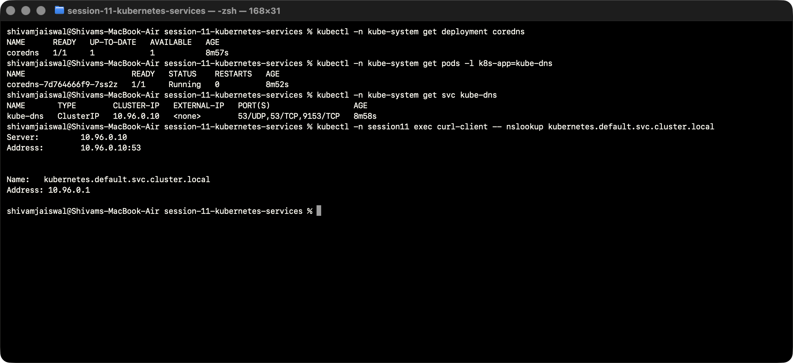
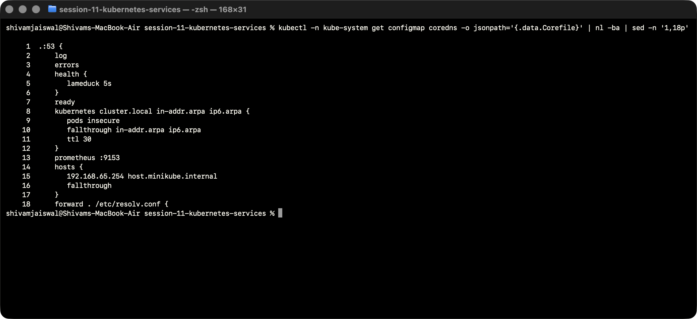
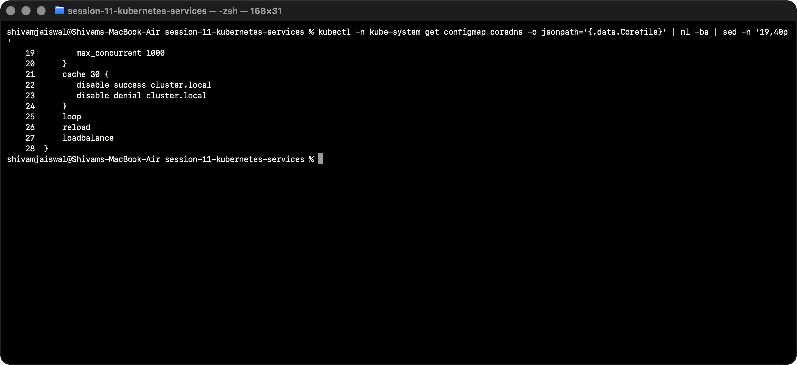

# CoreDNS

CoreDNS is the DNS server used by this Kubernetes cluster for service discovery. It runs as a Deployment in `kube-system` and is exposed by the Service named `kube-dns`. Its Kubernetes plugin watches resource data from the API to answer cluster DNS queries. This lets clients use names while Pod IPs and replica counts change.

## Resolution flow

1. The application's resolver reads the Pod's `/etc/resolv.conf`.
2. The query reaches the cluster DNS Service and a CoreDNS Pod.
3. For `*.svc.cluster.local`, the Kubernetes plugin answers from Service and endpoint information.
4. A normal Service resolves to its virtual IP; a Headless Service resolves to ready Pod addresses; ExternalName supplies a CNAME.
5. External queries are forwarded to configured upstream resolvers. Responses may be cached.

After a normal Service lookup, the application connects to the returned IP; CoreDNS does not carry the HTTP traffic.

## Observed runtime and configuration

```bash
kubectl -n kube-system get deployment coredns
kubectl -n kube-system get pods -l k8s-app=kube-dns
kubectl -n kube-system get svc kube-dns
kubectl -n session11 exec curl-client -- nslookup kubernetes.default.svc.cluster.local
kubectl -n kube-system get configmap coredns -o jsonpath='{.data.Corefile}'
```







The observed Corefile defines the `.:53` server block. It includes `errors`, `health`, `ready`, the `kubernetes cluster.local in-addr.arpa ip6.arpa` plugin, `prometheus :9153`, `forward . /etc/resolv.conf`, caching, loop detection, reload, and load balancing. The Kubernetes plugin uses `pods insecure`, `fallthrough` for reverse zones, and a TTL setting. This cluster also logs queries, defines a `hosts` entry for `host.minikube.internal`, limits concurrent upstream queries, and disables positive/negative caching for `cluster.local`. These are observations of this cluster, not defaults guaranteed for every installation. `pods insecure` concerns Pod address records; it does not disable HTTPS verification in applications.

The ConfigMap is the editable configuration; `reload` lets CoreDNS detect updates. No CoreDNS configuration change was needed for this exercise.

[Runtime transcript](../Output/logs/07-coredns-status.txt) · [Configuration transcript, part 1](../Output/logs/07-coredns-config.txt) · [part 2](../Output/logs/07-coredns-config-continued.txt).

## Troubleshooting sequence

```bash
# Confirm the querying Pod's nameserver, namespace search paths and DNS options.
kubectl -n session11 exec curl-client -- cat /etc/resolv.conf
# Confirm the DNS server is ready and has a Service and endpoints.
kubectl -n kube-system get pods -l k8s-app=kube-dns
kubectl -n kube-system get svc kube-dns
kubectl -n kube-system get endpointslices -l kubernetes.io/service-name=kube-dns
# Inspect recent logs and effective configuration.
kubectl -n kube-system logs deployment/coredns --tail=50
kubectl -n kube-system get configmap coredns -o yaml
# Compare an internal lookup with an external lookup.
kubectl -n session11 exec curl-client -- nslookup kubernetes.default.svc.cluster.local
kubectl -n session11 exec curl-client -- nslookup example.com
# If DNS resolves but HTTP fails, inspect the application Service and ready endpoints.
kubectl -n session11 describe svc web-service-clusterip
kubectl -n session11 get endpointslices -l kubernetes.io/service-name=web-service-clusterip
kubectl -n session11 get pods --show-labels
```

A lookup for a nonexistent Service or the wrong namespace can return NXDOMAIN. Timeouts suggest unreachable DNS servers, blocked UDP/TCP port 53, or unavailable CoreDNS Pods. If internal names work but external names fail, check upstream forwarding and network access. Inspect Pod `dnsPolicy`/`dnsConfig` and NetworkPolicies before changing CoreDNS. A valid DNS response with a failed HTTP request requires checking selectors, endpoint readiness, target ports and application health as well.

Sources: [Kubernetes DNS customization](https://kubernetes.io/docs/tasks/administer-cluster/dns-custom-nameservers/) and [DNS debugging](https://kubernetes.io/docs/tasks/administer-cluster/dns-debugging-resolution/).
