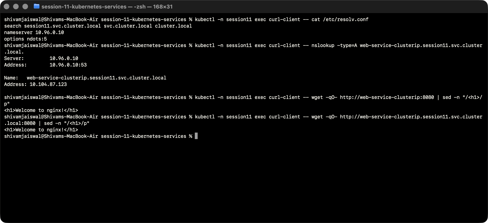

# FQDN and Kubernetes Service DNS

An FQDN (fully qualified domain name) includes the entire DNS hierarchy for a host or service. A trailing dot makes a query explicitly absolute. For example, `web-service-clusterip.session11.svc.cluster.local.` identifies a Service, its namespace, the Service zone, and this cluster's domain.

## Naming conventions

| Name | Meaning |
| --- | --- |
| `web-service-clusterip` | Short Service name, resolved using the client's namespace search list. |
| `web-service-clusterip.session11` | Service and namespace. Useful from another namespace. |
| `web-service-clusterip.session11.svc.cluster.local` | Complete Service name in this cluster. |
| `kubernetes.default.svc.cluster.local` | Kubernetes API Service in the default namespace. |
| `web-stateful-0.web-service-headless.session11.svc.cluster.local` | Stable StatefulSet Pod name under its governing Service. |

`cluster.local` is the configured domain in this lab; administrators can choose a different cluster domain. A normal Service has an address record for its virtual IP. A selector-based Headless Service instead returns addresses of ready endpoints. ExternalName returns a CNAME.

## Namespace search and Pod-to-Service communication

The resolver configuration inside the diagnostic Pod is shown in the screenshot below. It contains the cluster DNS server, the `session11.svc.cluster.local`, `svc.cluster.local`, and `cluster.local` search domains, and `ndots:5`. A short name is searched relative to these domains. An absolute name ending in a dot avoids search-domain expansion.

A Pod in `session11` can request `http://web-service-clusterip:8080`. A Pod in a different namespace must use `http://web-service-clusterip.session11:8080` or the complete name. The short name by itself would search the caller's own namespace. DNS success alone does not prove network access: policy, Service selectors, readiness and ports also affect the request.

## Hands-on commands

```bash
kubectl -n session11 exec curl-client -- cat /etc/resolv.conf
kubectl -n session11 exec curl-client -- wget -qO- http://web-service-clusterip:8080
kubectl -n session11 exec curl-client -- nslookup -type=A web-service-clusterip.session11.svc.cluster.local.
kubectl -n session11 exec curl-client -- wget -qO- http://web-service-clusterip.session11.svc.cluster.local:8080
```

The absolute DNS name resolved to the Service IP. HTTP requests using both the short name and the complete name returned Nginx content. The StatefulSet Pod name is tested separately in the Headless demonstration.



[Actual transcript](../Output/logs/06-fqdn.txt).

Source: [Kubernetes DNS for Services and Pods](https://kubernetes.io/docs/concepts/services-networking/dns-pod-service/).
