# Session 12: Ingress, ConfigMaps & Secrets

**Author:** Shivam
**Course:** SST DevOps & Cloud [SWE]
**Session:** 12 - Ingress, ConfigMaps & Secrets
**Repository:** devops-heros / session-12-ingress-configmaps-secrets

Executed on **Minikube v1.39.0** (Docker driver) with **Kubernetes v1.37.0** and the **NGINX Ingress** addon. All terminal screenshots are in [`./output/`](./output).

> **Ingress access on the macOS Docker driver:** `<minikube-ip>:<port>` is not directly routable from the host, so routing was verified with `kubectl port-forward svc/ingress-nginx-controller` plus a `Host:` header (HTTP) and `curl --resolve` (HTTPS). `yatri.local` is also mapped in `/etc/hosts` (Task 9). See [Task 12](#task-12-minikube-docker-driver-port-binding) of Session 11 for the underlying reason.

Deep-dive concept notes live alongside each sub-folder:
[01-configmap](./01-configmap/README.md) · [02-secret](./02-secret/README.md) · [03-ingress](./03-ingress/README.md) · [04-full-demo](./04-full-demo/README.md) · [base64 gotcha post-mortem](./troubleshooting/secret-base64-gotcha.md)

---

## Task 1: Non-Sensitive Config Decoupling via ConfigMaps

Store runtime config (`ENVIRONMENT`, `LOG_LEVEL`, `PORT`, `DEFAULT_CURRENCY`, `MAX_BOOKING_DAYS`) in a declarative ConfigMap, then read individual keys with JSONPath.

```bash
kubectl apply -f 01-configmap/app-config.yaml
kubectl describe configmap yatri-app-config
kubectl get configmap yatri-app-config -o jsonpath='{.data.ENVIRONMENT}'
```

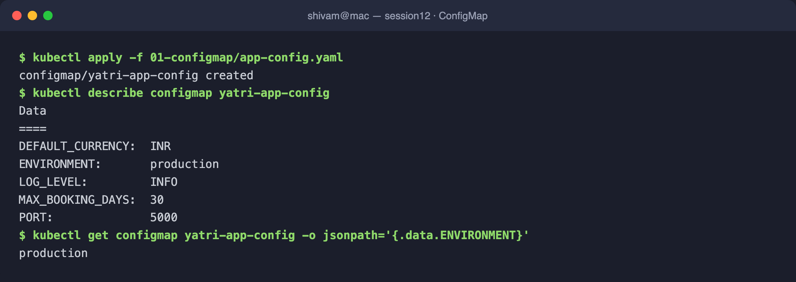

---

## Task 2: ConfigMap Live Update & Pod Immobility

Patching a ConfigMap does **not** update env vars in running containers — they read config only at startup. A `rollout restart` creates new pods that pick up the change.

```bash
kubectl patch configmap yatri-app-config --type merge -p '{"data":{"ENVIRONMENT":"staging"}}'
kubectl exec deploy/yatri-backend -- env | grep ENVIRONMENT   # still production
kubectl rollout restart deployment/yatri-backend              # zero-downtime
kubectl exec deploy/yatri-backend -- env | grep ENVIRONMENT   # now staging
```

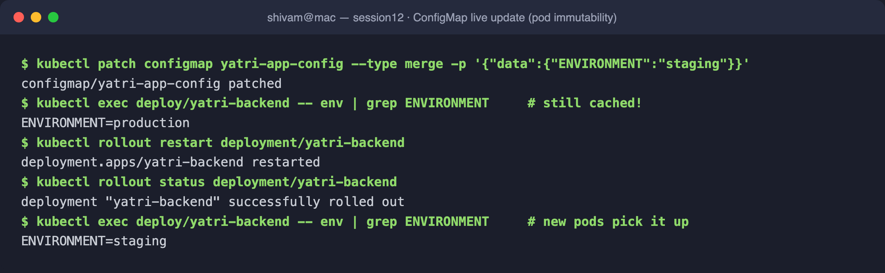

---

## Task 3: Sensitive Data via Secrets & Base64 Mechanics

An `Opaque` Secret stores credentials base64-**encoded** (not encrypted). `describe` masks values as byte counts; JSONPath + `base64 --decode` reveals plaintext.

```bash
kubectl apply -f 02-secret/db-secret.yaml
kubectl describe secret yatri-db-secret
kubectl get secret yatri-db-secret -o jsonpath='{.data.POSTGRES_PASSWORD}' | base64 --decode
```

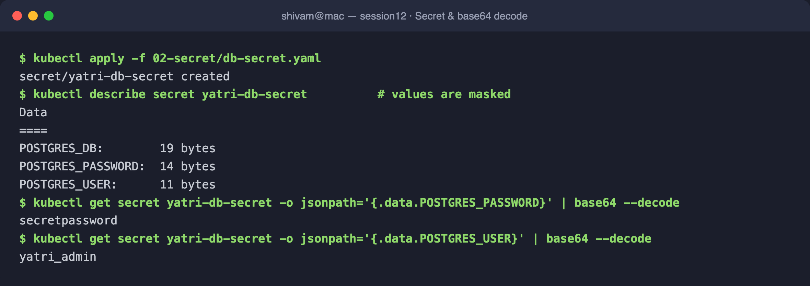

---

## Task 4: The Trailing-Newline Secret Gotcha

`echo "x"` appends an invisible `0x0a` newline, corrupting a base64-encoded password and causing auth failures. `echo -n` produces the exact byte stream. Note the differing base64 (`...ZK` vs `...Q=`) and the trailing `0a` in `xxd`.

```bash
echo    "secretpassword" | xxd     # ends in ...0a  -> c2VjcmV0cGFzc3dvcmQK
echo -n "secretpassword" | xxd     # exact bytes    -> c2VjcmV0cGFzc3dvcmQ=
```

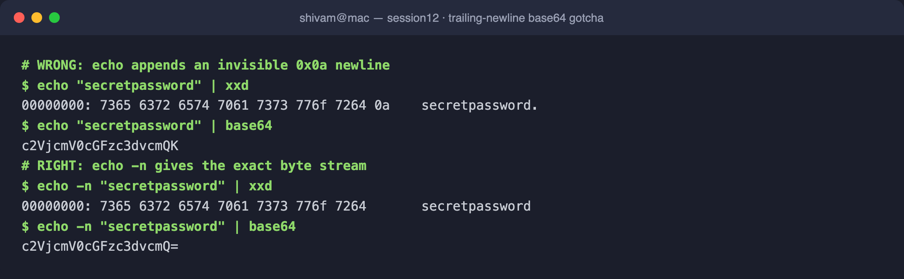

---

## Task 5: Enterprise Secret Management (Writeup)

Committing base64 Secret YAMLs to Git is a **DevSecOps anti-pattern** — base64 is trivially reversible, Git retains history forever, and there is no rotation. Production instead syncs secrets from an external vault into short-lived Kubernetes Secrets:

```
AWS Secrets Manager / Azure Key Vault / HashiCorp Vault
        │  (External Secrets Operator / Vault Agent Injector watches & syncs)
        ▼
   Kubernetes Secret (ephemeral)  ──►  Pod (env / mounted volume)
```

- **External Secrets Operator (ESO)** / **Vault Agent Injector** pull credentials at runtime; nothing sensitive lives in the manifest repo.
- **CI/CD:** GitHub Actions Secrets or Azure DevOps Variable Groups inject values at deploy time.

```bash
kubectl get crds | grep -i secret || echo "Standard native secrets in use"
```

---

## Task 6: Combined ConfigMap + Secret Pod Injection

The backend consumes plain config in bulk via `envFrom.configMapRef` and sensitive keys granularly via `env.valueFrom.secretKeyRef` — both merge into the container environment.

```bash
kubectl exec deploy/yatri-backend -- env | grep -E "ENVIRONMENT|LOG_LEVEL|POSTGRES|DEFAULT_CURRENCY"
```

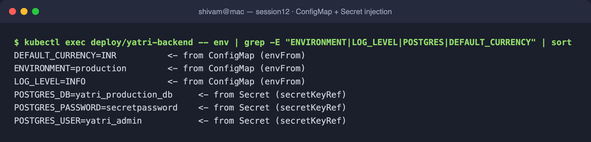

---

## Task 7: Ingress Resource vs. Ingress Controller (Writeup)

| | **Ingress Resource** | **Ingress Controller** |
|---|---|---|
| What | Declarative L7 API object (hosts, paths, TLS refs) | Reverse-proxy pod (NGINX/Traefik/HAProxy/Envoy) |
| Role | *Describes* desired routing — does nothing alone | *Watches* the API, generates `nginx.conf`, routes real traffic |
| Analogy | The blueprint | The builder that reads the blueprint and does the work |

An Ingress resource without a running controller has no effect. See [03-ingress/README.md](./03-ingress/README.md).

---

## Task 8: NGINX Ingress Controller Activation

Enable the addon and wait for the controller pod in the `ingress-nginx` namespace to be `Ready`.

```bash
minikube addons enable ingress
kubectl get pods -n ingress-nginx
kubectl wait -n ingress-nginx --for=condition=ready pod \
  --selector=app.kubernetes.io/component=controller --timeout=120s
```

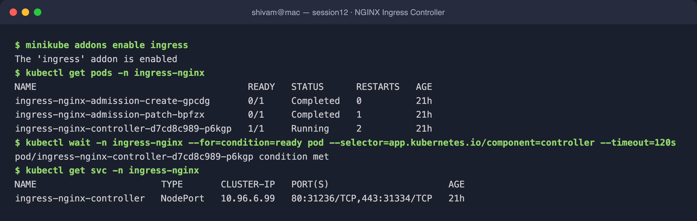

---

## Task 9: Local DNS Resolution via `/etc/hosts`

Map the Minikube IP to `yatri.local` so the browser/`curl` can resolve the ingress host.

```bash
MINIKUBE_IP=$(minikube ip)
echo "${MINIKUBE_IP}  yatri.local" | sudo tee -a /etc/hosts
grep yatri.local /etc/hosts
```

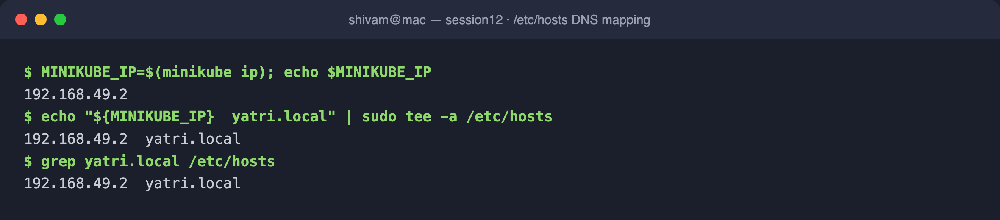

---

## Task 10: Layer-7 Path-Based Routing

One host (`yatri.local`), two paths: `/` → frontend (Nginx), `/api/*` → backend (Python), with `rewrite-target: /$2` stripping the `/api` prefix.

```bash
kubectl apply -f 04-full-demo/ingress.yaml
curl -s http://yatri.local/        | grep -i "<title>"   # frontend
curl -s http://yatri.local/api/                          # backend (ConfigMap+Secret values)
```

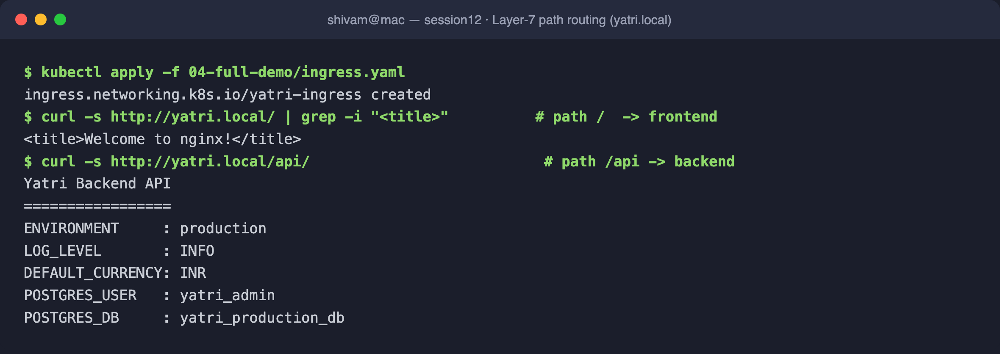

---

## Task 11: Virtual Host-Based (Subdomain) Routing

Two hostnames on the **same** ingress IP route to different services purely by the `Host` header: `portal.campus.local` → frontend, `api.campus.local` → backend. Defined in [`03-ingress/ingress-tls.yaml`](./03-ingress/ingress-tls.yaml).

```bash
kubectl apply -f 03-ingress/ingress-tls.yaml
curl -s -H "Host: portal.campus.local" http://<ingress>/       # frontend
curl -s -H "Host: api.campus.local"    http://<ingress>/       # backend
```

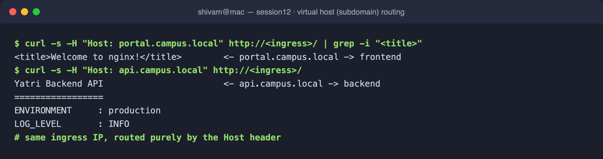

---

## Task 12: Hybrid Ingress (Host + Path) Routing

The same [`ingress-tls.yaml`](./03-ingress/ingress-tls.yaml) combines host-based routing with path-based routing (`api.campus.local` serves `/api(/|$)(.*)` and `/`). `describe` shows the full routing table.

```bash
kubectl describe ingress campus-ingress-tls
```

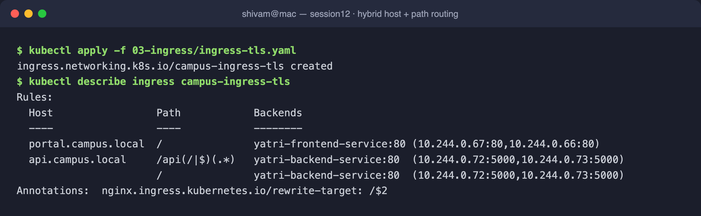

---

## Task 13: Ingress TLS/HTTPS Termination

Generate a self-signed cert (with SANs — nginx ignores a cert whose SAN doesn't match the host), store it as a `kubernetes.io/tls` secret, bind it in the ingress `spec.tls` block, and verify HTTPS on port 443. TLSv1.3 handshake completes and the served cert is `CN=campus.local`.

```bash
openssl req -x509 -nodes -days 365 -newkey rsa:2048 -keyout tls.key -out tls.crt \
  -subj "/CN=campus.local/O=CampusDevOps" \
  -addext "subjectAltName=DNS:portal.campus.local,DNS:api.campus.local"
kubectl create secret tls campus-tls-cert --cert=tls.crt --key=tls.key
kubectl apply -f 03-ingress/ingress-tls.yaml
curl -k --resolve portal.campus.local:443:<ingress> https://portal.campus.local/
```

> The private key (`tls.key`) is intentionally **not committed** — only the ingress manifest referencing the `campus-tls-cert` secret is in the repo.

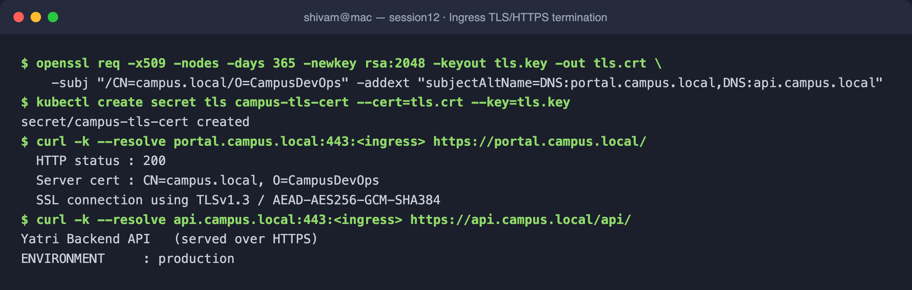

---

## Task 14: End-to-End Multi-Tier Integration & Automation

[`04-full-demo/run-demo.sh`](./04-full-demo/run-demo.sh) deploys the whole stack (ConfigMap + Secret + Frontend + Backend + Services + Ingress) using multi-document YAML (`---` co-locates each Deployment with its Service); [`cleanup.sh`](./04-full-demo/cleanup.sh) tears it down.

```bash
bash 04-full-demo/run-demo.sh
kubectl get configmap,secret,ingress,deploy,svc -l app=yatri-app
bash 04-full-demo/cleanup.sh
```

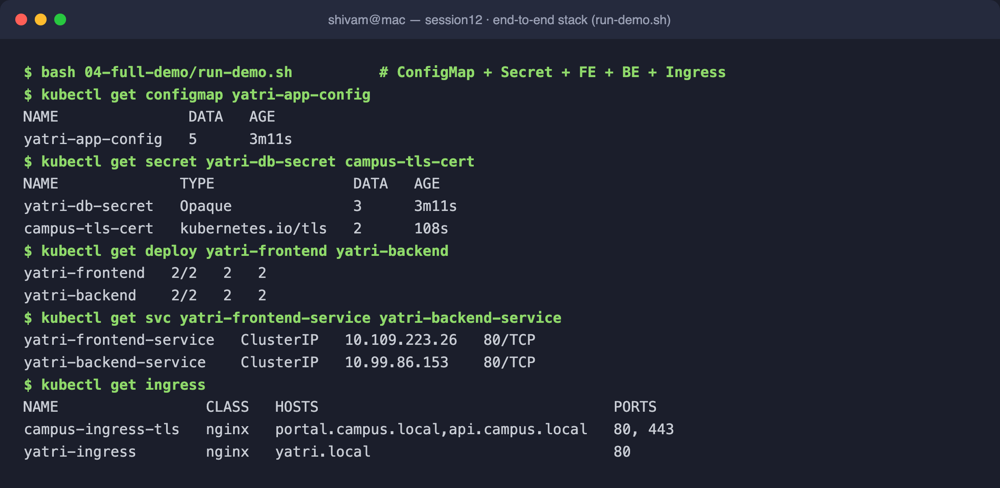

---

### Summary

All 14 tasks were executed against a live Minikube cluster with the NGINX Ingress controller: ConfigMap decoupling and live-update immutability, Secret encoding/decoding and the newline gotcha, combined injection, ingress controller lifecycle, and path-, host-, hybrid-, and TLS-based Layer-7 routing.
