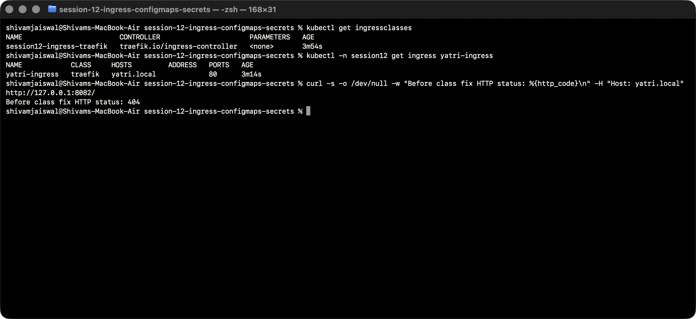
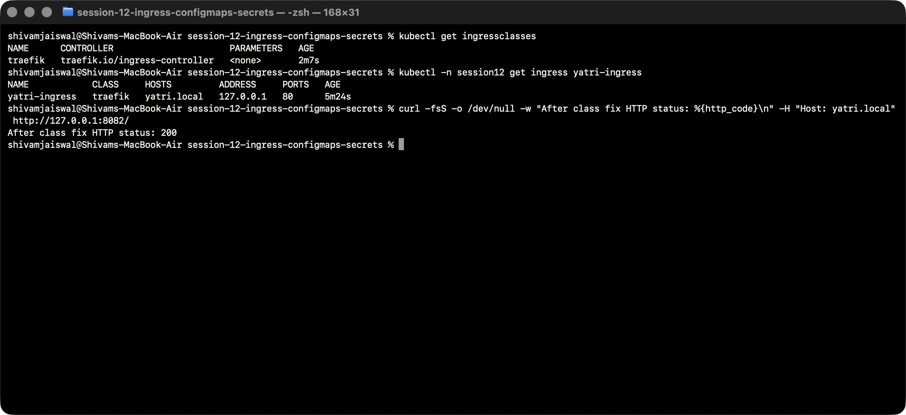
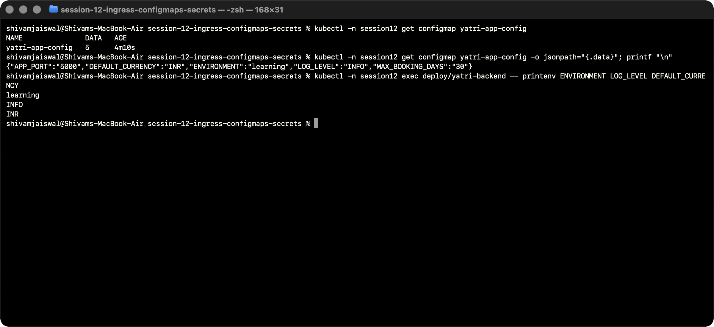
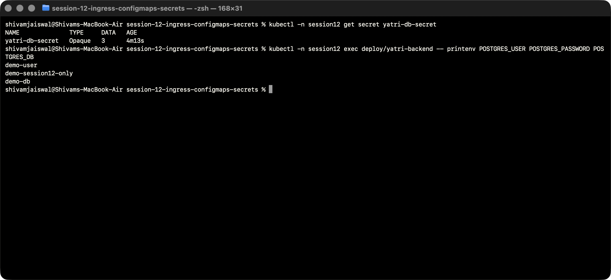
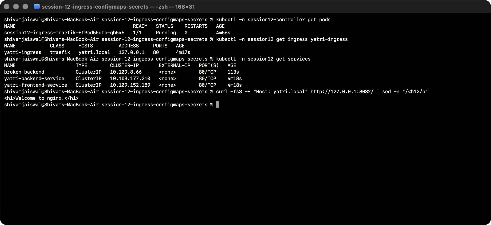
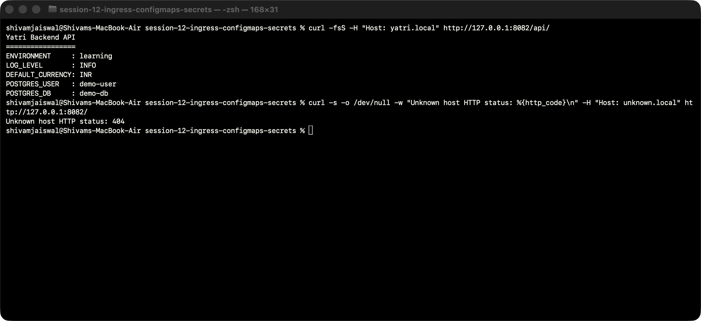
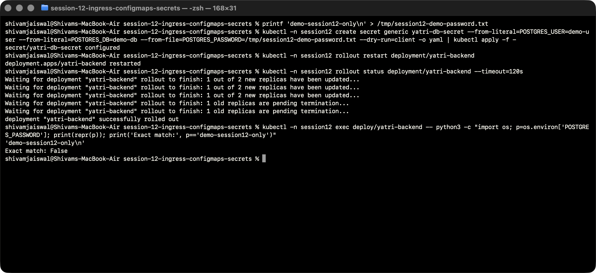
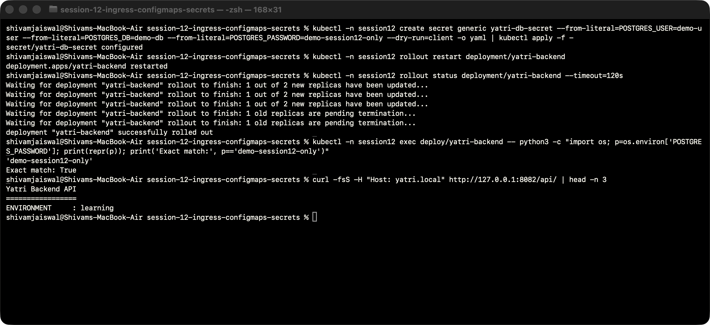
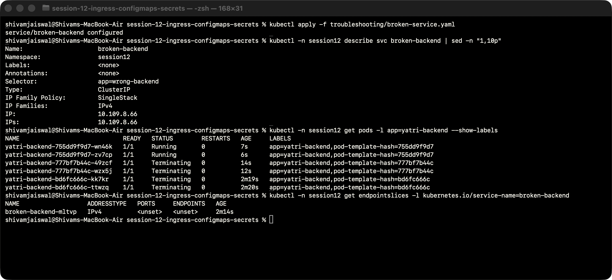
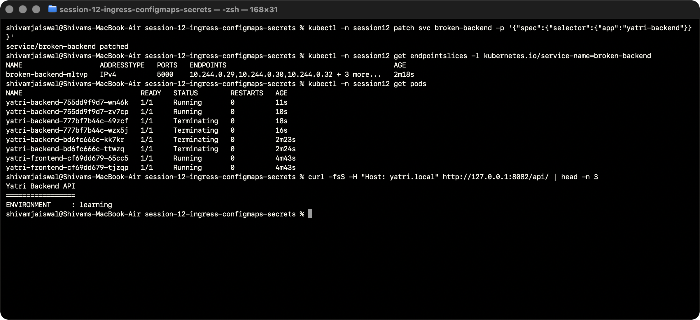

# Session 12: Ingress, ConfigMaps & Secrets

Completed on 7 October 2026 on branch `session12-ingress-secrets`, using the `devops-assignment` Minikube cluster (Kubernetes/kubectl v1.35.0). The existing `04-full-demo` manifests are the basis of this submission. Applications run in `session12`; the ingress controller runs in `session12-controller`.

## Assignment coverage

- ConfigMap: creation, configuration storage, injection and in-container verification.
- Secret: generated dummy values, injection and in-container verification.
- Ingress: frontend/backend application, Services, host and path routing through Traefik, including an unmatched host returning 404.
- Object comparison: Ingress versus controller, explained below.
- Troubleshooting: reproduce the supplied trailing-newline Secret issue and fix it; additionally diagnose an empty-endpoint selector mismatch.

## Reproduce the demo

```bash
helm repo add traefik https://traefik.github.io/charts
helm repo update traefik
helm upgrade --install session12-ingress traefik/traefik --version 41.6.1 --namespace session12-controller --create-namespace -f controller-values.yaml --wait --timeout 180s
./04-full-demo/run-demo.sh
kubectl -n session12-controller port-forward svc/session12-ingress-traefik 8082:80
```

Keep the port-forward process running; use another terminal for the requests below. This forwards to the controller, which then performs Ingress routing to the application Services. It does not bypass the controller by forwarding straight to the application.

The frontend uses Nginx and the backend uses the supplied Python HTTP server. The backend accepts /api directly, so a regex path rewrite is unnecessary. Images are `nginx:1.28-alpine`, `python:3.12-alpine`, and the controller chart installs Traefik v3.7.13.

## Ingress vs Ingress Controller

| Ingress | Ingress Controller |
| --- | --- |
| Kubernetes API object describing HTTP host/path rules and optional TLS configuration. | Running software that watches those rules and configures the actual traffic handling. |
| Created with networking.k8s.io/v1 and an ingressClassName. | Deployed as controller Pods plus Services/RBAC; commonly installed with Helm. |
| In this lab, yatri.local /api points to the backend, and / to the frontend. | Here, Traefik processes the traefik class and forwards requests. |
| Does not itself listen for or proxy connections. | Accepts connections and routes to the selected Service backends. |

The chart initially generated `session12-ingress-traefik` as the IngressClass name, which did not match the application's `traefik` class. Setting `ingressClass.name: traefik` in `controller-values.yaml` and upgrading the controller restored routing.





Both are needed for this demo: the object supplies desired routing and the controller implements it. Traefik, HAProxy and cloud-provider controllers are examples. The supplied teaching files use NGINX-specific annotations; the executed manifests use Traefik and standard Prefix paths.

## Secret handling

Base64 is encoding, not encryption. Secrets must be restricted with RBAC and protected using the cluster's encryption-at-rest configuration or an external secret manager. Committing a real Secret exposes its value even if it is base64-encoded. Environment variables and terminal output can also expose it.

Only clearly fictitious demo values are shown here. `04-full-demo/secret.yaml` is explicitly an example. The runnable script creates the demonstration Secret at runtime with kubectl; it does not apply a real credential file. Keep real secret files outside Git and use protected CI secrets or an external secret store. Existing teaching examples remain examples, not production credentials.

## Troubleshooting findings

1. Trailing newline: the password bytes differed because a file written with a newline was used as the Secret value. The backend received `demo-session12-only\n`; comparing against the expected value was false. Generating the exact literal and restarting Pods fixed the byte mismatch. This demonstrates credential comparison rather than claiming that an actual PostgreSQL server was deployed.
2. Empty endpoints: `broken-backend` selected `app=wrong-backend`, while actual Pods were labelled `app=yatri-backend`. Correcting the selector populated EndpointSlices. No DNS change was needed.


## Commands, output and screenshots

All screenshots show live Terminal commands and results. Screen capture runs in a separate window. Text transcripts preserve the visible output.

### ConfigMap creation and injection

The supplied ConfigMap is stored in session12 and its learning/INFO/INR values are present inside the backend container.

```bash
kubectl -n session12 get configmap yatri-app-config
kubectl -n session12 get configmap yatri-app-config -o jsonpath="{.data}"; printf "\n"
kubectl -n session12 exec deploy/yatri-backend -- printenv ENVIRONMENT LOG_LEVEL DEFAULT_CURRENCY
```



[Actual output](output/logs/01-configmap.txt).

### Secret creation and injection

The Secret is generated by the demo script. These are deliberately fictitious exercise credentials; no AWS, GitHub or real database credential is used.

```bash
kubectl -n session12 get secret yatri-db-secret
kubectl -n session12 exec deploy/yatri-backend -- printenv POSTGRES_USER POSTGRES_PASSWORD POSTGRES_DB
```



[Actual output](output/logs/02-secret.txt).

### Controller, Service and frontend routing

A ready Traefik controller processes the Ingress rule. The request uses the yatri.local Host header without modifying /etc/hosts.

```bash
kubectl -n session12-controller get pods
kubectl -n session12 get ingress yatri-ingress
kubectl -n session12 get services
curl -fsS -H "Host: yatri.local" http://127.0.0.1:8082/ | sed -n "/<h1>/p"
```



[Actual output](output/logs/03-ingress.txt).

### Backend route and application configuration

The /api path reaches the Python backend and returns the injected configuration and demo database user/name. The HTTP API does not expose the password.

```bash
curl -fsS -H "Host: yatri.local" http://127.0.0.1:8082/api/
curl -s -o /dev/null -w "Unknown host HTTP status: %{http_code}\n" -H "Host: unknown.local" http://127.0.0.1:8082/
```



[Actual output](output/logs/04-api-routing.txt).

### Trailing-newline investigation: before

The supplied troubleshooting note describes an extra newline in a Secret. This reproduces it in the backend: repr displays the newline and the exact-value comparison is false.

```bash
printf 'demo-session12-only\n' > /tmp/session12-demo-password.txt
kubectl -n session12 create secret generic yatri-db-secret --from-literal=POSTGRES_USER=demo-user --from-literal=POSTGRES_DB=demo-db --from-file=POSTGRES_PASSWORD=/tmp/session12-demo-password.txt --dry-run=client -o yaml | kubectl apply -f -
kubectl -n session12 rollout restart deployment/yatri-backend
kubectl -n session12 rollout status deployment/yatri-backend --timeout=120s
kubectl -n session12 exec deploy/yatri-backend -- python3 -c "import os; p=os.environ['POSTGRES_PASSWORD']; print(repr(p)); print('Exact match:', p=='demo-session12-only')"
```



[Actual output](output/logs/05-newline-before.txt).

### Trailing-newline fix: after

Recreate the value with --from-literal and restart the Deployment because environment variable injection is evaluated when the container starts. The exact-value comparison now passes.

```bash
kubectl -n session12 create secret generic yatri-db-secret --from-literal=POSTGRES_USER=demo-user --from-literal=POSTGRES_DB=demo-db --from-literal=POSTGRES_PASSWORD=demo-session12-only --dry-run=client -o yaml | kubectl apply -f -
kubectl -n session12 rollout restart deployment/yatri-backend
kubectl -n session12 rollout status deployment/yatri-backend --timeout=120s
kubectl -n session12 exec deploy/yatri-backend -- python3 -c "import os; p=os.environ['POSTGRES_PASSWORD']; print(repr(p)); print('Exact match:', p=='demo-session12-only')"
curl -fsS -H "Host: yatri.local" http://127.0.0.1:8082/api/ | head -n 3
```



[Actual output](output/logs/06-newline-after.txt).

### Service troubleshooting: before

The deliberately incorrect selector finds no ready backend. Compare the Service selector with actual Pod labels to identify the cause.

```bash
kubectl apply -f troubleshooting/broken-service.yaml
kubectl -n session12 describe svc broken-backend | sed -n "1,10p"
kubectl -n session12 get pods -l app=yatri-backend --show-labels
kubectl -n session12 get endpointslices -l kubernetes.io/service-name=broken-backend
```



[Actual output](output/logs/07-selector-before.txt).

### Service troubleshooting: after

Patch the selector to app=yatri-backend. The EndpointSlice now includes the backend addresses. The original broken YAML is retained as the reproducible failure fixture.

```bash
kubectl -n session12 patch svc broken-backend -p '{"spec":{"selector":{"app":"yatri-backend"}}}' 
kubectl -n session12 get endpointslices -l kubernetes.io/service-name=broken-backend
kubectl -n session12 get pods
curl -fsS -H "Host: yatri.local" http://127.0.0.1:8082/api/ | head -n 3
```



[Actual output](output/logs/08-selector-after.txt).

## Cleanup and references

After review, stop the controller port-forward with Ctrl+C and run `./04-full-demo/cleanup.sh`. The controller can be removed with `helm uninstall session12-ingress -n session12-controller`. Cleanup removes only this exercise's resources.

- [Kubernetes ConfigMaps](https://kubernetes.io/docs/concepts/configuration/configmap/)
- [Kubernetes Secrets](https://kubernetes.io/docs/concepts/configuration/secret/)
- [Kubernetes Ingress](https://kubernetes.io/docs/concepts/services-networking/ingress/)
- [Traefik Kubernetes setup](https://doc.traefik.io/traefik/setup/kubernetes/)
