# Session 14: Kubernetes Troubleshooting

This session covers practical Kubernetes troubleshooting with `kubectl get`, `describe`, `logs`, `exec`, Events, and common failure states.

## Difference Between Events and Logs

| Events | Logs |
| --- | --- |
| Events are generated by Kubernetes components such as the scheduler, kubelet, and controllers. | Logs are generated by the application or process running inside the container. |
| They explain what Kubernetes did or tried to do with a resource. | They explain what the application printed while running. |
| Useful for problems like `Pending`, `ImagePullBackOff`, scheduling failures, failed mounts, and container restarts. | Useful for application errors, crashes, startup failures, dependency issues, and runtime behavior. |
| Checked with `kubectl get events` or the Events section of `kubectl describe`. | Checked with `kubectl logs <pod-name>`. |

Simple rule:

```text
Events = What Kubernetes says happened to the resource.
Logs   = What the application/container says happened inside it.
```

All examples were run on the `minikube` context.

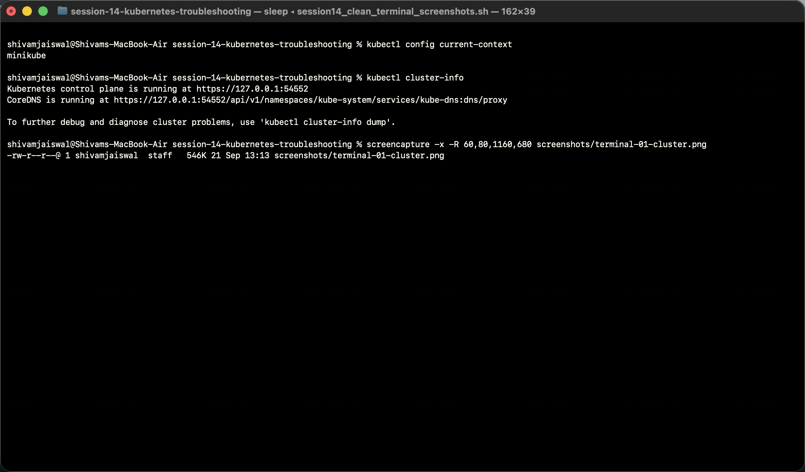

## Folder Structure

```text
session-14-kubernetes-troubleshooting/
├── 01-kubectl-get/
├── 02-kubectl-describe/
├── 03-kubectl-logs/
├── 04-kubectl-exec/
├── 05-events/
├── 06-crashloopbackoff/
├── 07-imagepullbackoff/
├── 08-pending-pods/
├── 09-service-dns-troubleshooting/
└── mini-project/
```

## Troubleshooting Flow

```text
Observe -> Check status -> Describe -> Read events -> Check logs -> Exec if needed -> Fix -> Verify
```

## 01-kubectl-get

File run: `01-kubectl-get/sample-workload.yaml`

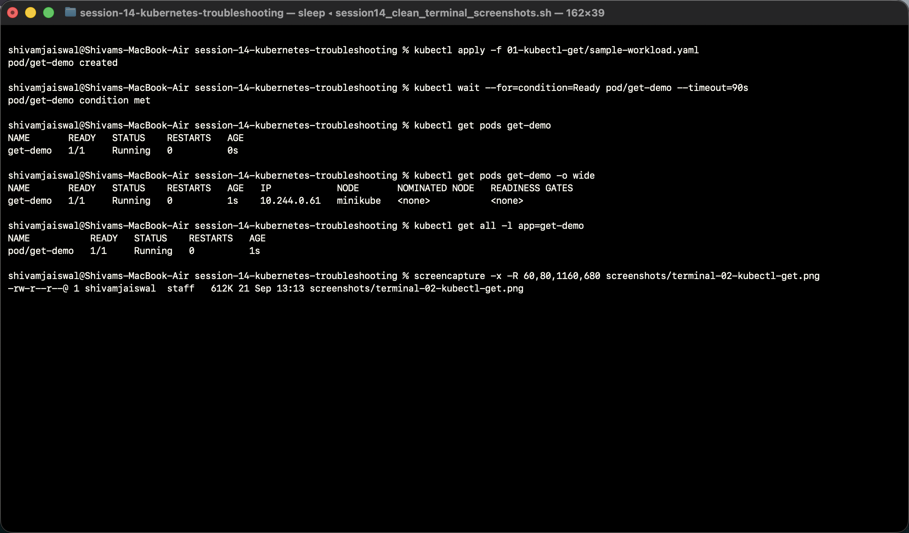

Learning: `kubectl get` gives the quick current state of Kubernetes resources.

## 02-kubectl-describe

File run: `02-kubectl-describe/demo-pod.yaml`

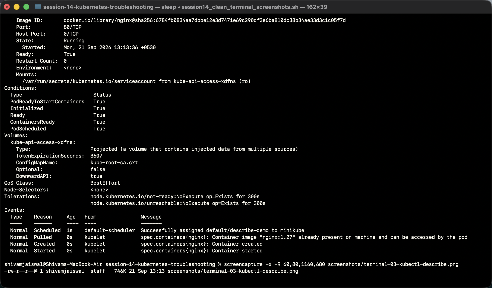

Learning: `kubectl describe` shows details, container state, restart count, and Events.

## 03-kubectl-logs

File run: `03-kubectl-logs/pod.yaml`

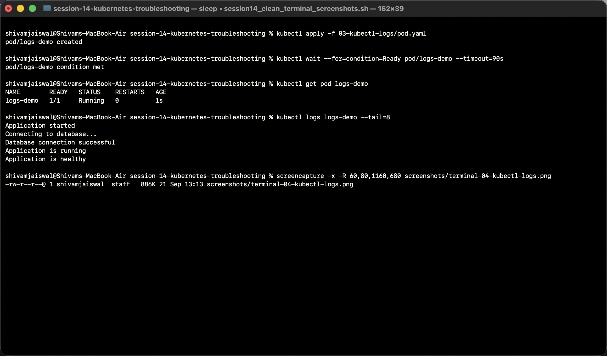

Learning: `kubectl logs` shows what the application printed to stdout/stderr.

## 04-kubectl-exec

File run: `04-kubectl-exec/pod.yaml`

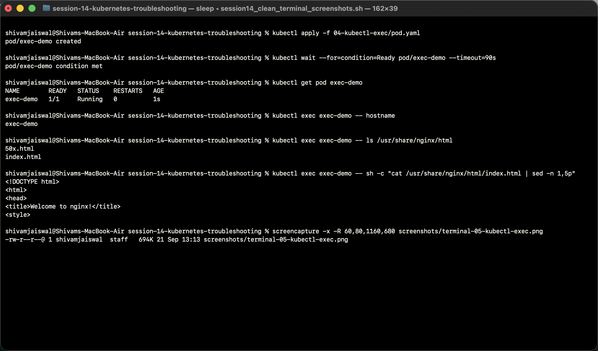

Learning: `kubectl exec` works only when the container is running. This nginx image did not include `wget`, which is itself a useful troubleshooting observation.

## 05-events

File run: `05-events/pod.yaml`

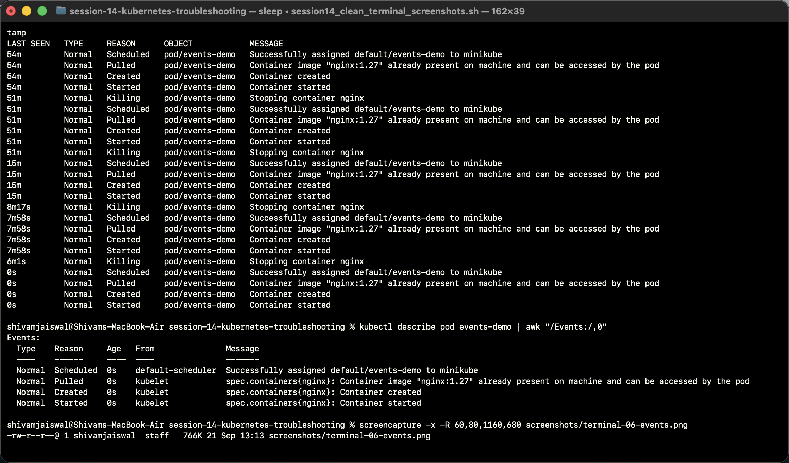

Learning: Events show what Kubernetes tried and what happened.

## 06-crashloopbackoff

Files run:

```text
06-crashloopbackoff/broken-pod.yaml
06-crashloopbackoff/fixed-pod.yaml
```


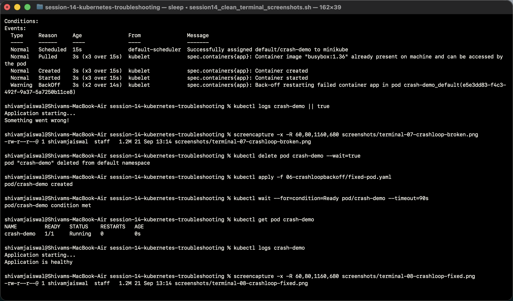

Root cause: the broken pod exits with `exit 1`, so Kubernetes restarts it repeatedly.

## 07-imagepullbackoff

Files run:

```text
07-imagepullbackoff/broken-pod.yaml
07-imagepullbackoff/fixed-pod.yaml
```


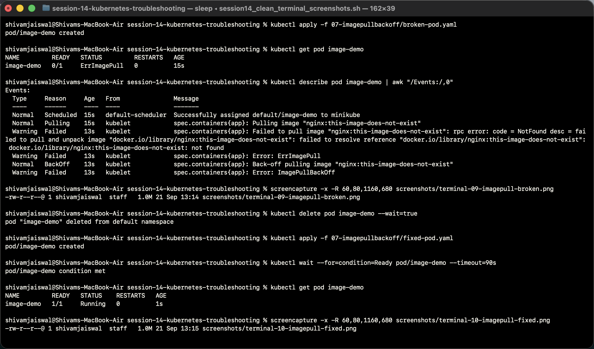

Root cause: the image tag `nginx:this-image-does-not-exist` does not exist.

## 08-pending-pods

Files run:

```text
08-pending-pods/broken-pod.yaml
08-pending-pods/fixed-pod.yaml
```


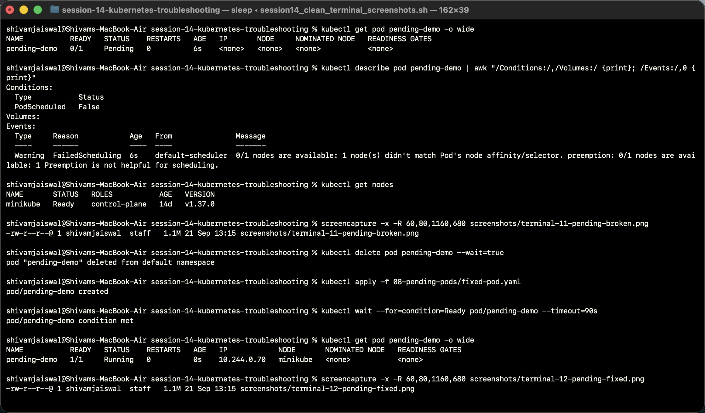

Root cause: the broken pod asks for `node-that-does-not-exist` using `nodeSelector`.

## 09-service-dns-troubleshooting

Files run:

```text
09-service-dns-troubleshooting/deployment.yaml
09-service-dns-troubleshooting/service.yaml
09-service-dns-troubleshooting/dns-test-pod.yaml
09-service-dns-troubleshooting/broken-service.yaml
```

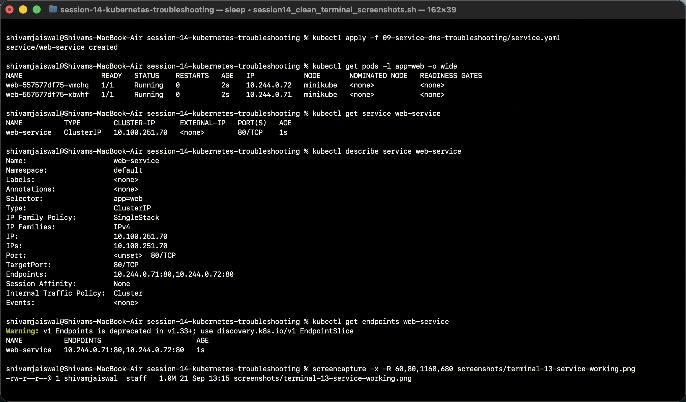

The DNS test pod file was also run, but the image currently fails to pull:

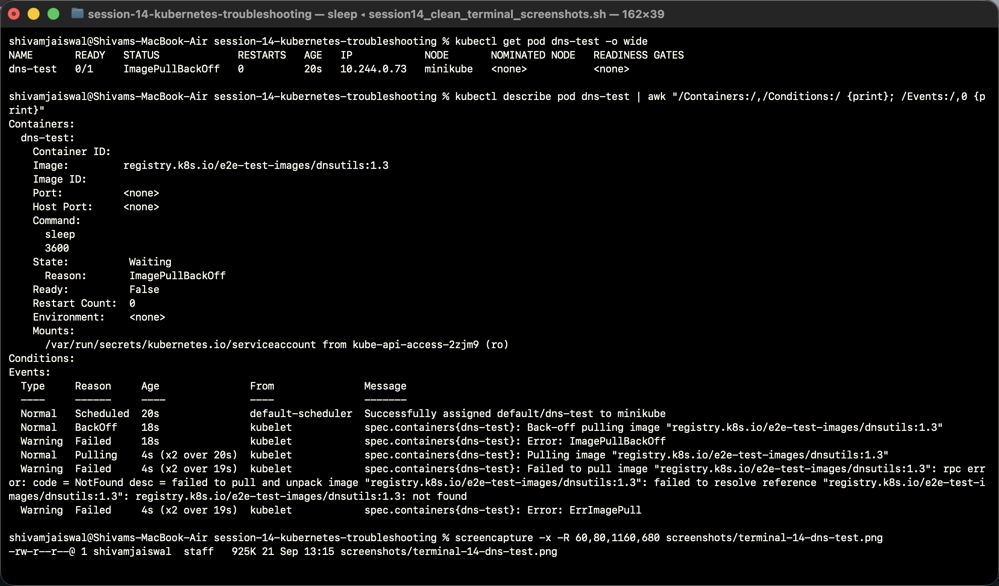

Broken service selector test:

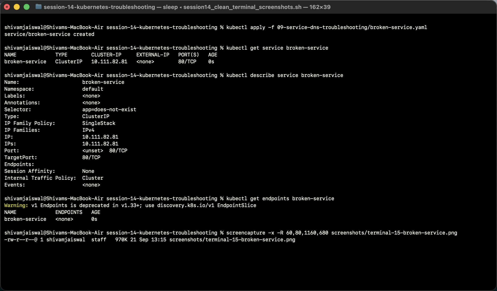

Learning: a Service with a selector that matches pods gets endpoints. A Service with a selector that matches nothing has `<none>` endpoints.

## Mini Project

Files run:

```text
mini-project/deployment.yaml
mini-project/service.yaml
mini-project/broken-pod.yaml
```

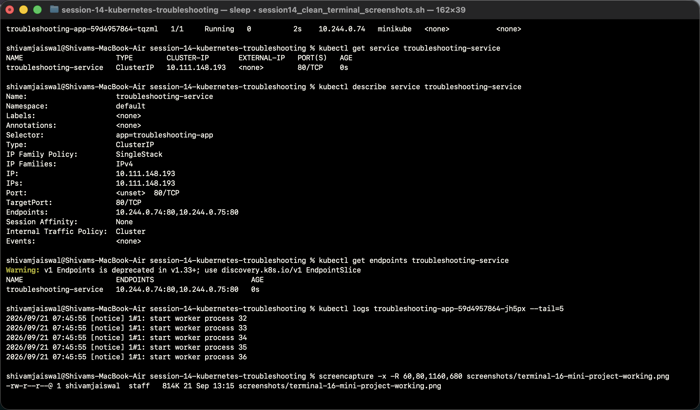

Broken pod challenge:

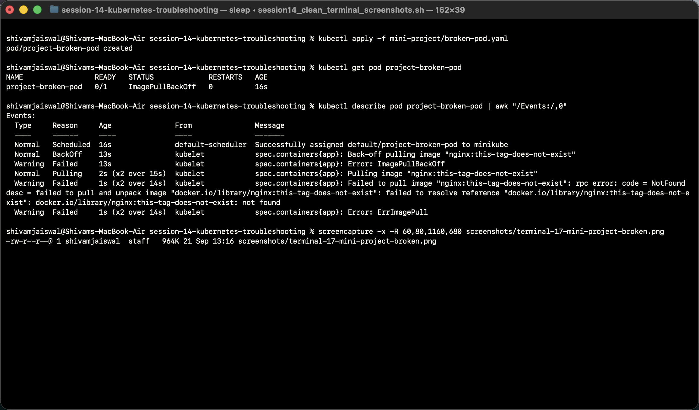

Challenge answers:

| Question | Answer |
| --- | --- |
| What is the Pod status? | `ErrImagePull`, then it can become `ImagePullBackOff` after retries. |
| What is the actual error? | Kubernetes cannot pull `nginx:this-tag-does-not-exist`. |
| Which command helped find the reason? | `kubectl describe pod project-broken-pod` and the Events section. |
| What is wrong with the image? | The image tag does not exist. |
| How would you fix it? | Use a valid image tag such as `nginx:1.27`, then recreate/apply the fixed pod spec. |

## Cleanup

After running the examples, the demo resources were removed:

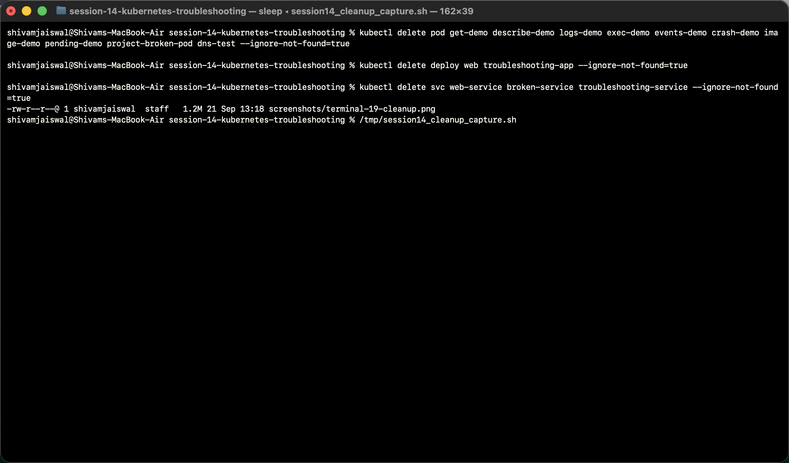

## Useful Commands

```bash
kubectl get pods
kubectl get pods -o wide
kubectl describe pod <pod-name>
kubectl logs <pod-name>
kubectl logs <pod-name> --previous
kubectl exec <pod-name> -- <command>
kubectl get events --sort-by=.lastTimestamp
kubectl get endpoints <service-name>
```
