# Session 14: Kubernetes Troubleshooting

Completed on branch `session14-kubernetes-troubleshooting`, in namespace `session14` on the `devops-assignment` Minikube cluster. Kubernetes/kubectl v1.35.0, macOS/Apple Silicon, 7 October 2026. The existing command examples, failure fixtures and mini-project were inspected and used for the hands-on work.

## Coverage and findings

| Problem | Evidence / investigation | Root cause | Fix and verification |
| --- | --- | --- | --- |
| CrashLoopBackOff | State, previous logs, restart events. | Supplied process exits 1 on every start. | Recreate Pod with the corrected long-running command; Ready and healthy startup logs. |
| ErrImagePull / ImagePullBackOff | Image-not-found and retry/backoff events. | Nonexistent Nginx image tag. | Apply fixed valid tag; Ready. |
| Pending | FailedScheduling and node labels. | Nonexistent nodeSelector hostname. | Recreate without the incorrect constraint; scheduled and Ready. |
| ContainerCreating | FailedMount events. | Missing required ConfigMap volume. | Create the ConfigMap; mounted file readable. |
| Configuration error | CreateContainerConfigError and events. | Missing required environment ConfigMap. | Create APP_MODE key; value present inside the container. |
| Service connectivity | Selector, Pod labels, empty EndpointSlice. | Selector mismatch. | Patch selector; endpoints populated and HTTP succeeds. |
| DNS | Resolver configuration and NXDOMAIN. | Wrong namespace in the hostname. | Correct FQDN; DNS and HTTP succeed. |
| Pod-to-Pod networking | Connection refused on Pod IP:81; direct IP:80 test. | Wrong destination listener port. | Correct port; direct Pod-to-Pod HTTP succeeds. |
| Mini-project image | Investigate before modifying supplied broken Pod. | nginx:this-tag-does-not-exist cannot be pulled. | Set nginx:1.28-alpine and verify readiness. |
| Mini-project Service | Ready application Pods but no Service endpoints. | Selector intentionally changed to wrong-app. | Restore troubleshooting-app selector and verify Nginx through the Service. |

All listed fixes were executed and verified. Error text in the **before** screenshots is intentional evidence, not a claimed successful command. Networking diagnosis here tests direct Pod IP/port connectivity; it does not claim a NetworkPolicy enforcement test. If traffic times out rather than refusing, also inspect routing/CNI health and policies supported by that cluster's network implementation.

## Reproduce

Create the isolated namespace, then apply the supplied healthy workload files and selected failure fixtures with `kubectl -n session14 apply -f <file>`. Do not apply both broken and fixed versions of the same Pod together. Investigate the broken fixture first, then use the corresponding fix below. `10-container-configuration` adds reproducible missing-volume and missing-environment cases. Remove a previous run's `session14` namespace before repeating the create-ConfigMap steps.

```bash
kubectl apply -f namespace.yaml
kubectl -n session14 apply -f mini-project/deployment.yaml -f mini-project/service.yaml
kubectl -n session14 apply -f mini-project/broken-pod.yaml
kubectl -n session14 get pods
kubectl -n session14 describe pod project-broken-pod
# Only after investigation:
kubectl -n session14 apply -f mini-project/fixed-pod.yaml
```

## Mini-project answers

1. `get` gives a concise state summary: existence, readiness, status and selected fields.
2. `describe` adds configuration, conditions and events; it helps explain the observed state.
3. `logs` reads container output to investigate application behavior; `--previous` helps after a restart.
4. `exec` runs a diagnostic command inside a running container, for example checking config or testing a request.
5. CrashLoopBackOff means repeated container exits are being delayed by restart backoff; inspect exit reasons and logs.
6. ImagePullBackOff means repeated image-pull attempts are delayed; inspect the tag, registry, credentials and pull events.
7. Pending can reflect unsatisfied scheduling constraints, resource requests, storage binding or other startup prerequisites; inspect conditions and events.
8. A Service can have no ready endpoints when selectors match no Pods or matching Pods are unready.
9. A selector must match the desired Pod labels; EndpointSlices are maintained from the matching ready backends.
10. Kubernetes DNS supplies discovery names for Services and supported Pod identities; CoreDNS serves this cluster's DNS.

For the supplied broken Pod, status was ImagePullBackOff (with initial ErrImagePull events), the registry reported the tag not found, and `kubectl describe pod` exposed the cause. Updating the tag after investigation fixed it. The completed incident table above answers the supplied mini-project worksheet.

```text
Client → Service DNS/IP → matching ready Pod → Nginx
Deployment → ReplicaSet → two mini-project Pods
```

## Commands, output and screenshots

All screenshots show live Terminal commands and results. Screen capture runs in a separate window. Text transcripts preserve the visible output.

### Get and wide output

Get lists current states; wide output adds Pod IP and node information. The unhealthy states here are deliberately introduced fixtures.

```bash
kubectl -n session14 get pods
kubectl -n session14 get pod get-demo -o wide
kubectl -n session14 get svc web-service
```

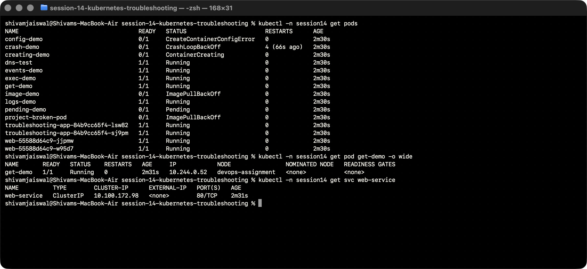

[Actual output](Output/logs/01-get-wide.txt).

### Describe, logs and exec

Describe adds configuration and events. Logs reads the supplied demonstration log messages; they are sample text, not proof that a real database is running. Exec runs a command inside an existing container.

```bash
kubectl -n session14 describe pod get-demo | head -n 12
kubectl -n session14 logs logs-demo --tail=5
kubectl -n session14 exec exec-demo -- nginx -v
```

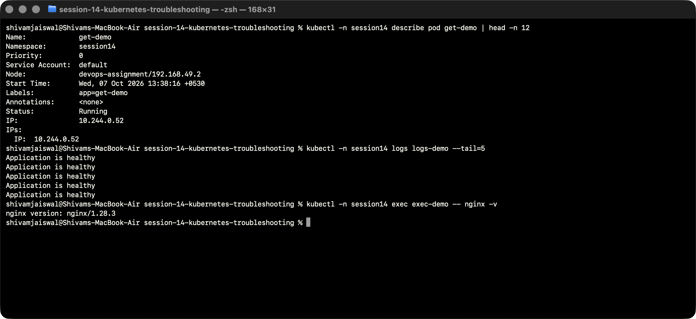

[Actual output](Output/logs/02-describe-logs-exec.txt).

### Events, schema explanation and metrics

Events explain scheduling failure, explain describes the API field schema, and top reads live Metrics Server CPU/memory samples.

```bash
kubectl -n session14 events --for pod/pending-demo
kubectl explain pod.spec.containers | head -n 10
kubectl -n session14 top pods | head -n 9
```

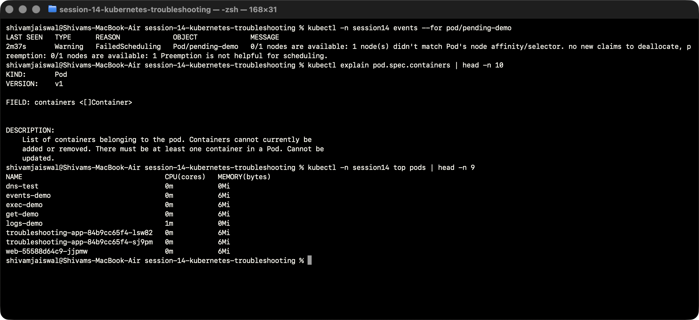

[Actual output](Output/logs/03-events-explain-top.txt).

### CrashLoopBackOff: investigation

The supplied command exits 1 on every start. Previous logs contain the failure message and events show restart backoff.

```bash
kubectl -n session14 get pod crash-demo
kubectl -n session14 logs crash-demo --previous
kubectl -n session14 describe pod crash-demo | tail -n 8
```

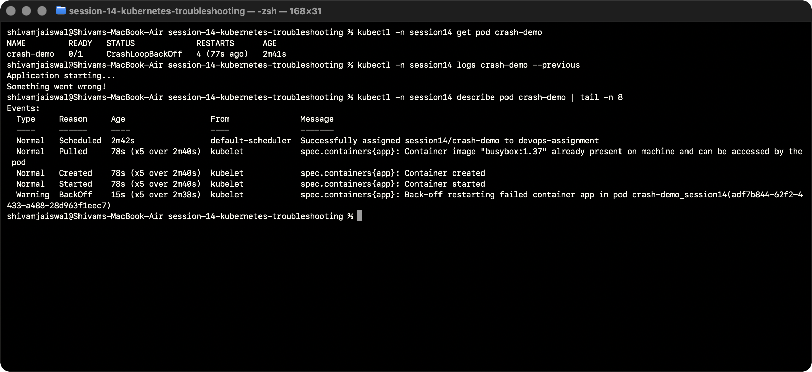

[Actual output](Output/logs/04-crash-before.txt).

### CrashLoopBackOff: fixed

Container command fields are immutable on a Pod. Recreate it from the provided corrected manifest; it now remains running and logs healthy startup.

```bash
kubectl -n session14 delete pod crash-demo
kubectl -n session14 apply -f 06-crashloopbackoff/fixed-pod.yaml
kubectl -n session14 wait --for=condition=Ready pod/crash-demo --timeout=120s
kubectl -n session14 get pod crash-demo
kubectl -n session14 logs crash-demo
```

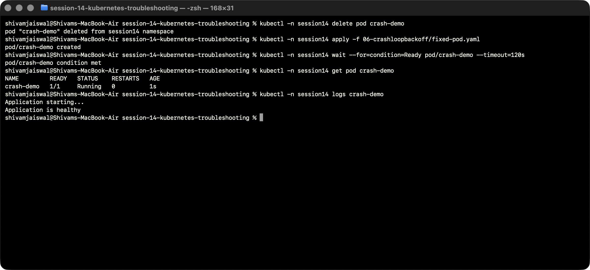

[Actual output](Output/logs/05-crash-after.txt).

### ErrImagePull and ImagePullBackOff: investigation

The tag does not exist. Events record the initial ErrImagePull and the subsequent ImagePullBackOff retry delay; this is distinct from an application crash.

```bash
kubectl -n session14 get pod image-demo
kubectl -n session14 describe pod image-demo | tail -n 10
```

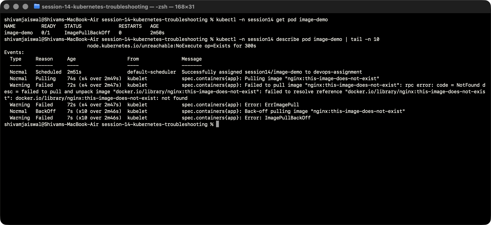

[Actual output](Output/logs/06-image-before.txt).

### Image pull: fixed

Use an existing image tag. The Pod image field can be updated without recreating the entire Pod.

```bash
kubectl -n session14 apply -f 07-imagepullbackoff/fixed-pod.yaml
kubectl -n session14 wait --for=condition=Ready pod/image-demo --timeout=120s
kubectl -n session14 get pod image-demo
```

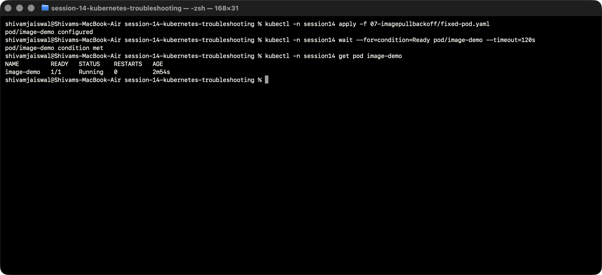

[Actual output](Output/logs/07-image-after.txt).

### Pending: investigation

The nodeSelector requests a hostname that does not exist. Scheduling events identify the unmatched node constraint.

```bash
kubectl -n session14 get pod pending-demo
kubectl -n session14 describe pod pending-demo | tail -n 8
kubectl get nodes --show-labels | cut -c 1-150
```

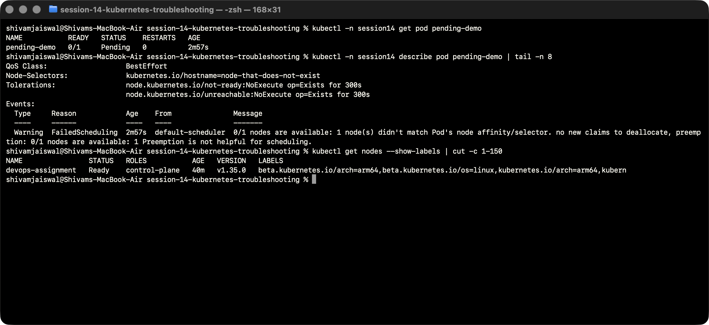

[Actual output](Output/logs/08-pending-before.txt).

### Pending: fixed

Recreate the Pod without the invalid node selector; the scheduler can place it on the actual lab node.

```bash
kubectl -n session14 delete pod pending-demo
kubectl -n session14 apply -f 08-pending-pods/fixed-pod.yaml
kubectl -n session14 wait --for=condition=Ready pod/pending-demo --timeout=120s
kubectl -n session14 get pod pending-demo -o wide
```

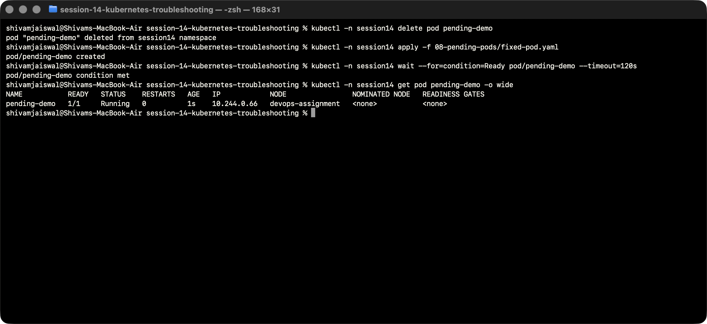

[Actual output](Output/logs/09-pending-after.txt).

### ContainerCreating: investigation

The volume references a missing ConfigMap. The Pod remains ContainerCreating with a FailedMount event; waiting alone does not correct the missing object.

```bash
kubectl -n session14 get pod creating-demo
kubectl -n session14 describe pod creating-demo | tail -n 8
```

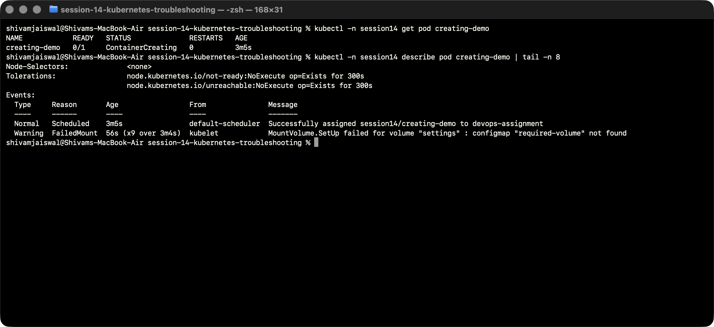

[Actual output](Output/logs/10-creating-before.txt).

### ContainerCreating: fixed

Create the missing volume ConfigMap. The kubelet mounts it, starts the container and the mounted file is readable.

```bash
kubectl -n session14 create configmap required-volume --from-literal=message=volume-now-available
kubectl -n session14 wait --for=condition=Ready pod/creating-demo --timeout=180s
kubectl -n session14 get pod creating-demo
kubectl -n session14 exec creating-demo -- cat /settings/message; printf "\n"
```

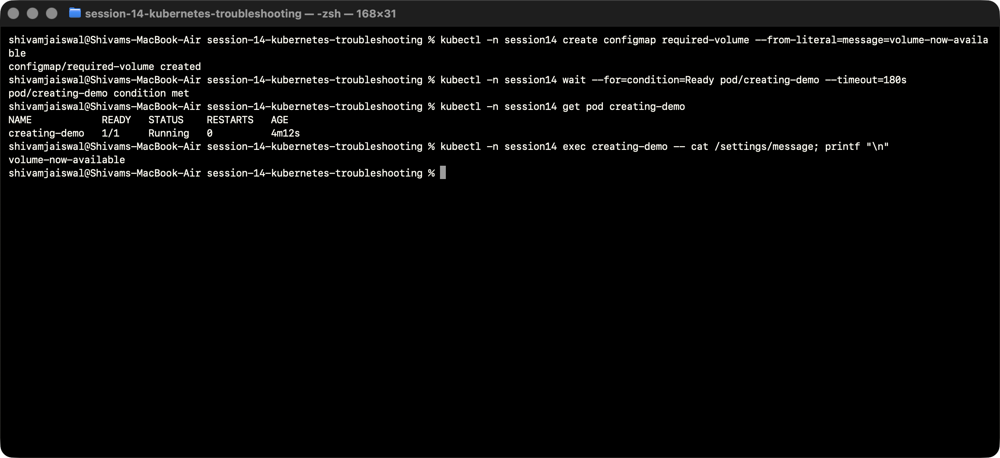

[Actual output](Output/logs/11-creating-after.txt).

### Configuration error: investigation

A required environment ConfigMap does not exist. The kubelet cannot construct the container configuration and reports CreateContainerConfigError.

```bash
kubectl -n session14 get pod config-demo
kubectl -n session14 describe pod config-demo | tail -n 8
```

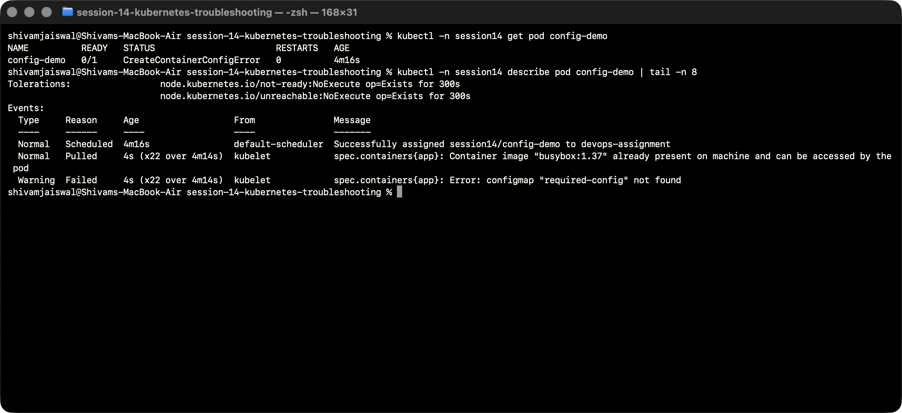

[Actual output](Output/logs/12-config-before.txt).

### Configuration error: fixed

Create the required key and verify its value inside the now-ready container.

```bash
kubectl -n session14 create configmap required-config --from-literal=APP_MODE=learning
kubectl -n session14 wait --for=condition=Ready pod/config-demo --timeout=180s
kubectl -n session14 exec config-demo -- printenv APP_MODE
```

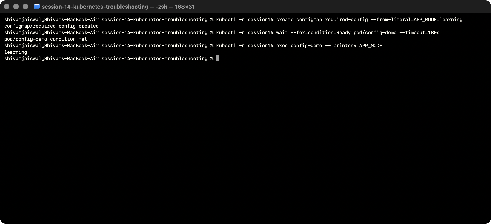

[Actual output](Output/logs/13-config-after.txt).

### Service connectivity: investigation

The broken Service selector does not match the actual Pod labels. No ready endpoints are available to receive connections.

```bash
kubectl -n session14 describe svc broken-service | head -n 10
kubectl -n session14 get pods -l app=web --show-labels
kubectl -n session14 get endpointslices -l kubernetes.io/service-name=broken-service
```

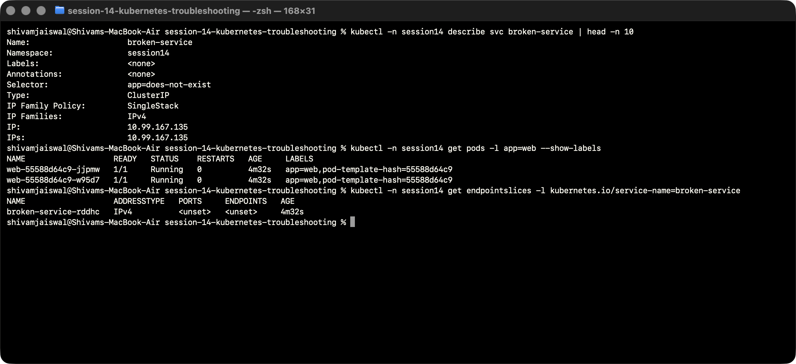

[Actual output](Output/logs/14-service-before.txt).

### Service connectivity: fixed

Correct the selector. EndpointSlice now lists ready Pod addresses and the same Service responds with Nginx HTML.

```bash
kubectl -n session14 patch svc broken-service -p '{"spec":{"selector":{"app":"web"}}}'
kubectl -n session14 get endpointslices -l kubernetes.io/service-name=broken-service
kubectl -n session14 exec dns-test -- wget -qO- http://broken-service | sed -n "/<h1>/p"
```

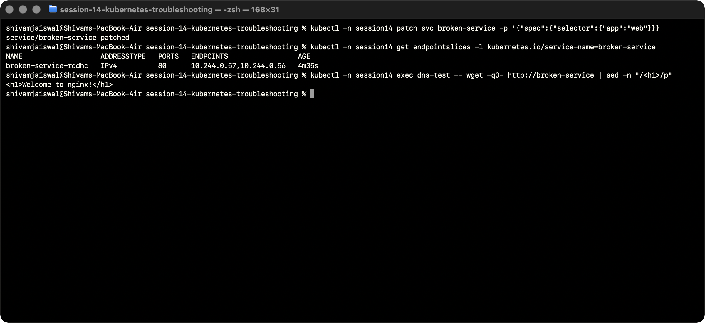

[Actual output](Output/logs/15-service-after.txt).

### DNS failure: investigation

The client uses a valid-looking FQDN but the wrong namespace. NXDOMAIN identifies a name/discovery error, rather than assuming an HTTP server failure.

```bash
kubectl -n session14 exec dns-test -- cat /etc/resolv.conf
kubectl -n session14 exec dns-test -- nslookup -type=A web-service.wrong-namespace.svc.cluster.local.
```

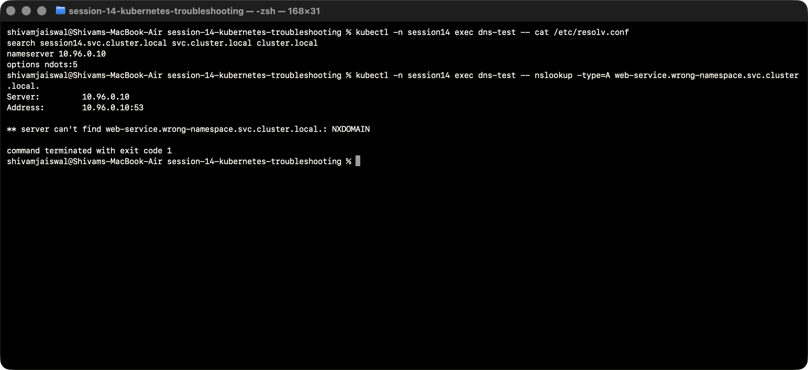

[Actual output](Output/logs/16-dns-before.txt).

### DNS failure: fixed

Use the actual namespace. CoreDNS resolves the Service virtual IP and a request through its complete name succeeds.

```bash
kubectl -n session14 exec dns-test -- nslookup -type=A web-service.session14.svc.cluster.local.
kubectl -n session14 exec dns-test -- wget -qO- http://web-service.session14.svc.cluster.local | sed -n "/<h1>/p"
```

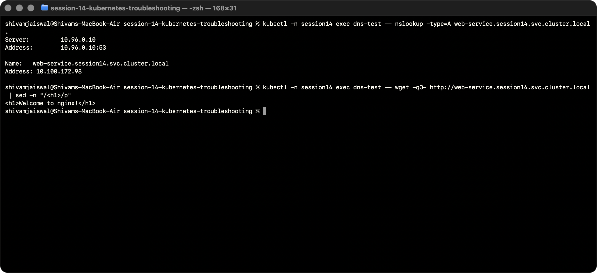

[Actual output](Output/logs/17-dns-after.txt).

### Pod-to-Pod port failure: investigation

Probe the actual destination Pod IP on an incorrect port. Connection refused distinguishes a reachable address with no listener from a missing DNS name.

```bash
WEB_POD_IP=$(kubectl -n session14 get pods -l app=web -o jsonpath='{.items[0].status.podIP}')
kubectl -n session14 exec dns-test -- wget -T 3 -qO- "http://$WEB_POD_IP:81"
```

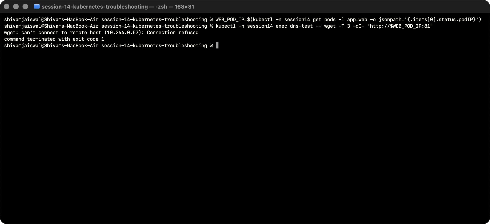

[Actual output](Output/logs/18-pod-network-before.txt).

### Pod-to-Pod connectivity: verified

The same Pod IP on the correct Nginx port 80 works. Compare direct Pod traffic and Service traffic to isolate address, port, selector and DNS problems.

```bash
kubectl -n session14 exec dns-test -- wget -T 3 -qO- "http://$WEB_POD_IP:80" | sed -n "/<h1>/p"
kubectl -n session14 get pods -l app=web -o wide
```

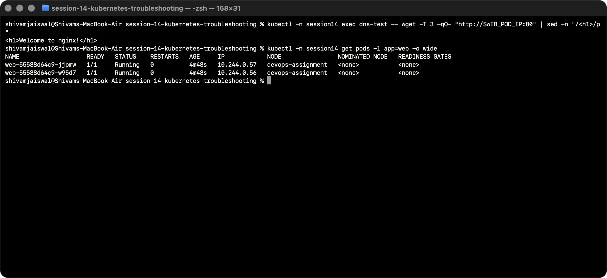

[Actual output](Output/logs/19-pod-network-after.txt).

### Mini-project image incident: investigation

Investigate the supplied broken Pod before altering its image. The nonexistent tag is identified from actual events.

```bash
kubectl -n session14 get pod project-broken-pod
kubectl -n session14 describe pod project-broken-pod | tail -n 10
```

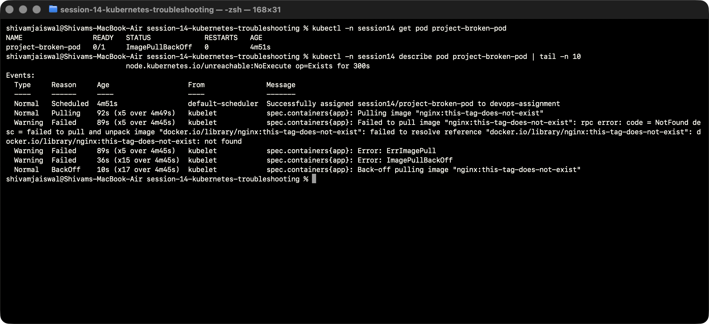

[Actual output](Output/logs/20-mini-image-before.txt).

### Mini-project image incident: fixed

Set a valid image, wait for readiness, and inspect the ready mini-project Deployment.

```bash
kubectl -n session14 set image pod/project-broken-pod app=nginx:1.28-alpine
kubectl -n session14 wait --for=condition=Ready pod/project-broken-pod --timeout=120s
kubectl -n session14 get pod project-broken-pod
kubectl -n session14 get deploy troubleshooting-app
```

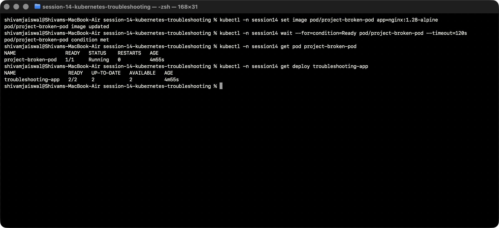

[Actual output](Output/logs/21-mini-image-after.txt).

### Mini-project selector incident: before

The challenge deliberately changes the otherwise-working Service selector to wrong-app. The ready application Pods remain available, but the Service has no endpoints.

```bash
kubectl -n session14 patch svc troubleshooting-service -p '{"spec":{"selector":{"app":"wrong-app"}}}'
kubectl -n session14 get endpointslices -l kubernetes.io/service-name=troubleshooting-service
kubectl -n session14 get pods -l app=troubleshooting-app --show-labels
```

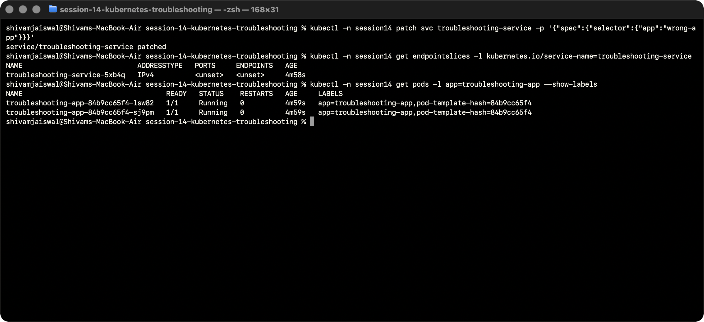

[Actual output](Output/logs/22-mini-service-before.txt).

### Mini-project selector incident: after

Restore the matching selector and verify the application through the repaired Service.

```bash
kubectl -n session14 patch svc troubleshooting-service -p '{"spec":{"selector":{"app":"troubleshooting-app"}}}'
kubectl -n session14 get endpointslices -l kubernetes.io/service-name=troubleshooting-service
kubectl -n session14 exec dns-test -- wget -qO- http://troubleshooting-service | sed -n "/<h1>/p"
```

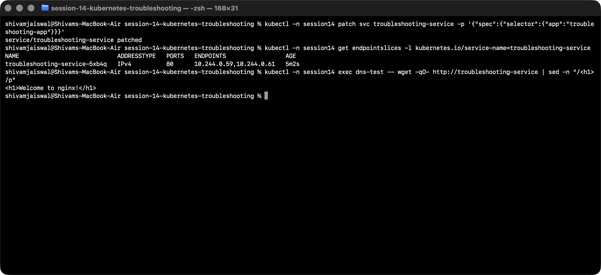

[Actual output](Output/logs/23-mini-service-after.txt).

### Final verification

Every lab Pod is running and ready after the fixes. Broken manifests remain fixtures for reproducing incidents, not the final desired runtime state.

```bash
kubectl -n session14 get pods
kubectl -n session14 get deployments
```

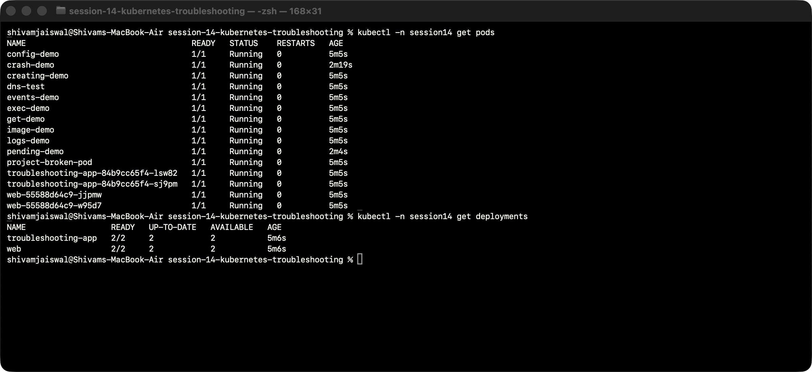

[Actual output](Output/logs/24-final-ready.txt).

## Cleanup and references

`kubectl --context=devops-assignment delete namespace session14` removes only this lab. The failure YAMLs intentionally stay broken as teaching fixtures; applying the entire tree would reintroduce incidents.

- [Kubernetes Pod troubleshooting](https://kubernetes.io/docs/tasks/debug/debug-application/debug-pods/)
- [Service debugging](https://kubernetes.io/docs/tasks/debug/debug-application/debug-service/)
- [DNS debugging](https://kubernetes.io/docs/tasks/administer-cluster/dns-debugging-resolution/)
