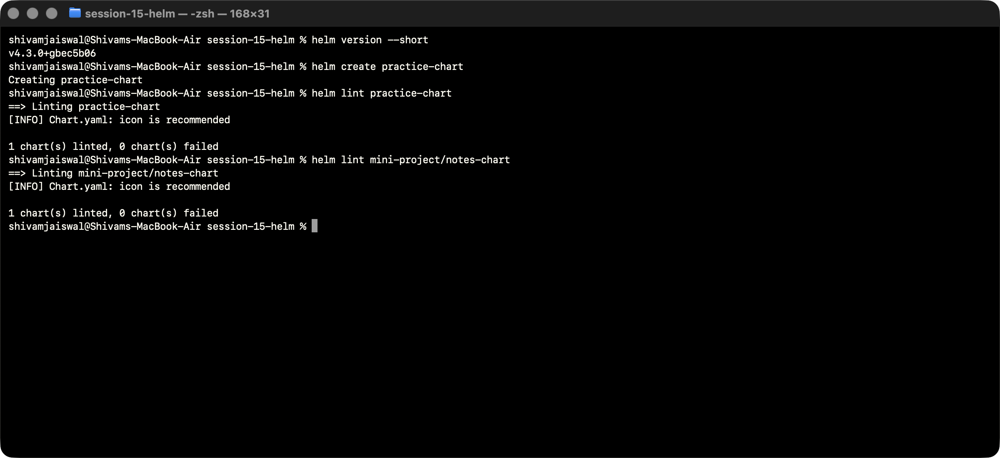
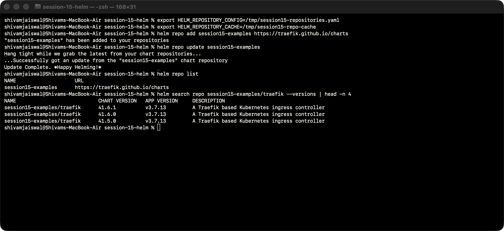
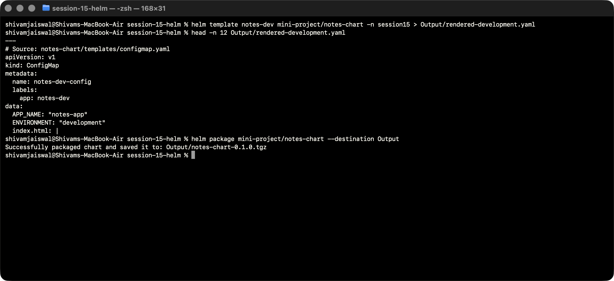
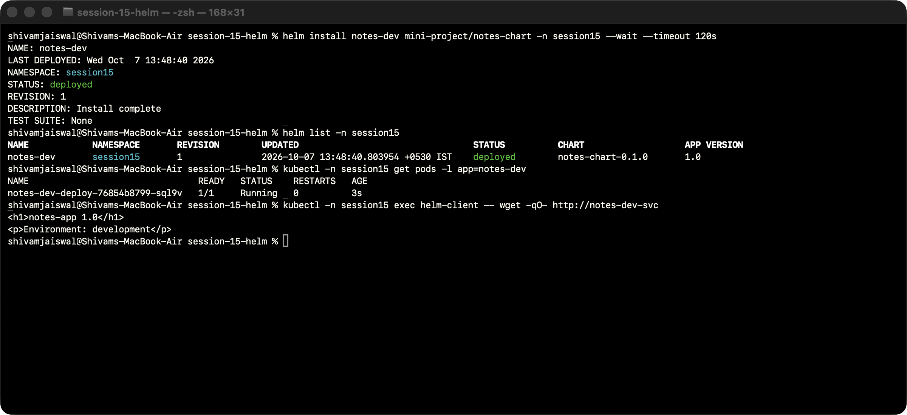
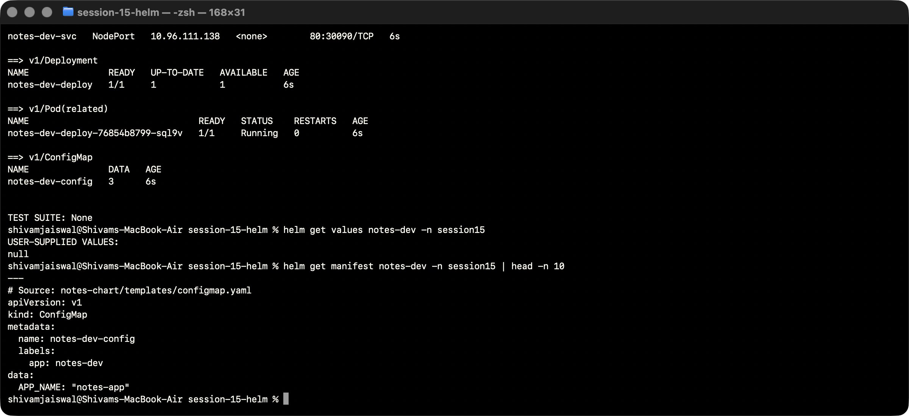
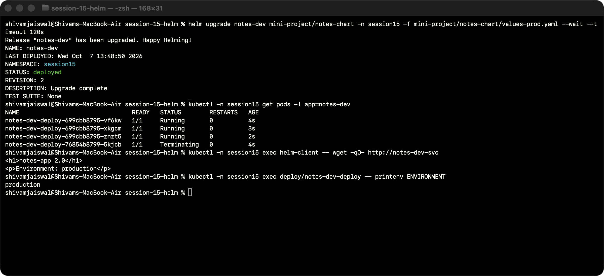
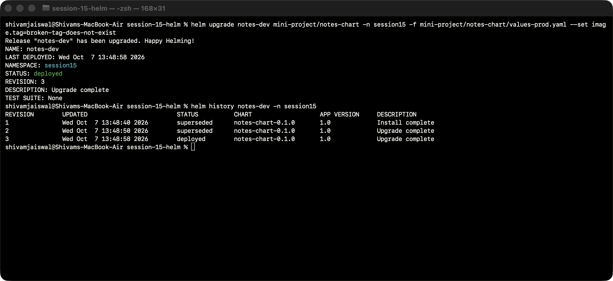
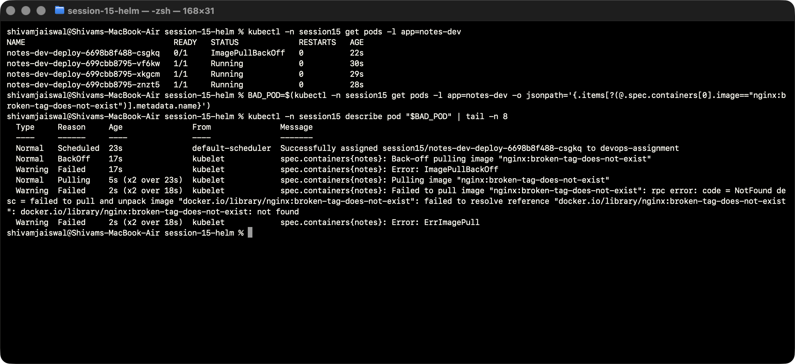
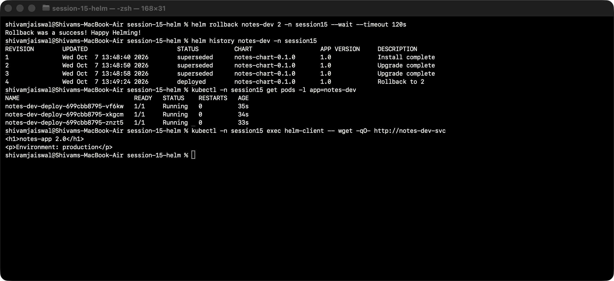
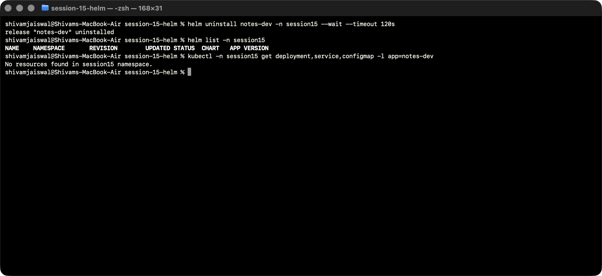

# Session 15: Helm commands, rollback and mini-project

Completed on branch `session15-helm`, using the existing `session-15-helm/mini-project/notes-chart`. Environment: Helm v4.3.0, Kubernetes/kubectl v1.35.0, Minikube context `devops-assignment`, isolated namespace `session15`, macOS/Apple Silicon, 7 October 2026.

## Assignment coverage

All requested commands were executed: create, install, list, status, get, upgrade, history, rollback, uninstall, repo and search. Additional lint, template and package commands validate and export the chart.

The supplied mini-project's Notes app is represented by Nginx, as in the source exercise. The ConfigMap now serves a page showing version and environment, so application behavior verifies upgrades and rollback. This is not a CRUD notes service.

## Workflow and observed behavior

| Revision | Action | Configuration / observation |
| --- | --- | --- |
| 1 | Install | Development, version 1.0, one ready Pod and correct served page. |
| 2 | Upgrade | Production, version 2.0, three ready Pods and correct environment/page. |
| 3 | Upgrade again | Deliberately nonexistent image; new Pod shows ImagePullBackOff. Old ready Pods may still serve requests during a blocked rolling update. |
| 4 | Rollback to revision 2 | Three healthy production replicas and version 2.0 page restored. |
| — | Uninstall | Release resources removed and release no longer listed. |

This completes both the assignment's install → upgrade → verify → upgrade → verify → rollback → verify workflow and the provided mini-project's broken-image incident.

## Chart implementation

- Chart.yaml defines the application chart and its package version.
- values.yaml supplies one development replica and version 1.0.
- values-prod.yaml supplies three production replicas and version 2.0.
- templates/configmap.yaml supplies environment values and the served index.html.
- templates/deployment.yaml injects the ConfigMap, mounts the page, declares a readiness probe and resource requests/limits, and hashes configuration into a Pod-template annotation.
- templates/service.yaml preserves the provided NodePort service at 30090.
- practice-chart is the generated helm create exercise; it was linted but not installed.

The NodePort Service is tested from a diagnostic Pod using its internal Service name. macOS host NodePort access would require a Minikube service tunnel; the exercise does not claim a direct host connection to the private node IP.

## Reproduce

From this folder, create the namespace and client before following the Helm commands below:

```bash
kubectl apply -f namespace.yaml
kubectl -n session15 run helm-client --image=busybox:1.37 --restart=Never --command -- sleep 86400
kubectl -n session15 wait --for=condition=Ready pod/helm-client --timeout=120s
```

Do not run helm create over the existing practice chart when reviewing its files. In the live exercise it was generated into an absent directory. The temporary repository configuration/cache is used only for the repository-command practice. Helm manages the release through the existing Kubernetes context.


## Commands, output and screenshots

All screenshots show live Terminal commands and results. Screen capture runs in a separate window. Text transcripts preserve the visible output.

### Create and lint a chart

helm create generates the practice skeleton; lint validates its chart structure. The actual mini-project uses the supplied notes-chart, adapted below.

```bash
helm version --short
helm create practice-chart
helm lint practice-chart
helm lint mini-project/notes-chart
```



[Actual output](Output/logs/01-create-lint.txt).

### Repository commands and search

An isolated temporary Helm repository configuration/cache keeps this exercise separate from pre-existing repository entries. The official Traefik repository is added, refreshed, listed and searched.

```bash
export HELM_REPOSITORY_CONFIG=/tmp/session15-repositories.yaml
export HELM_REPOSITORY_CACHE=/tmp/session15-repo-cache
helm repo add session15-examples https://traefik.github.io/charts
helm repo update session15-examples
helm repo list
helm search repo session15-examples/traefik --versions | head -n 4
```



[Actual output](Output/logs/02-repo-search.txt).

### Template and package

Rendering substitutes chart values into Kubernetes YAML; packaging produces a distributable chart archive. The full rendered manifest is saved alongside the evidence.

```bash
helm template notes-dev mini-project/notes-chart -n session15 > Output/rendered-development.yaml
head -n 12 Output/rendered-development.yaml
helm package mini-project/notes-chart --destination Output
```



[Actual output](Output/logs/03-render.txt).

### Install development release

Revision 1 uses one development replica and serves the Notes stand-in page at version 1.0.

```bash
helm install notes-dev mini-project/notes-chart -n session15 --wait --timeout 120s
helm list -n session15
kubectl -n session15 get pods -l app=notes-dev
kubectl -n session15 exec helm-client -- wget -qO- http://notes-dev-svc
```



[Actual output](Output/logs/04-install.txt).

### Status and get commands

Inspect the installed release and its supplied values and generated manifest. A Helm release is an installation of a chart, with revision history.

```bash
helm status notes-dev -n session15
helm get values notes-dev -n session15
helm get manifest notes-dev -n session15 | head -n 10
```



[Actual output](Output/logs/05-get-status.txt).

### Upgrade to production values

Revision 2 has three ready replicas, production configuration and a served version 2.0 page. A checksum annotation triggers Pod rollout when the ConfigMap page/configuration changes.

```bash
helm upgrade notes-dev mini-project/notes-chart -n session15 -f mini-project/notes-chart/values-prod.yaml --wait --timeout 120s
kubectl -n session15 get pods -l app=notes-dev
kubectl -n session15 exec helm-client -- wget -qO- http://notes-dev-svc
kubectl -n session15 exec deploy/notes-dev-deploy -- printenv ENVIRONMENT
```



[Actual output](Output/logs/06-upgrade-production.txt).

### Second upgrade: deliberate broken image

Revision 3 deliberately references a nonexistent image tag, as requested by the supplied mini-project. This upgrade intentionally omits --wait so the subsequent Kubernetes failure can be investigated.

```bash
helm upgrade notes-dev mini-project/notes-chart -n session15 -f mini-project/notes-chart/values-prod.yaml --set image.tag=broken-tag-does-not-exist
helm history notes-dev -n session15
```



[Actual output](Output/logs/07-bad-upgrade.txt).

### Verify the failed rollout

The new Pod cannot pull its image. A Deployment rolling update may retain healthy old Pods; a Helm status of deployed without readiness waiting does not prove every new Pod is healthy.

```bash
kubectl -n session15 get pods -l app=notes-dev
BAD_POD=$(kubectl -n session15 get pods -l app=notes-dev -o jsonpath='{.items[?(@.spec.containers[0].image=="nginx:broken-tag-does-not-exist")].metadata.name}')
kubectl -n session15 describe pod "$BAD_POD" | tail -n 8
```



[Actual output](Output/logs/08-bad-image-evidence.txt).

### Rollback to the verified production release

Rollback to revision 2 creates revision 4. Three ready Pods and the version 2.0 production response confirm recovery, rather than relying only on a CLI success message.

```bash
helm rollback notes-dev 2 -n session15 --wait --timeout 120s
helm history notes-dev -n session15
kubectl -n session15 get pods -l app=notes-dev
kubectl -n session15 exec helm-client -- wget -qO- http://notes-dev-svc
```



[Actual output](Output/logs/09-rollback.txt).

### Uninstall and verify removal

Uninstall removes the Helm release resources. The independently created diagnostic client is removed separately with the namespace.

```bash
helm uninstall notes-dev -n session15 --wait --timeout 120s
helm list -n session15
kubectl -n session15 get deployment,service,configmap -l app=notes-dev
```



[Actual output](Output/logs/10-uninstall.txt).

## Cleanup and references

The live workflow already uninstalled notes-dev. `kubectl --context=devops-assignment delete namespace session15` removes the standalone client and namespace. The [rendered development manifest](Output/rendered-development.yaml) and [packaged chart](Output/notes-chart-0.1.0.tgz) are preserved as artifacts.

- [Helm CLI reference](https://helm.sh/docs/helm/)
- [Using Helm](https://helm.sh/docs/intro/using_helm/)
- [Helm rollback](https://helm.sh/docs/helm/helm_rollback/)
