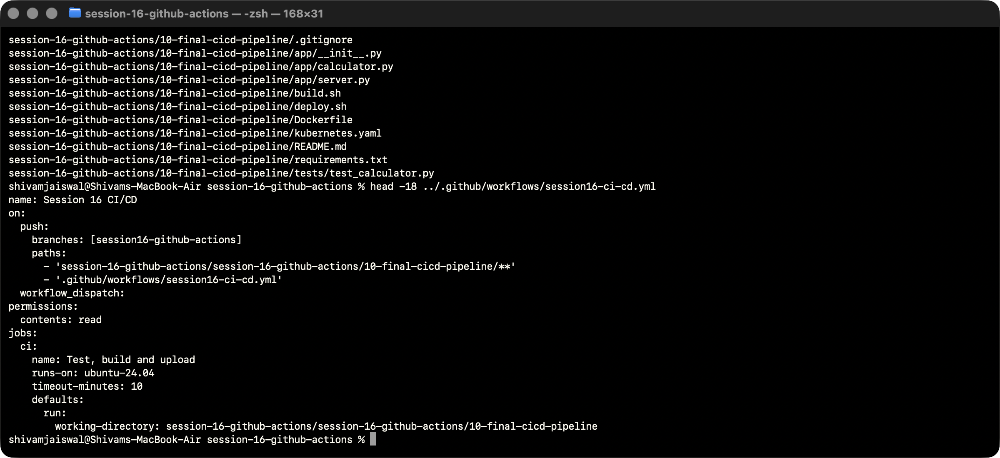
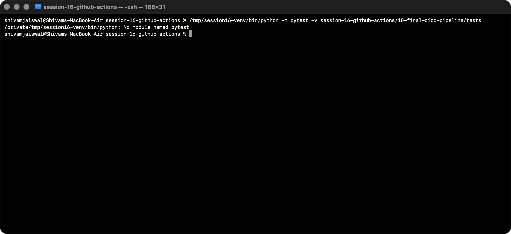
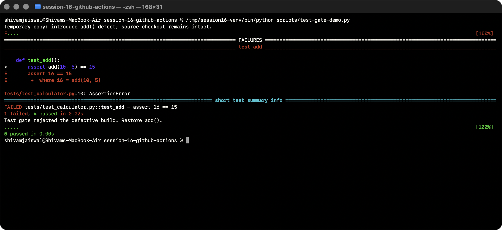
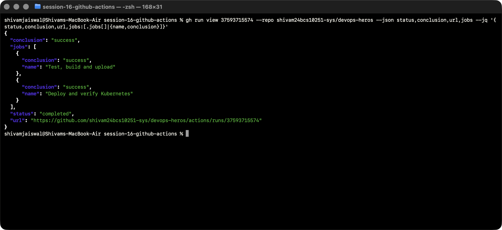
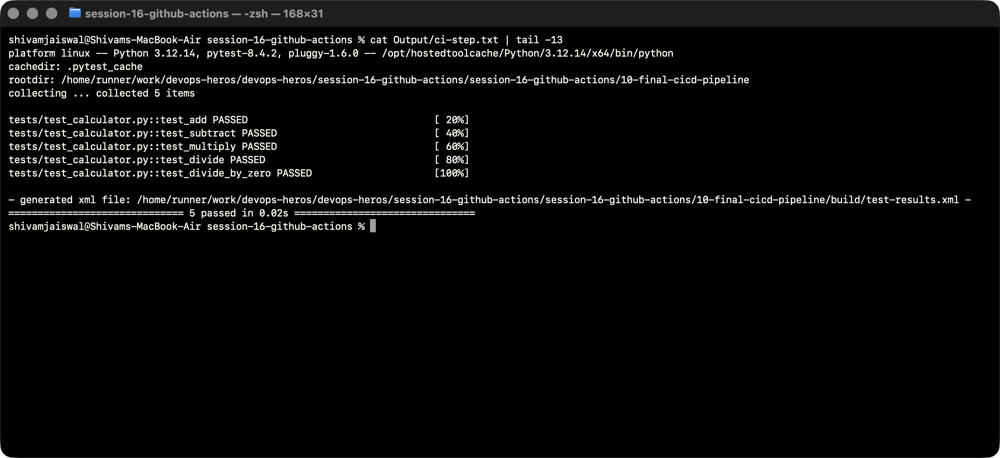
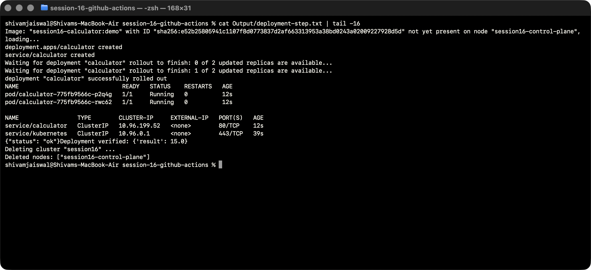
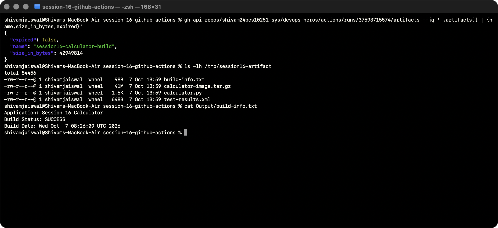

# Session 16 — CI/CD with GitHub Actions

This submission extends the supplied `session-16-github-actions/10-final-cicd-pipeline` calculator: the existing five arithmetic tests gate a Docker image build, artifact delivery, and a real Kubernetes deployment on a disposable Kind cluster. The HTTP calculator returns 15 for `10 + 5`. Two replicas have readiness and liveness probes and run as a non-root user.

## Pipeline

`push → CI: checkout → Python → tests → secret check → application/Docker build → upload artifact → CD: download → load image → Kubernetes deployment → HTTP assertion → cluster cleanup`

| Concept | Implementation |
|---|---|
| CI | Tests and builds each change to this branch/project. Failed tests prevent CD. |
| CD | Downloads the built image, deploys two Kubernetes replicas, waits for rollout and verifies HTTP. |
| Workflow | Repository-root `.github/workflows/session16-ci-cd.yml`; push and manual triggers. |
| Jobs | `ci` and `cd`, ordered by `needs: ci`, on separate Ubuntu 24.04 hosted runners. |
| Steps | Checkout, dependency installation, pytest, Docker build/save, artifact transfer, deployment. |
| Runner | A fresh hosted VM for each job; CD needs the image artifact because runners do not share Docker state. |
| Secrets | Random demonstration `SESSION16_DEMO_TOKEN` stored in repository Actions secrets; check only its presence. Its value is never printed or committed. |
| Artifacts | `session16-calculator-build`: application, build information, JUnit XML and compressed Docker image; retained 7 days. |
| Deployment target | Temporary Kind cluster on the runner, deleted at job completion. This demonstrates deployment without a persistent cloud server. |

## Reproduce

```bash
cd session-16-github-actions/session-16-github-actions/10-final-cicd-pipeline
python3 -m venv .venv
. .venv/bin/activate
python -m pip install -r requirements.txt
python -m pytest -v
bash build.sh
docker build -t session16-calculator:demo .
bash deploy.sh
```

Local deployment requires Docker, Kind and kubectl. GitHub CI installs Kind itself. Push application changes to `session16-github-actions`; inspect the two jobs in Actions. The deployment verifies `/health` and `/calculate?op=add&a=10&b=5`. The original interactive CLI remains available as `python -m app.calculator`.

## References

[GitHub artifact transfer](https://docs.github.com/en/actions/tutorials/store-and-share-data) explains passing a build between jobs. [Kind quick start](https://kind.sigs.k8s.io/docs/user/quick-start/) documents loading Docker images into its Kubernetes nodes.

## Execution evidence

[Successful CI/CD run](https://github.com/shivam24bcs10251-sys/devops-heros/actions/runs/37593715574). The tested source commit is `62182a2d15a0dff12671068bd5db3acf345a113e`. [Run metadata](Output/run.json), [complete runner log](Output/github-run.log), [JUnit test report](Output/test-results.xml) and [build information](Output/build-info.txt) are retained alongside the screenshots. The Docker image artifact expires after seven days; the evidence files here remain in Git.

The failure/fix demonstration is local; this published GitHub run uses the corrected code.

## Commands, output and screenshots

All screenshots show live Terminal commands and results. Screen capture runs in a separate window. Text transcripts preserve the visible output.

### Inspect the supplied project

The existing calculator and tests are the starting point.

```bash
find session-16-github-actions/10-final-cicd-pipeline -maxdepth 2 -type f | sort
head -18 ../.github/workflows/session16-ci-cd.yml
```



[Actual output](Output/logs/01-project-inspection.txt).

### Run unit tests locally

All five supplied arithmetic tests pass.

```bash
/tmp/session16-venv/bin/python -m pytest -v session-16-github-actions/10-final-cicd-pipeline/tests
```



[Actual output](Output/logs/02-local-tests.txt).

### Failure and fix

A temporary project copy returns 16 instead of 15. Pytest rejects it; restoring addition passes all tests. The committed application stays correct.

```bash
/tmp/session16-venv/bin/python scripts/test-gate-demo.py
```



[Actual output](Output/logs/03-test-gate.txt).

### Successful GitHub Actions run

Both independent hosted jobs completed successfully.

```bash
gh run view 37593715574 --repo shivam24bcs10251-sys/devops-heros --json status,conclusion,url,jobs --jq '{status,conclusion,url,jobs:[.jobs[]|{name,conclusion}]}'
```



[Actual output](Output/logs/04-github-success.txt).

### CI test evidence

These are downloaded GitHub runner logs, not simulated output.

```bash
cat Output/ci-step.txt | tail -13
```



[Actual output](Output/logs/05-ci-output.txt).

### CD deployment and HTTP evidence

The downloaded job log records rollout success, two Ready replicas, healthy HTTP and result 15.

```bash
cat Output/deployment-step.txt | tail -16
```



[Actual output](Output/logs/06-deployment-output.txt).

### Download the build artifact

The image is downloaded outside Git to avoid committing a large binary. Test report and build information are preserved in this branch.

```bash
gh api repos/shivam24bcs10251-sys/devops-heros/actions/runs/37593715574/artifacts --jq ' .artifacts[] | {name,size_in_bytes,expired}'
ls -lh /tmp/session16-artifact
cat Output/build-info.txt
```



[Actual output](Output/logs/07-artifact.txt).
