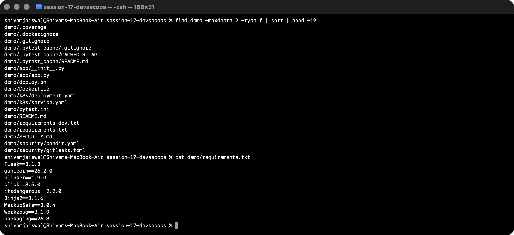
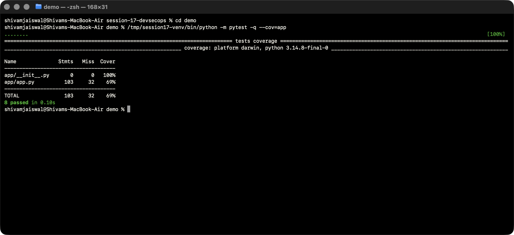
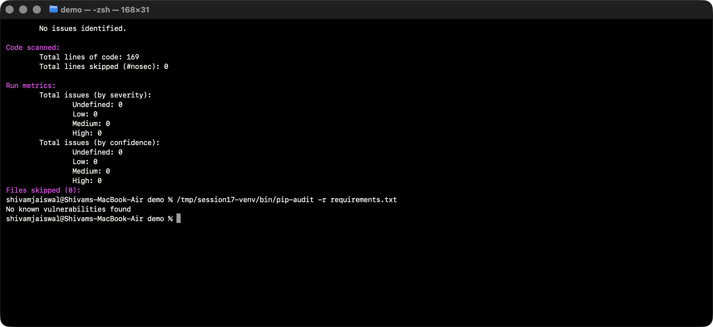
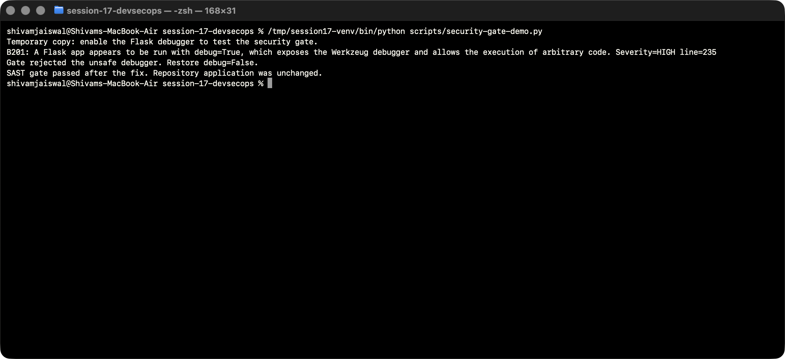
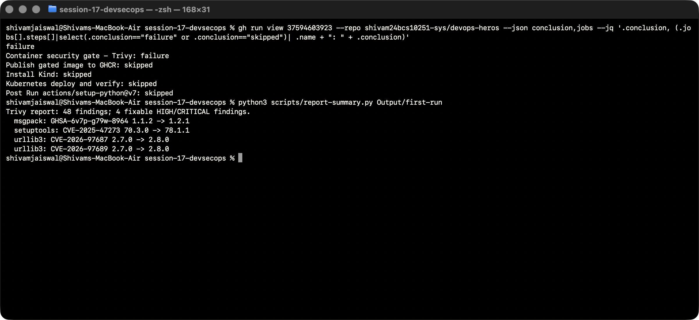
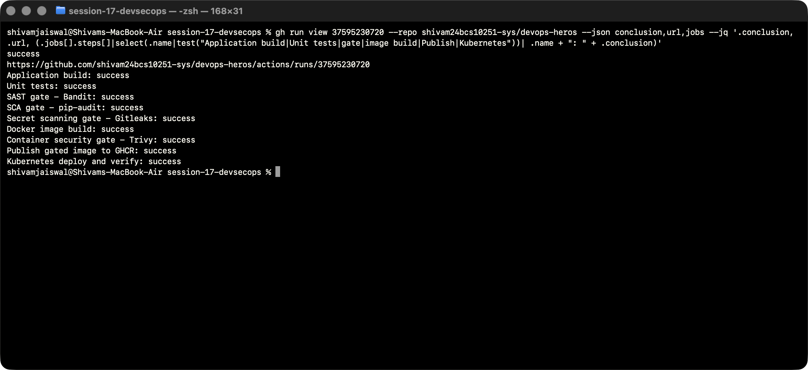
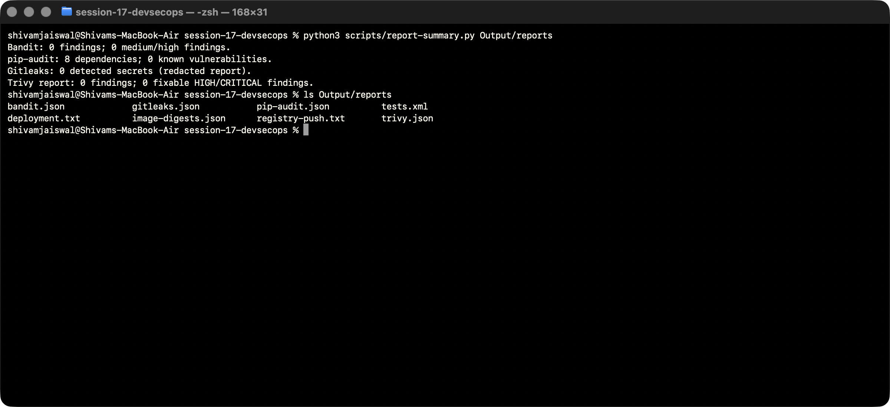
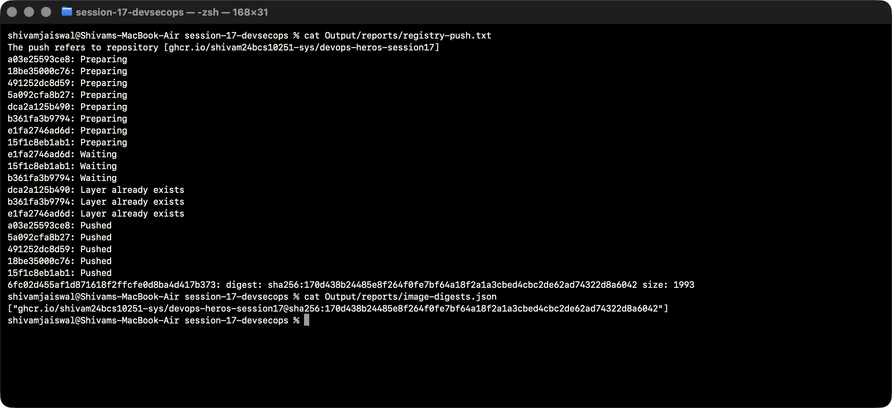
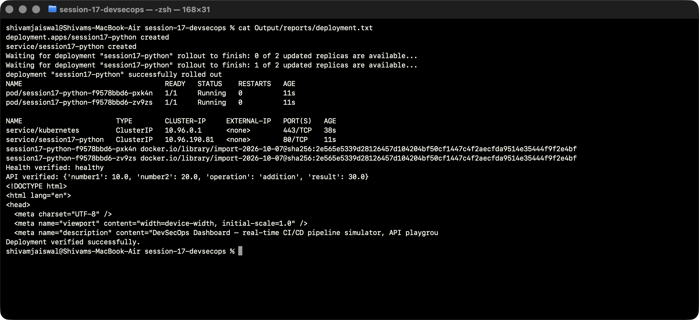
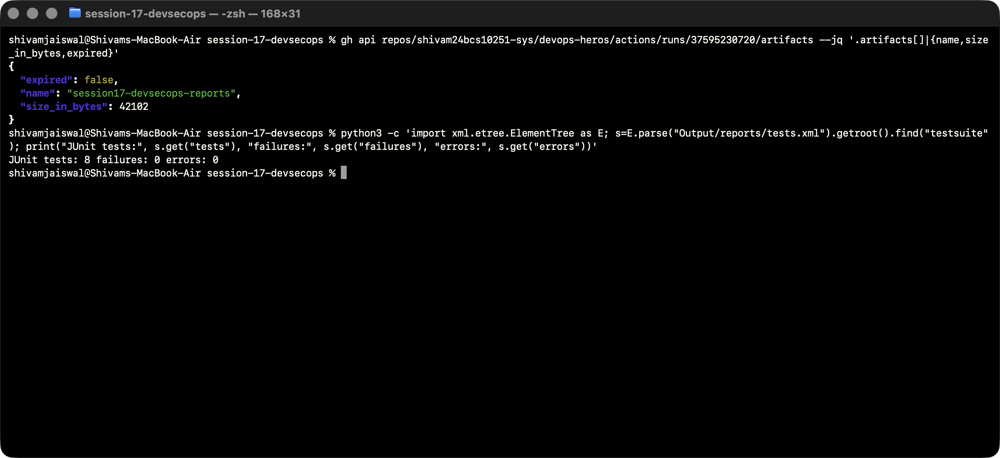

# Session 17 — Complete CI/CD and DevSecOps

The supplied Flask dashboard is built, tested, scanned, containerized, published to GHCR and deployed to a real disposable Kubernetes cluster by GitHub Actions. The existing dashboard and eight unit tests are retained. Debug mode is disabled, Gunicorn serves the container, and both Kubernetes replicas run without root privileges and have health probes.

## Execution flow

`Code → application build → unit tests → SAST → SCA → secret scan → Docker build → image scan/security gate → registry push → Kubernetes deployment → rollout and HTTP verification`

[Active workflow](../.github/workflows/session17-devsecops.yml) runs on changes to the demo on `session17-devsecops`. The supplied nested workflow is updated for reference; GitHub discovers only the repository-root workflow. A single Ubuntu 24.04 runner retains the exact image between build, scan, push and deployment. Each step must pass before the next runs. Security reports upload even on failure.

| Requirement | Implementation and gate |
|---|---|
| Application build | Install pinned dependencies; compile application Python. |
| Unit tests | Pytest and coverage; any failed test stops delivery. |
| SAST | Bandit scans `demo/app`; medium/high severity findings fail. |
| SCA | pip-audit audits runtime requirements; known vulnerabilities fail. |
| Secrets | Gitleaks default rules scan demo source, tests, config, manifests and active workflow; findings are redacted and fail. This scope excludes other sessions and prior Git history. |
| Docker build | Non-root Python/Gunicorn image built once and tagged with the full Git SHA. |
| Image scan | Trivy blocks fixable HIGH/CRITICAL findings; the complete policy is in [SECURITY.md](demo/SECURITY.md). |
| Registry | `ghcr.io/shivam24bcs10251-sys/devops-heros-session17:<git-sha>`; authenticated using the short-lived Actions token. |
| Kubernetes | Two replicas, probes, resource requests/limits, Service; Kind loads the exact built/published image. |
| Verification | Wait for successful rollout, show image IDs, assert healthy status and addition result 30 over HTTP. |
| Cleanup | Kind cluster is deleted at deployment completion. No persistent cloud resources are created. |

## Local reproduction

```bash
cd session-17-devsecops/demo
python3 -m venv .venv
. .venv/bin/activate
python -m pip install -r requirements-dev.txt
python -m pytest -v --cov=app
bandit -r app -c security/bandit.yaml -ll
pip-audit -r requirements.txt
gitleaks dir . --config security/gitleaks.toml --redact --exit-code 1
export IMAGE=session17-dashboard:local
docker build -t "$IMAGE" .
trivy image --config security/trivy.yaml "$IMAGE"
bash deploy.sh
```

Docker, Kind, kubectl, Gitleaks and Trivy are prerequisites for local deployment. GitHub installs the tools automatically. Runtime dependencies and scanner/test tools are pinned separately. Publishing in CI uses `contents: read` and `packages: write` permissions and no personal token. The registry can be private; the disposable cluster loads the same image directly, so it does not require a stored image-pull secret.

The dashboard's `/api/pipeline/run` endpoint remains a UI simulation. Successful pipeline evidence below comes from the real GitHub runner.

## References

[Gitleaks CLI](https://github.com/gitleaks/gitleaks), [Trivy vulnerability filtering](https://trivy.dev/docs/latest/configuration/filtering/), [GitHub Container Registry authentication](https://docs.github.com/en/packages/working-with-a-github-packages-registry/working-with-the-container-registry), and [Kind image loading](https://kind.sigs.k8s.io/docs/user/quick-start/).

## Container gate investigation

The [first run](https://github.com/shivam24bcs10251-sys/devops-heros/actions/runs/37594603923) stopped at the image scan and skipped publishing/deployment. Its [Trivy report](Output/first-run/trivy.json) identified fixable vulnerabilities in `setuptools` and in `msgpack`/`urllib3` bundled with pip. These package installers are not needed by the running dashboard, so the Dockerfile removes pip/setuptools after installing the pinned application dependencies. The initial YAML also placed `ignore-unfixed` at the wrong level; the corrected `vulnerability.ignore-unfixed` setting enforces the stated fixable HIGH/CRITICAL policy. No CVE-specific exceptions were added.

The [second run](https://github.com/shivam24bcs10251-sys/devops-heros/actions/runs/37594892602) passed all security gates, published the image, and verified two Ready replicas plus the healthy/addition APIs. The HTML preview used `curl | head`, which closed the pipe early and produced a curl write error under `pipefail`. The deployment script now downloads the page to a file before printing its first 250 bytes. [Second-run deployment evidence](Output/second-run/deployment.txt) records the completed API checks before that preview failure.

## Run evidence

[Successful full pipeline](https://github.com/shivam24bcs10251-sys/devops-heros/actions/runs/37595230720) tested commit `6fc02d455af1d871618f2ffcfe0d8ba4d417b373`. All eight tests and all security gates passed, the SHA-tagged image was published, and Kubernetes completed rollout and live HTTP verification. [Run metadata](Output/run.json), [complete runner log](Output/github-run.log), [test results](Output/reports/tests.xml), [Bandit](Output/reports/bandit.json), [pip-audit](Output/reports/pip-audit.json), [Gitleaks](Output/reports/gitleaks.json), [Trivy](Output/reports/trivy.json), [registry digest](Output/reports/image-digests.json) and [deployment log](Output/reports/deployment.txt) preserve actual evidence.

GitHub artifacts expire after seven days; these downloaded reports and screenshots remain in this branch. The published image remains in GHCR. The Kubernetes demonstration cluster is deleted after verification, so it is not a permanently hosted website.

## Commands, output and screenshots

All screenshots show live Terminal commands and results. Screen capture runs in a separate window. Text transcripts preserve the visible output.

### Inspect the supplied project

The existing Flask dashboard, source, tests and Kubernetes examples were inspected before changes.

```bash
find demo -maxdepth 2 -type f | sort | head -19
cat demo/requirements.txt
```



[Actual output](Output/logs/01-project-inspection.txt).

### Local unit tests

All eight existing tests pass; application coverage is 69%.

```bash
cd demo
/tmp/session17-venv/bin/python -m pytest -q --cov=app
```



[Actual output](Output/logs/02-local-tests.txt).

### Local SAST and SCA

Actual Bandit and pip-audit results before pushing.

```bash
cd demo
/tmp/session17-venv/bin/bandit -r app -c security/bandit.yaml -ll
/tmp/session17-venv/bin/pip-audit -r requirements.txt
```



[Actual output](Output/logs/03-local-security.txt).

### Reject and fix an unsafe debugger

The temporary copy triggers Bandit B201. Restoring debug=False passes the same gate; repository source remains intact.

```bash
/tmp/session17-venv/bin/python scripts/security-gate-demo.py
```



[Actual output](Output/logs/04-security-gate-rejection.txt).

### Container gate stops delivery

The first actual run blocked publishing and deployment. Four fixable HIGH findings identified the installer/vendor packages removed from the runtime image.

```bash
gh run view 37594603923 --repo shivam24bcs10251-sys/devops-heros --json conclusion,jobs --jq '.conclusion, (.jobs[].steps[]|select(.conclusion=="failure" or .conclusion=="skipped")| .name + ": " + .conclusion)'
python3 scripts/report-summary.py Output/first-run
```



[Actual output](Output/logs/05-first-container-gate.txt).

### Successful complete DevSecOps run

Every required build, security, registry and deployment step completed successfully.

```bash
gh run view 37595230720 --repo shivam24bcs10251-sys/devops-heros --json conclusion,url,jobs --jq '.conclusion, .url, (.jobs[].steps[]|select(.name|test("Application build|Unit tests|gate|image build|Publish|Kubernetes"))| .name + ": " + .conclusion)'
```



[Actual output](Output/logs/06-github-success.txt).

### Inspect downloaded security reports

These summaries read actual JSON artifacts from the successful GitHub run. Trivy reports are filtered by the declared fixable HIGH/CRITICAL policy; zero policy findings does not mean the image has no lower-severity/unfixed vulnerabilities.

```bash
python3 scripts/report-summary.py Output/reports
ls Output/reports
```



[Actual output](Output/logs/07-security-reports.txt).

### Verify registry publication

The registry push output and immutable digest are saved from the actual runner.

```bash
cat Output/reports/registry-push.txt
cat Output/reports/image-digests.json
```



[Actual output](Output/logs/08-registry-push.txt).

### Kubernetes rollout and live HTTP checks

Actual runner output shows two Ready replicas, image IDs, healthy status, result 30 and successful deployment completion.

```bash
cat Output/reports/deployment.txt
```



[Actual output](Output/logs/09-kubernetes-verification.txt).

### Verify the retained reports artifact

Tests, security results, registry digest and deployment logs were downloaded and committed for lasting evidence.

```bash
gh api repos/shivam24bcs10251-sys/devops-heros/actions/runs/37595230720/artifacts --jq '.artifacts[]|{name,size_in_bytes,expired}'
python3 -c 'import xml.etree.ElementTree as E; s=E.parse("Output/reports/tests.xml").getroot().find("testsuite"); print("JUnit tests:", s.get("tests"), "failures:", s.get("failures"), "errors:", s.get("errors"))'
```



[Actual output](Output/logs/10-artifacts.txt).
