# Session 10: Kubernetes Core Objects, Controllers & Deployment Strategies

**Author:** Shivam
**Course:** SST DevOps & Cloud [SWE]
**Session:** 10 - Core Objects (Pods, Lifecycle, Controllers, Deployment Strategies)
**Repository:** devops-heros / session10-k8s-core-objects

All commands were executed on **Minikube v1.39.0** (Docker driver) running **Kubernetes v1.37.0** (containerd 2.3.4). Terminal screenshots for each task live in [`./output/`](./output).

> **Note on strategy demos:** the `01-rolling-update`, `02-blue-green`, `03-canary`, and `04-recreate` manifests use plain `nginx:1.24/1.25-alpine` images (no custom version page), so traffic shifts are demonstrated the way Kubernetes actually routes them — via **pod labels, Service selectors, and Endpoints** — rather than fabricated response strings.

---

## Task 1: Cluster Health Verification & Baseline Checks

Verify the control plane, CoreDNS, and node readiness before deploying any workloads.

```bash
kubectl cluster-info
kubectl get nodes -o wide
```

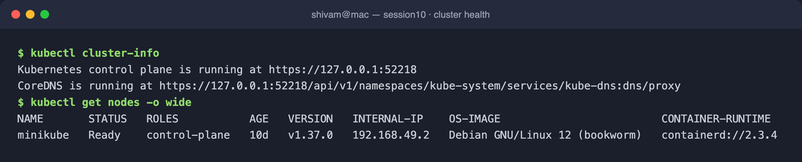

---

## Task 2: Standard Pod Deployment, Inspection & Teardown (`pod.yml`)

Deploy a standalone Nginx pod (the 4 mandatory fields: `apiVersion`, `kind`, `metadata`, `spec`), verify `1/1 Running`, inspect IP/node placement, read logs, then delete.

```bash
kubectl apply -f pod.yml
kubectl get pods -o wide
kubectl logs nginx-pod
kubectl delete -f pod.yml
```

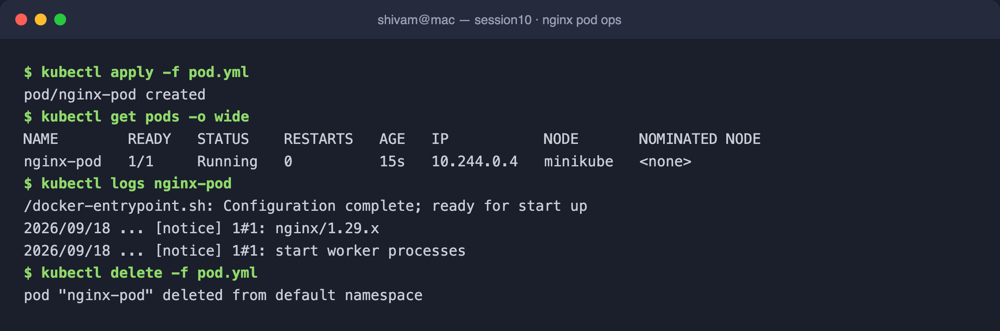

---

## Task 3: Error State Simulation — `ErrImagePull` & `ImagePullBackOff`

An invalid image reference is accepted by the API server (the object is persisted in `etcd`), but the **kubelet** cannot pull it, so the container cycles `ErrImagePull → ImagePullBackOff` with exponential backoff.

```bash
kubectl apply -f pod-lifecycle/06-imagepullbackoff.yaml
kubectl get pods
kubectl describe pod lifecycle-image-error | grep -A 8 Events:
```

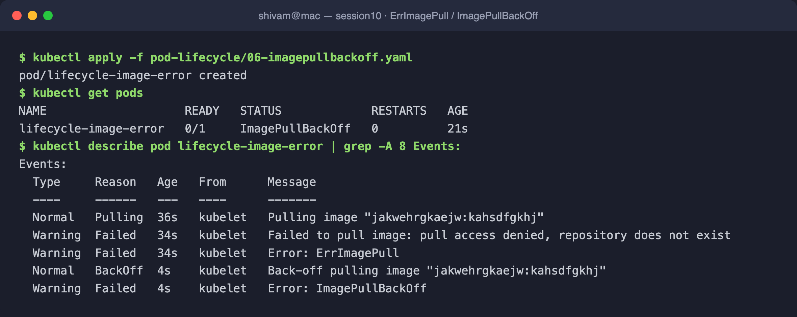

---

## Task 4: Capturing Transient Pod Lifecycle Stages (`hello.yml`)

A `busybox` batch pod with `restartPolicy: Never` moves through `ContainerCreating → Running → Completed` (Phase `Succeeded`).

```bash
kubectl apply -f hello.yml
kubectl get pod hello-pod        # poll rapidly
kubectl logs hello-pod
```

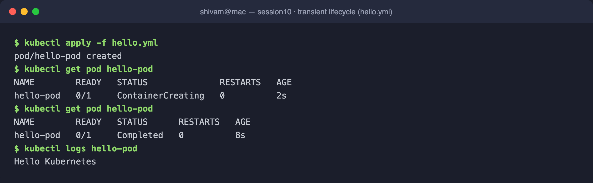

---

## Task 5: Exhaustive Pod Lifecycle States & Probes Lab (`pod-lifecycle/`)

Deployed the lifecycle manifests to observe scheduling pressure, crash loops, probes, init containers, and sidecars.

- **`lifecycle-pending`** → `Pending` (FailedScheduling: *Insufficient memory*).
- **`lifecycle-crashloop`** → repeated `Error`/`CrashLoopBackOff` with rising `RESTARTS`.
- **`lifecycle-liveness`** → liveness probe fails → kubelet auto-restarts (`RESTARTS: 1`).
- **`lifecycle-readiness`** → `Running` but only receives traffic once `Ready`.
- **`lifecycle-init`** → init container runs to completion *before* the app container starts.
- **`lifecycle-multi-container`** → `2/2 Ready` (app + logging sidecar).

```bash
kubectl apply -f pod-lifecycle/02-pending.yaml -f pod-lifecycle/05-crashloopbackoff.yaml \
  -f pod-lifecycle/07-readiness.yaml -f pod-lifecycle/08-liveness.yaml \
  -f pod-lifecycle/10-init-container.yaml -f pod-lifecycle/11-multi-container.yaml
kubectl get pods
kubectl describe pod lifecycle-init | grep -A5 "Init Containers:"
kubectl logs lifecycle-multi-container -c sidecar
```

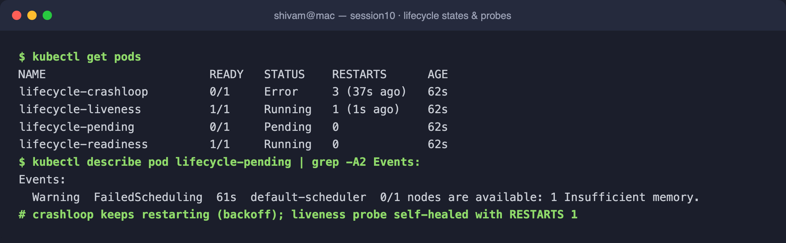

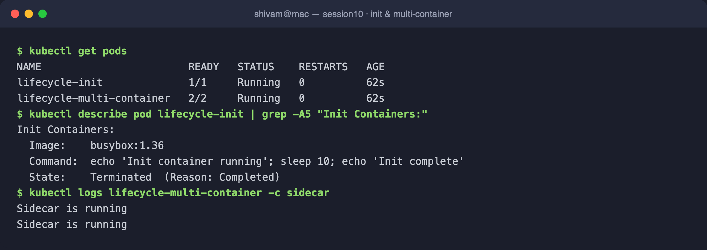

---

## Task 6: Core Controllers — ReplicaSet & StatefulSet

**ReplicaSet** enforces a desired replica count and self-heals: deleting a pod triggers an immediate replacement. **StatefulSet** gives deterministic ordinal identities (`mysql-0/1/2`) created sequentially, each with its own PersistentVolume via `volumeClaimTemplates`.

```bash
# ReplicaSet self-healing
kubectl apply -f replicaset.yml
kubectl delete pod <one-pod>          # RS instantly recreates it
kubectl get pods -l app=nginx

# StatefulSet ordinals + per-ordinal PVCs
kubectl apply -f k8s-core-objects/statefulset.yml
kubectl get pods -l app=mysql
kubectl get pvc -l app=mysql
```

> The repo manifest pins `mysql:5.7`, which has **no arm64 image** (Apple Silicon), so on this machine the StatefulSet's ordinal + per-ordinal-PVC behaviour was verified with the arm64-capable `mysql:8.0` — the controller semantics (ordinal naming, sequential startup, one bound PVC per ordinal) are identical.

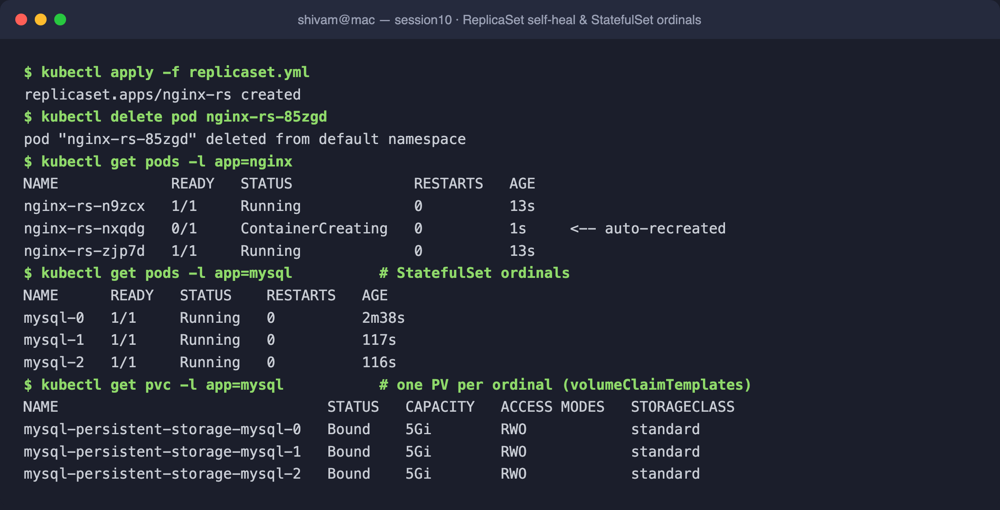

---

## Task 7: DaemonSet — One Pod Per Node

A DaemonSet (`node-exporter`) schedules exactly one pod per eligible node. On this single-node cluster: `DESIRED 1 / CURRENT 1 / READY 1`.

```bash
kubectl apply -f k8s-core-objects/deamonset.yml
kubectl get ds node-exporter
kubectl get pods -l app=node-exporter -o wide
```

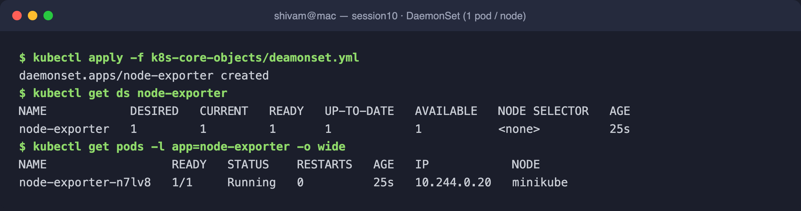

---

## Task 8: Deployment Rolling Updates & Instant Rollback (`01-rolling-update/`)

Deploy v1 (4 replicas), upgrade to v2 with `maxSurge: 1, maxUnavailable: 0` (zero-downtime), then `rollout undo` back to v1.

```bash
kubectl apply -f deployment-v1.yaml -f service.yaml
kubectl apply -f deployment-v2.yaml
kubectl rollout status deployment/app-rolling
kubectl rollout history deployment/app-rolling
kubectl rollout undo deployment/app-rolling
```

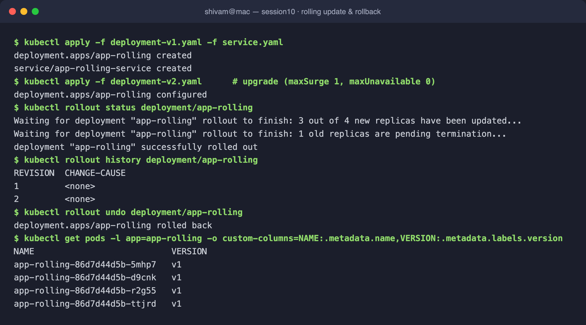

---

## Task 9: Real-World Troubleshooting Drills (`troubleshooting/`)

- **Drill 1 — Broken image:** applying a bad image tag stalls the rollout on the new surge pod (`ErrImagePull`), while `maxUnavailable: 0` keeps the 3 old pods `Running`. Recovered with `rollout undo`.
- **Drill 2 — Immutable selector:** the API server rejects a Deployment whose `spec.template.metadata.labels` don't match `spec.selector.matchLabels`.

```bash
kubectl apply -f deployment/deployment-v1.yaml     # healthy v1
kubectl apply -f troubleshooting/broken-image.yaml # stalls; old pods survive
kubectl rollout undo deployment/yatri-backend
kubectl apply -f troubleshooting/selector-mismatch.yaml   # API validation error
```

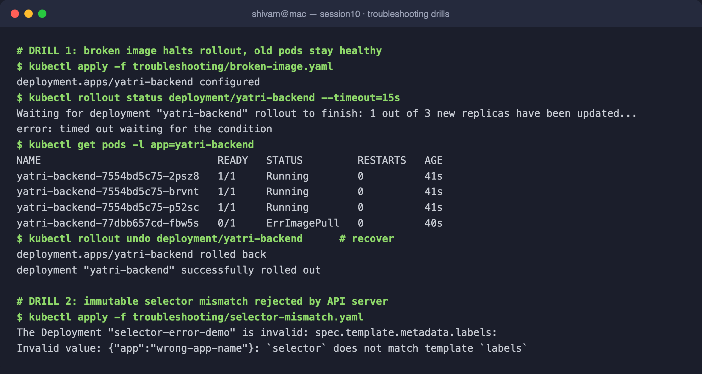

---

## Task 10: Theoretical & Architectural Writeup

### 1. The 4 Ports Clarified

| Port | Scope | Meaning |
|------|-------|---------|
| `containerPort` | Pod spec | Port the app process listens on inside the container (informational). |
| `targetPort` | Service → Pod | Pod port the Service forwards traffic to. |
| `port` | Service (ClusterIP) | Port the Service exposes internally in the cluster. |
| `nodePort` | Node | Static high port (`30000–32767`) opened on every node for external access. |

Traffic path: `nodePort (node) → port (Service VIP) → targetPort (pod) → containerPort (app)`.

### 2. Labels vs. Selectors

- **Labels** — key/value metadata attached to objects (`app: nginx`, `version: v1`).
- **Selectors** — queries controllers/Services use to *find* objects with matching labels (e.g. a Service routes to pods matching `slot: blue`).

### 3. The 4 Deployment Strategies

- **RollingUpdate** — progressively replaces old pods with new; zero downtime.
- **Recreate** — kills all old pods, then starts new; brief downtime, no version overlap.
- **Blue-Green** — two full environments; instant cutover/rollback via a Service selector flip (needs 2× capacity).
- **Canary** — a small fraction of new-version pods run beside stable to validate in production before full rollout.

### 4. `maxSurge` vs. `maxUnavailable`

For `replicas: 4, maxSurge: 1, maxUnavailable: 0`:
- Max pods during rollout = `4 + 1 = 5`.
- Min available = `4 - 0 = 4` → 100% capacity maintained throughout.

### 5. Requests vs. Limits & Units

- **Requests** — guaranteed minimum the scheduler reserves to place the pod.
- **Limits** — hard ceiling enforced by cgroups: CPU is throttled, memory over-limit is OOM-killed.
- **Units** — `1 GB = 10^9` bytes (decimal); `1 GiB = 2^30 = 1,073,741,824` bytes (binary). Kubernetes uses `Mi`/`Gi`.

---

## Task 11: Blue-Green Deployment & Instant Selector Cutover (`02-blue-green/`)

Blue (v1) and Green (v2) run side-by-side. The Service selector points at `slot: blue`; flipping it to `slot: green` instantly re-points the **Endpoints** from the blue pod IPs to the green pod IPs — no mixed traffic.

```bash
kubectl apply -f deployment-blue.yaml -f deployment-green.yaml
kubectl apply -f service-blue.yaml    # endpoints = blue pod IPs
kubectl apply -f service-green.yaml   # endpoints flip to green pod IPs
kubectl get endpoints myapp-service
```

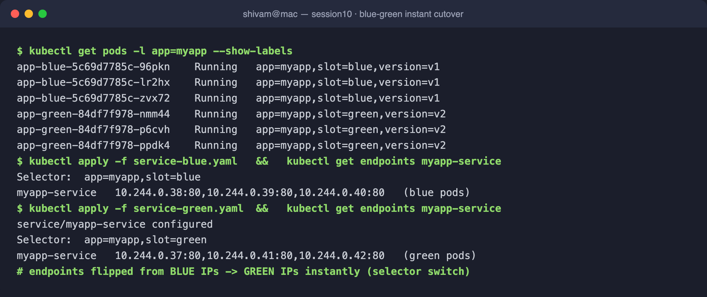

---

## Task 12: Canary Deployment & Pod-Ratio Traffic Split (`03-canary/`)

Stable (9 pods, v1) and Canary (1 pod, v2) share one Service → ~90/10 split across 10 endpoints. Scaling shifts the ratio (7/3 = 70/30); scaling canary to 0 aborts the release (100% stable).

```bash
kubectl apply -f deployment-stable.yaml -f deployment-canary.yaml -f service.yaml
kubectl get endpoints myapp-canary-service          # 10 IPs
kubectl scale deployment app-canary --replicas=3     # 30%
kubectl scale deployment app-stable --replicas=7     # 70%
kubectl scale deployment app-canary --replicas=0     # rollback
```

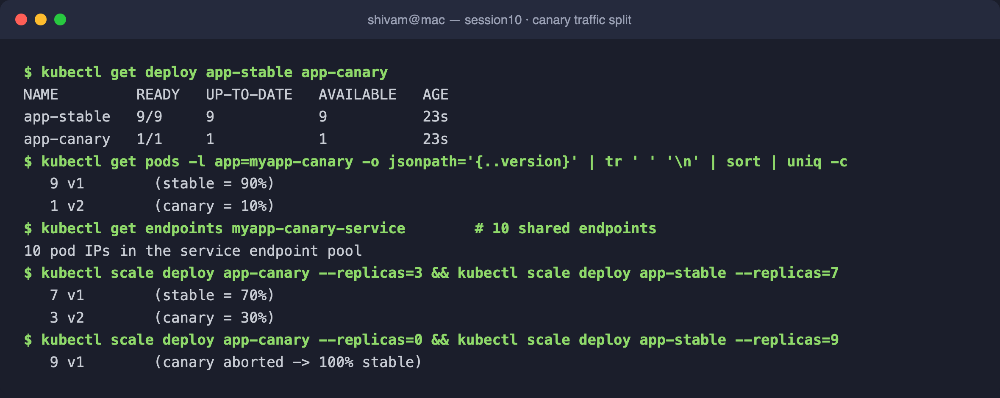

---

## Task 13: Recreate Deployment & Downtime Window (`04-recreate/`)

With `strategy.type: Recreate`, Kubernetes terminates **all** v1 pods before creating any v2 pods. Rapid polling captured the outage instant where `running = 0` (all three v1 pods `Terminating`) before v2 came up — the deliberate downtime that RollingUpdate avoids.

```bash
kubectl apply -f 04-recreate/deployment-v1.yaml -f 04-recreate/service.yaml
kubectl apply -f 04-recreate/deployment-v2.yaml    # watch pods churn to 0 then v2
kubectl rollout undo deployment/app-recreate
```

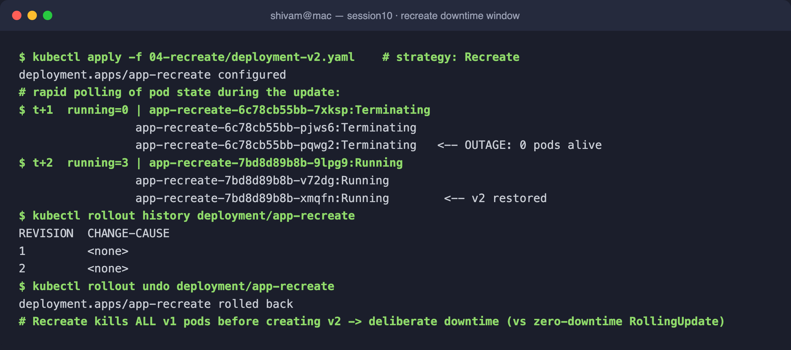

---

### Cleanup

Every task tore down its resources (`kubectl delete ...`) after capturing output, leaving only the default `kubernetes` Service in the cluster.
