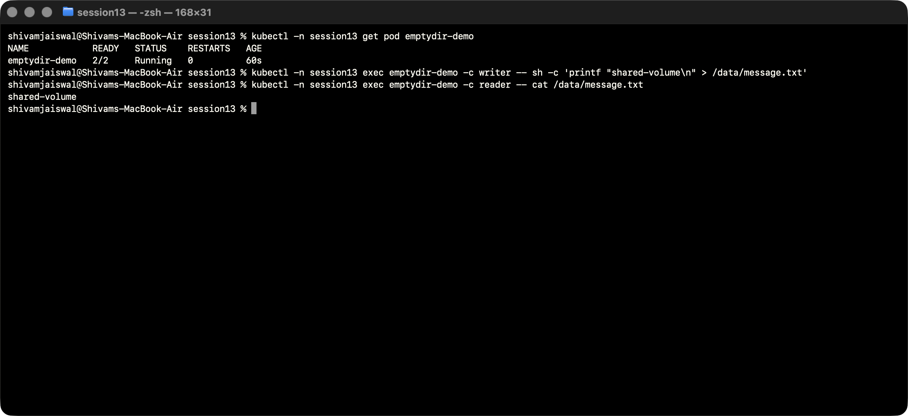
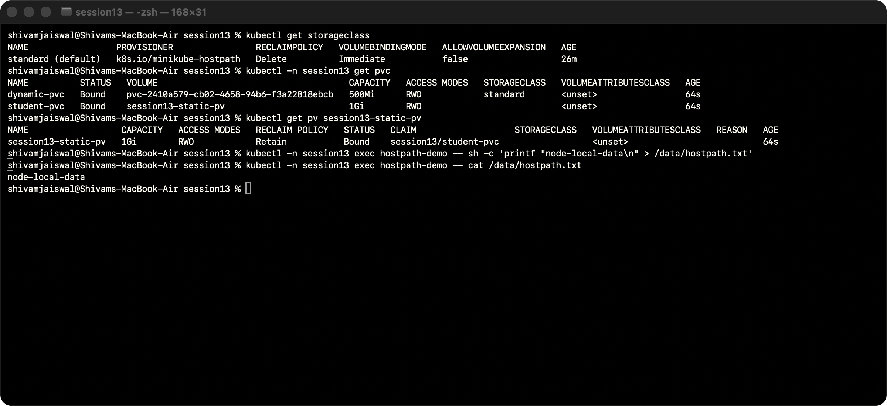
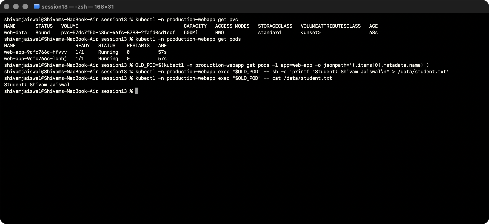
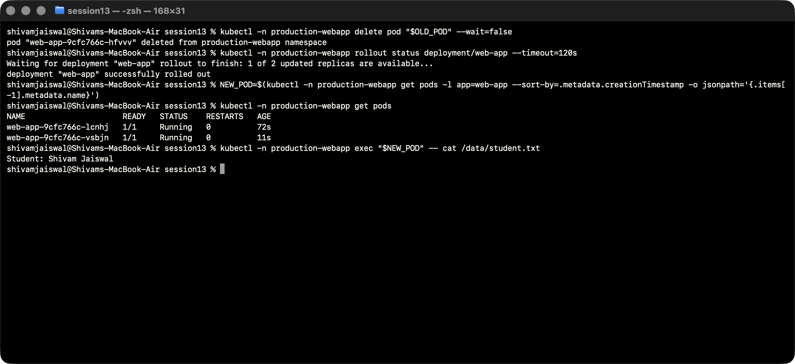
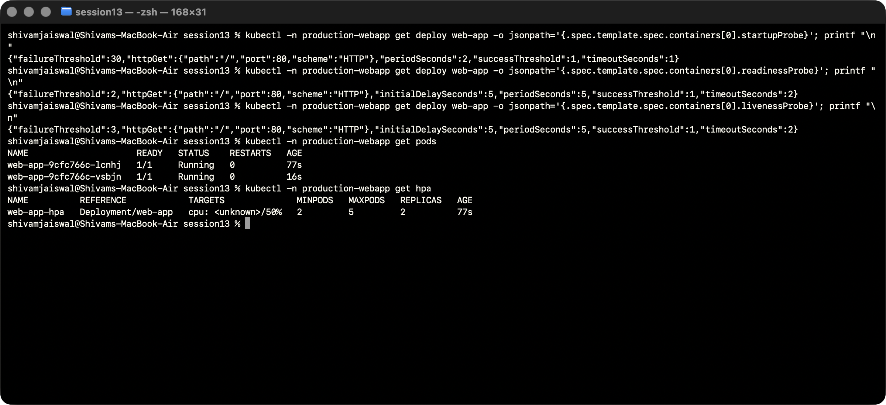
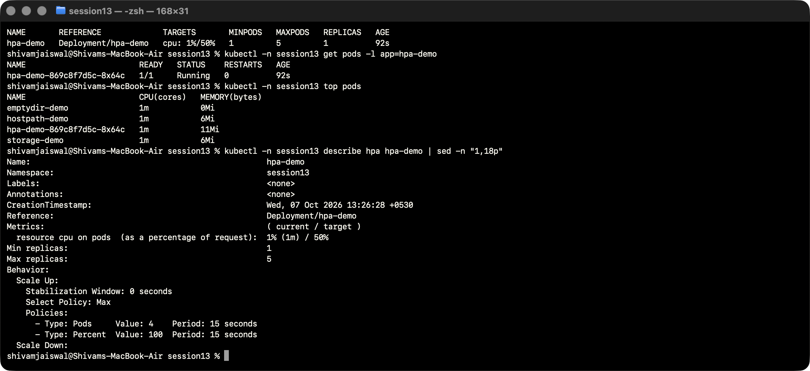
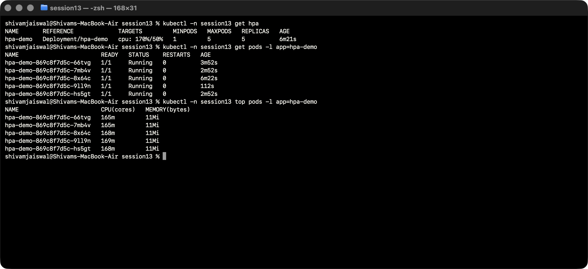
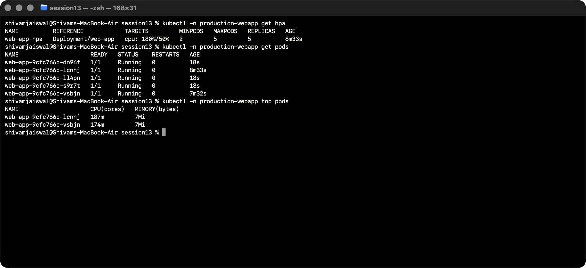
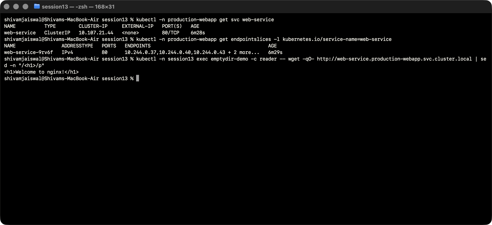
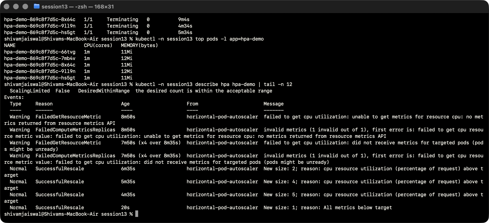

# Session 13: Kubernetes Storage, HPA & Probes

Completed on branch `session13-storage` using the supplied `session13` folder. Environment: macOS/Apple Silicon, Docker Desktop, Minikube profile/context `devops-assignment`, Kubernetes/kubectl v1.35.0, run date 7 October 2026.

## Task 1: Volumes

The required [01-kubernetes-volumes/README.md](01-kubernetes-volumes/README.md) explains emptyDir, hostPath, PV, PVC, StorageClass and dynamic provisioning. The supplied manifests in `01-volumes`, `02-persistent-storage`, and `03-storageclass` were deployed in the isolated `session13` namespace. The two-container emptyDir example proves sharing; static and dynamic PVCs are Bound. The mini-project's persisted student file survives Pod deletion and is read from the newly created replacement Pod.

## Task 2: HPA

The supplied `04-hpa/hpa.yaml` targets CPU utilization of 50%, with minimum 1 and maximum 5 replicas. CPU request is 100m and limit 200m. Metrics Server is enabled. A small Python HTTP handler performs bounded CPU work for each request so HTTP traffic causes a reproducible CPU load; the accompanying `load-generator.yaml` runs eight request workers.

The screenshots show idle metrics, increased CPU utilization and extra replicas under load, and reduction to the minimum after deleting the load generator. The timestamped [HPA status timeline](output/logs/hpa-timeline.txt) records actual API status observations during the test. CPU percentage is measured against requested CPU: 200m usage against a 100m request is 200%. The HPA roughly computes ceil(current replicas × current utilization / target), then applies limits, readiness/missing-metric handling and scaling policies.

Both lab HPAs use a 30-second scale-down stabilization window to make the demonstration observable quickly. This is a deliberate demo setting rather than the usual longer default. Initial unknown metrics are expected before samples are available; the loaded and recovery screenshots include real CPU measurements.

## Task 3: Supplied mini-project

The files in [mini-project](mini-project/README.md) deploy the provided Nginx web application in `production-webapp` with a dynamically provisioned 500Mi PVC, ClusterIP Service, two-to-five replica HPA, resource requests/limits and three HTTP probes.

- Startup probe gates other probes until initial success.
- Readiness determines whether the Pod may serve Service traffic; failure does not itself restart the container.
- Liveness failure restarts the container.
- Persistence was tested by deleting the actual writer Pod and reading the file from the newest replacement.
- The Service returns Nginx HTML from a client in another namespace.
- A separate, time-bounded CPU-load script drives scaling of the mini-project. Static Nginx pages are inexpensive to serve, so this explicitly uses synthetic CPU stress rather than claiming that a low traffic rate proves CPU-based scaling.

This is a learning demo on one node, not a production-grade database or multi-node shared-storage deployment.

## Reproduce

```bash
minikube -p devops-assignment addons enable metrics-server
kubectl apply -f namespace.yaml
kubectl -n session13 apply -f 01-volumes/ -f 02-persistent-storage/ -f 03-storageclass/
kubectl -n session13 apply -f 04-hpa/deployment.yaml -f 04-hpa/service.yaml -f 04-hpa/hpa.yaml
# Namespace must exist before applying its other resources.
kubectl apply -f mini-project/namespace.yaml
kubectl apply -f mini-project/
kubectl -n session13 rollout status deploy/hpa-demo --timeout=180s
kubectl -n production-webapp rollout status deploy/web-app --timeout=180s
kubectl -n session13 get hpa
kubectl -n session13 top pods
kubectl -n session13 apply -f 04-hpa/load-generator.yaml
kubectl -n session13 get hpa -w
# Once scaling has been observed:
kubectl -n session13 delete pod load-generator
kubectl -n session13 get hpa -w
# Run mini-project synthetic CPU load in a separate terminal:
./mini-project/load-generator.sh
```

Use the screenshot commands below to inspect replicas, CPU and HPA decisions. Metrics collection and HPA reconciliation are asynchronous; wait for the displayed state rather than copying fixed Pod names or IP addresses.

## Commands, output and screenshots

All screenshots show live Terminal commands and results. Screen capture runs in a separate window. Text transcripts preserve the visible output.

### Shared emptyDir

A write in the writer container is readable from the reader container in the same Pod.

```bash
kubectl -n session13 get pod emptydir-demo
kubectl -n session13 exec emptydir-demo -c writer -- sh -c 'printf "shared-volume\n" > /data/message.txt'
kubectl -n session13 exec emptydir-demo -c reader -- cat /data/message.txt
```



[Actual output](output/logs/01-emptydir.txt).

### Static and dynamic storage

Both claims are Bound; the manually supplied PV is selected explicitly and hostPath contains the test file.

```bash
kubectl get storageclass
kubectl -n session13 get pvc
kubectl get pv session13-static-pv
kubectl -n session13 exec hostpath-demo -- sh -c 'printf "node-local-data\n" > /data/hostpath.txt'
kubectl -n session13 exec hostpath-demo -- cat /data/hostpath.txt
```



[Actual output](output/logs/02-storage.txt).

### Mini-project persistence: before

The writer Pod stores the student file on the bound PVC.

```bash
kubectl -n production-webapp get pvc
kubectl -n production-webapp get pods
OLD_POD=$(kubectl -n production-webapp get pods -l app=web-app -o jsonpath='{.items[0].metadata.name}')
kubectl -n production-webapp exec "$OLD_POD" -- sh -c 'printf "Student: Shivam Jaiswal\n" > /data/student.txt'
kubectl -n production-webapp exec "$OLD_POD" -- cat /data/student.txt
```



[Actual output](output/logs/03-mini-persistence-before.txt).

### Mini-project persistence: after

The writer Pod is deleted; the newest replacement Pod reads the same data.

```bash
kubectl -n production-webapp delete pod "$OLD_POD" --wait=false
kubectl -n production-webapp rollout status deployment/web-app --timeout=120s
NEW_POD=$(kubectl -n production-webapp get pods -l app=web-app --sort-by=.metadata.creationTimestamp -o jsonpath='{.items[-1].metadata.name}')
kubectl -n production-webapp get pods
kubectl -n production-webapp exec "$NEW_POD" -- cat /data/student.txt
```



[Actual output](output/logs/04-mini-persistence-after.txt).

### Startup, readiness and liveness probes

All three probes are read from the actual Deployment and the application is ready.

```bash
kubectl -n production-webapp get deploy web-app -o jsonpath='{.spec.template.spec.containers[0].startupProbe}'; printf "\n"
kubectl -n production-webapp get deploy web-app -o jsonpath='{.spec.template.spec.containers[0].readinessProbe}'; printf "\n"
kubectl -n production-webapp get deploy web-app -o jsonpath='{.spec.template.spec.containers[0].livenessProbe}'; printf "\n"
kubectl -n production-webapp get pods
kubectl -n production-webapp get hpa
```



[Actual output](output/logs/05-probes.txt).

### HPA before load

A real low CPU measurement, minimum replica count, and HPA configuration are shown.

```bash
kubectl -n session13 get hpa
kubectl -n session13 get pods -l app=hpa-demo
kubectl -n session13 top pods
kubectl -n session13 describe hpa hpa-demo | sed -n "1,18p"
```



[Actual output](output/logs/06-hpa-idle.txt).

### HPA under HTTP load

CPU exceeds the 50% utilization target and the HTTP workload has scaled from one to five replicas.

```bash
kubectl -n session13 get hpa
kubectl -n session13 get pods -l app=hpa-demo
kubectl -n session13 top pods -l app=hpa-demo
```



[Actual output](output/logs/07-hpa-loaded.txt).

### Mini-project HPA under synthetic CPU load

The mini-project has increased replicas and CPU above its target. This uses the documented bounded CPU script, not a fabricated traffic result.

```bash
kubectl -n production-webapp get hpa
kubectl -n production-webapp get pods
kubectl -n production-webapp top pods
```



[Actual output](output/logs/08-mini-hpa-loaded.txt).

### Mini-project Service connectivity

EndpointSlice selects ready Pods and a cross-namespace HTTP request returns Nginx content.

```bash
kubectl -n production-webapp get svc web-service
kubectl -n production-webapp get endpointslices -l kubernetes.io/service-name=web-service
kubectl -n session13 exec emptydir-demo -c reader -- wget -qO- http://web-service.production-webapp.svc.cluster.local | sed -n "/<h1>/p"
```



[Actual output](output/logs/09-mini-service.txt).

### HPA after removing HTTP load

The load-generator Pod has been deleted; utilization falls and the HPA returns to one replica.

```bash
kubectl -n session13 get hpa
kubectl -n session13 get pods -l app=hpa-demo
kubectl -n session13 top pods -l app=hpa-demo
kubectl -n session13 describe hpa hpa-demo | tail -n 12
```



[Actual output](output/logs/10-hpa-recovered.txt).

## Cleanup

After bounded load has ended, remove this session's namespaces and the explicitly named static PV. The static hostPath Retain policy does not automatically erase the backing directory. Removing the dedicated Minikube profile later disposes of the local node container.

```bash
kubectl --context=devops-assignment delete namespace session13 production-webapp
kubectl --context=devops-assignment delete pv session13-static-pv
```

References: [HPA](https://kubernetes.io/docs/tasks/run-application/horizontal-pod-autoscale/), [Probes](https://kubernetes.io/docs/tasks/configure-pod-container/configure-liveness-readiness-startup-probes/), [Storage documentation](01-kubernetes-volumes/README.md).
