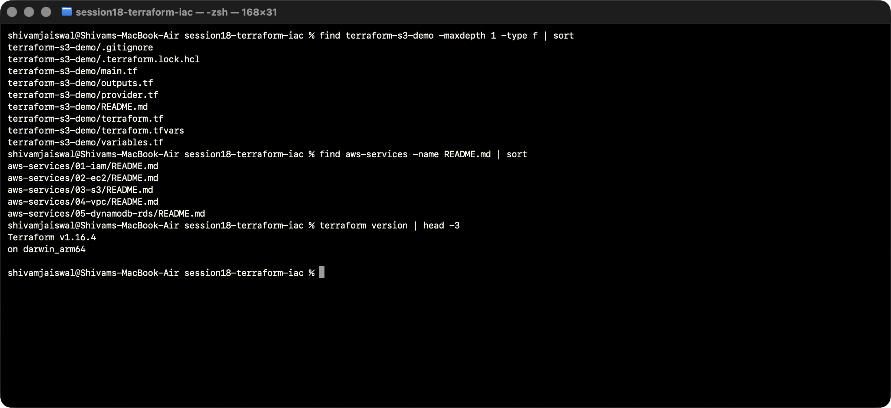
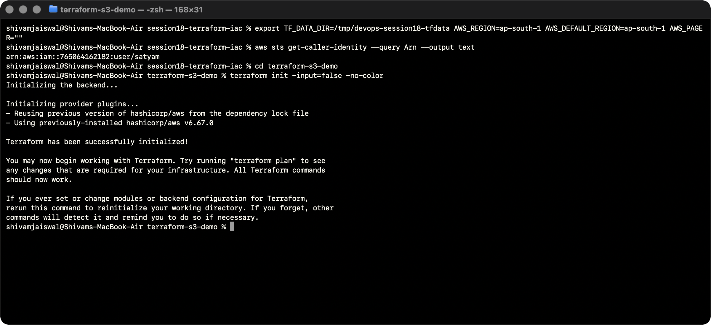
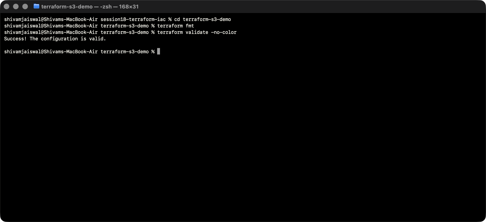
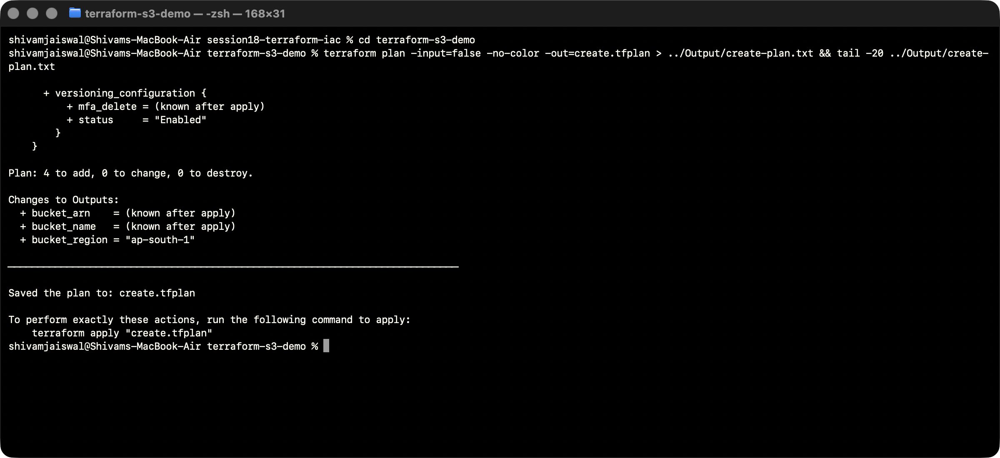
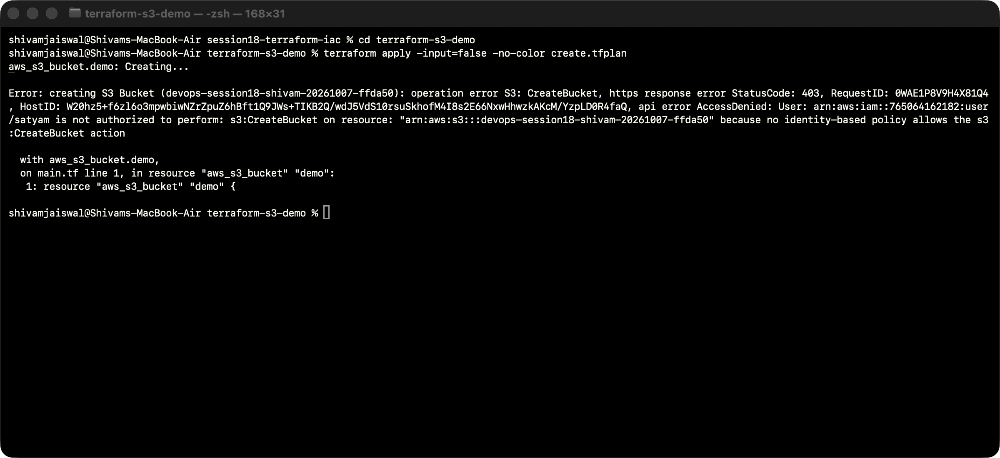
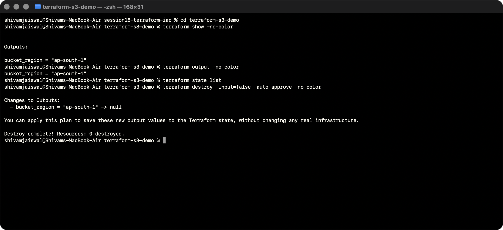

# Session 18 — Terraform and Infrastructure as Code

## Task 1: Terraform S3 demo

[Terraform project](terraform-s3-demo/README.md) contains `main.tf`, `variables.tf`, `outputs.tf`, `provider.tf`, `terraform.tfvars`, provider requirements and a dependency lock file. It creates one isolated S3 bucket with public access blocked, AES256 encryption and versioning, then destroys the lab resources after verification.

The existing files were inspected first. The invalid output `type` properties were removed, the generic bucket name was replaced, credentials are discovered through a local profile, and state/plans are excluded from Git. Plaintext AWS keys are never part of the project or screenshots.

## Task 2: AWS service research

- [IAM](aws-services/01-iam/README.md)
- [EC2](aws-services/02-ec2/README.md)
- [S3](aws-services/03-s3/README.md)
- [VPC](aws-services/04-vpc/README.md)
- [DynamoDB and RDS](aws-services/05-dynamodb-rds/README.md)

Each README covers the concepts and use cases listed in the assignment and links to official AWS documentation. These are research deliverables; no database instances or NAT gateways are needed for this session.

## Execution status

**Prepared and locally verified; AWS provisioning is blocked by IAM permissions.** Terraform init, fmt, validate and plan succeeded. The plan proposes four resources. The actual apply was denied for `s3:CreateBucket`; no resources were added to state, and the cleanup command reports zero resources destroyed. This is not yet a completed live S3 demonstration.

All five AWS research READMEs are complete. [Permissions and resume instructions](iam/README.md) and a [bucket-prefix-scoped policy](iam/terraform-s3-lab-policy.json) are available for administrator review. Credentials, local Terraform state and binary plans are excluded from Git.

Once AWS access is corrected, regenerate the plan, apply it, verify the real bucket/security configuration and outputs, record successful screenshots, and destroy the lab. Those cloud steps are still outstanding.

## Commands, output and screenshots

All screenshots show live Terminal commands and results. Screen capture runs in a separate window. Text transcripts preserve the visible output.

### Inspect files and research deliverables

The supplied Terraform example and the assignment folders were inspected before implementation.

```bash
find terraform-s3-demo -maxdepth 1 -type f | sort
find aws-services -name README.md | sort
terraform version | head -3
```



[Actual output](Output/logs/01-project-inspection.txt).

### Authenticate and initialize

The current default AWS profile authenticates, and the signed AWS provider initializes. Authentication alone does not authorize creating resources.

```bash
export TF_DATA_DIR=/tmp/devops-session18-tfdata AWS_REGION=ap-south-1 AWS_DEFAULT_REGION=ap-south-1 AWS_PAGER=""
aws sts get-caller-identity --query Arn --output text
cd terraform-s3-demo
terraform init -input=false -no-color
```



[Actual output](Output/logs/02-identity-init.txt).

### Format and validate

Terraform reports a valid configuration.

```bash
cd terraform-s3-demo
terraform fmt
terraform validate -no-color
```



[Actual output](Output/logs/03-format-validate.txt).

### Plan the S3 lab

The actual plan proposes four resources: the bucket and its public-access, encryption and versioning configurations. [Full plan](Output/create-plan.txt).

```bash
cd terraform-s3-demo
terraform plan -input=false -no-color -out=create.tfplan > ../Output/create-plan.txt && tail -20 ../Output/create-plan.txt
```



[Actual output](Output/logs/04-create-plan.txt).

### Apply attempt denied by AWS

The real apply failed with HTTP 403 AccessDenied for s3:CreateBucket. This screenshot is an access-failure record, not a successful deployment.

```bash
cd terraform-s3-demo
terraform apply -input=false -no-color create.tfplan
```



[Actual output](Output/logs/05-apply.txt).

### Inspect empty state and clean up

Because creation was denied, state contains no managed resources, no resource outputs exist, and destroy removes zero resources. Successful AWS create/show/output/destroy evidence remains pending access.

```bash
cd terraform-s3-demo
terraform show -no-color
terraform output -no-color
terraform state list
terraform destroy -input=false -auto-approve -no-color
```



[Actual output](Output/logs/06-state-and-cleanup.txt).
