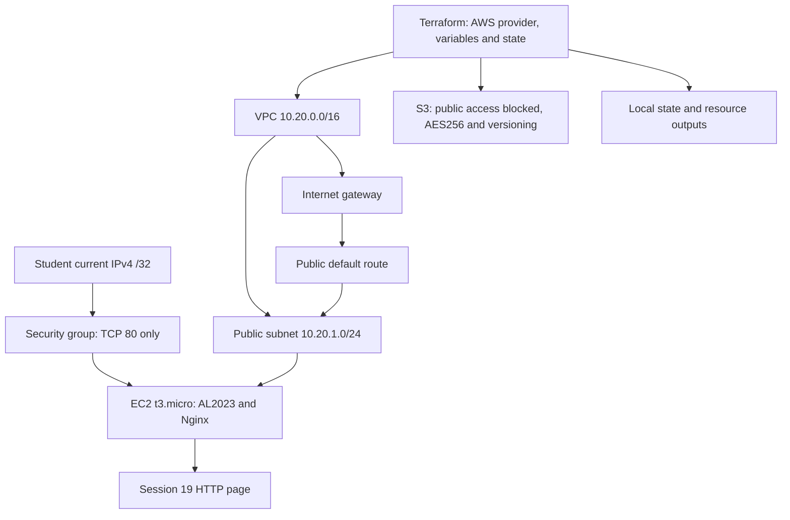

# Session 19 — Cloud and Terraform in action

## Project and assignment coverage

The [supplied mini-project](08-mini-project/README.md) was inspected and extended to include an EC2 web server and a private S3 bucket alongside its VPC/subnet/security-group network. The AWS provider is pinned to 6.67.0. Variables configure region, local profile, instance type, bucket name and a single-host HTTP source. Outputs identify the created resources and website endpoint.

| Requirement | Implementation |
|---|---|
| Provider | AWS provider and committed dependency lock file. |
| Variables | Region/profile, bounded instance type, unique S3 name and IPv4 /32. |
| Resources | Six supplied networking resources plus EC2 and four S3 resources: eleven total. |
| Outputs | VPC, subnet, security group, instance, public IP, HTTP URL, bucket and region. |
| Dependencies | References build the graph; EC2 waits for the public route association. |
| AWS infrastructure | Live provisioning requires a successful AWS plan and apply, followed by API and HTTP verification. |
| State | Local state maps addresses to AWS IDs; state/plans are ignored and not fabricated or committed. |
| Cleanup | Destroy the lab only; encrypted EBS root volume deletes on termination; empty S3 bucket is removed. |

## Architecture diagram

This is the proposed architecture, not a claim that deployment has succeeded. S3 is independently managed by Terraform; the web server does not read from it. The short classroom lab is a single instance, not a highly available production setup.

## Security and configuration verification

The offline Terraform tests enforce a single HTTP ingress rule, reject a world-open HTTP CIDR, require IMDSv2, verify encrypted/delete-on-termination EBS, block all S3 public-access modes and preserve unexpected bucket contents. Mock-provider tests never contact AWS and are labeled accordingly. Real `verify.sh` waits for EC2 status checks, queries VPC/instance/S3 settings and asserts the served page contains the Session 19 marker.

## Execution status

Implementation passes Terraform format/validation checks and two offline mock-provider tests (2 passed, 0 failed). Live AWS deployment remains pending. The default AWS identity currently lacks EC2/VPC and S3 creation access; actual plan/apply, resource verification and destroy evidence must not be marked successful until AWS permissions are resolved.

## References

[Terraform test mocking](https://developer.hashicorp.com/terraform/language/tests/mocking) · [AL2023 on EC2](https://docs.aws.amazon.com/linux/al2023/ug/ec2.html) · [AWS EC2 resource configuration](https://registry.terraform.io/providers/hashicorp/aws/latest/docs/resources/instance) · [AWS VPC creation](https://docs.aws.amazon.com/vpc/latest/userguide/create-vpc.html)
