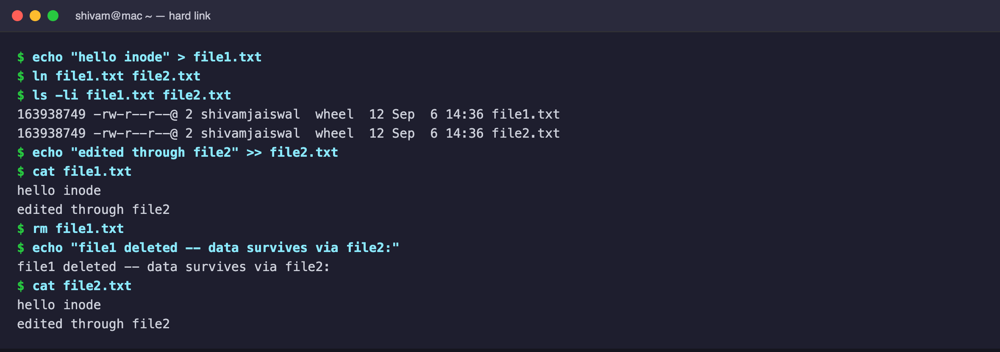
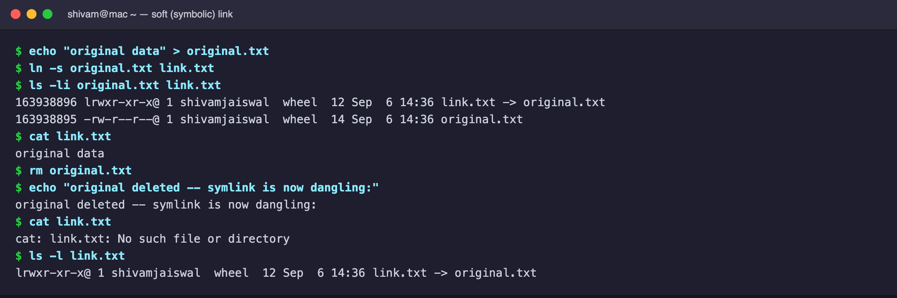
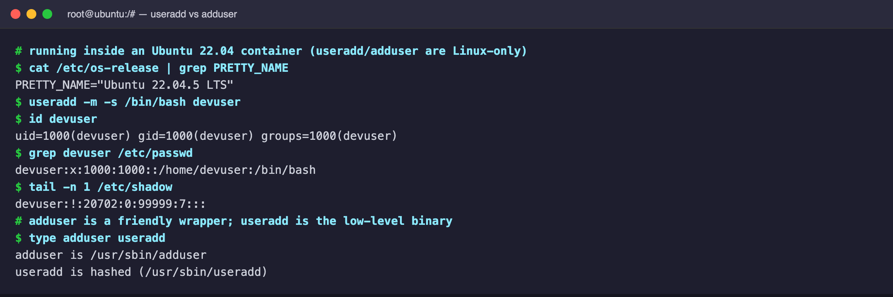
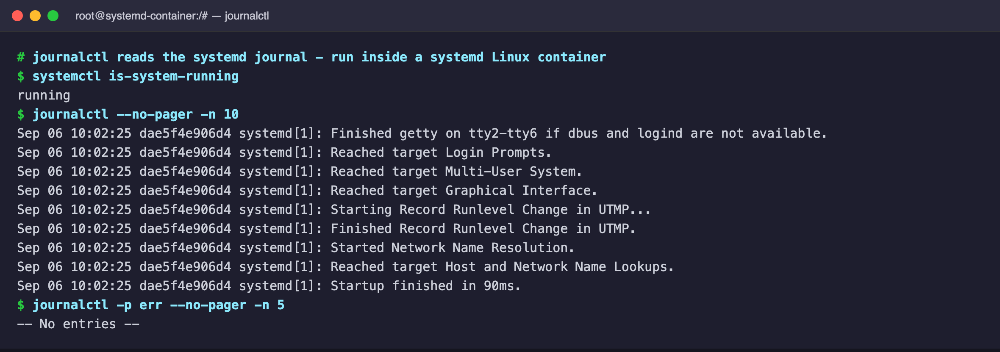

# Session 2 — Linux

All commands below were run on my machine (macOS for native tools; Linux-only
tools such as `useradd` and `journalctl` were run inside Docker containers).

# Task 1: Soft Link & Hard Link

**`Hard Link`** — simply another name for the same file.

- Both names point to the **same inode**.
- Editing either name updates the shared data (both show the new content).
- Deleting one name does **not** delete the data — it survives while another
  hard link still points to the inode.
- Storage is freed only after **all** hard links are removed.

**`Soft (symbolic) Link`** — a special file that stores a **path** to the target.

- The symlink is just a shortcut; opening it makes Linux follow the stored path
  to the real file.
- It has its **own inode** (different from the target).
- If the original file is deleted, the symlink still exists but points to a path
  that no longer exists — a **dangling** (broken) symlink.

# Task 2: adduser vs useradd

**`useradd`** is the low-level binary — non-interactive, scriptable, precise.
**`adduser`** is a friendly, interactive Perl wrapper around `useradd`.

`useradd` is preferred in **scripts, Dockerfiles, and automation** because it is
low-level and non-interactive, giving exact control over the account created.

# Task 3: journalctl

**`journalctl`** is the command-line tool for reading the systemd journal
(system logs). Run here inside a systemd-enabled Linux container.

