# Session 20 — Monitoring, observability and GitOps

This assignment uses the local `devops-assignment` Kubernetes cluster, Prometheus 3.15.0, Grafana 12.1.1 and Argo CD 3.5.4 (Helm chart 10.9.7). The supplied folders were inspected; [the mini-project](08-mini-project/README.md) was extended with an instrumented application, monitoring configuration and a real GitOps release workflow. No AWS resources are required.

## Assignment coverage

| Task | Implementation and evidence |
|---|---|
| Metrics | Prometheus discovers and scrapes each application Pod every five seconds. |
| CPU | Real process CPU seconds, converted with `100 * rate(...[1m])`; `kubectl top pods` provides Kubernetes CPU usage. |
| Memory | Current resident set size from Linux `/proc/self/statm`; Grafana shows the sum in bytes and Kubernetes top shows per-Pod usage. |
| Health | `/health` returns HTTP 200 or 503; `up` measures scrape availability and a separate gauge measures application dependency health. |
| Logs | Structured JSON requests with status, duration, version, Pod and a correlation ID; inspected with `kubectl logs`. |
| Alerts | A real Prometheus rule fires after ten seconds of failed demo health, then resolves after recovery. |
| Observability | Metrics, logs, traces, tools and Kubernetes investigation are documented below. |
| GitOps | Git branch is the source of truth; Argo CD automatically syncs commits, detects drift and self-heals. |
| Screenshots | Real Terminal and dashboard screenshots, with command transcripts, linked below. |

## Architecture

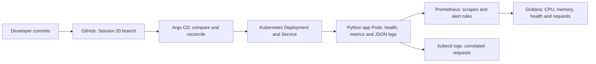

Argo CD watches only `08-mini-project/app/` on this branch, using the exact repository URL. Its Application is stored separately in `gitops/`, avoiding a self-referential workload directory. An AppProject restricts it to this repository and the `session20` namespace. The controller runs in `session20-argocd`. Monitoring is installed from separate manifests. Prometheus has namespace-scoped read-only Pod discovery permission. Services use ClusterIP and browser access uses loopback port-forwards.

## Monitoring and observability

Monitoring checks known health signals and thresholds: failed HTTP health, rising CPU, excessive memory or unavailable scrape targets. Observability lets us investigate an unexpected symptom by relating telemetry to the request and the system state. It is needed because a healthy container process can still return errors, and aggregate resource graphs alone cannot identify a specific slow dependency or failed request.

| Signal | Meaning and use | Common tools |
|---|---|---|
| Metrics | Numeric time series: counters for requests/CPU time, gauges for current memory/health, histograms for latency distributions. Show trends and support alerts. | Prometheus, Grafana, Kubernetes Metrics Server. |
| Logs | Timestamped events with context such as Pod, path, status and request ID. Explain what happened and support error investigation. | `kubectl logs`, Loki, Fluent Bit, Elasticsearch/OpenSearch. |
| Traces | Spans record timed operations and parent/child relationships within one request, linked by a trace ID across services. Identify where a distributed request spends time. | OpenTelemetry instrumentation/Collector, Jaeger, Grafana Tempo. |

The app's `X-Trace-ID` is a **log correlation ID**, not a distributed tracing implementation. This assignment demonstrates metrics and logs live and documents traces. A production trace setup would instrument server/dependency spans, propagate W3C `traceparent`, export through an OpenTelemetry Collector and inspect the trace in Jaeger or Tempo. No trace collection UI or exported spans are claimed here.

### Kubernetes investigation

Start with `kubectl get pods`, `kubectl describe pod`, readiness status and events. Use `kubectl top pods` for current CPU/memory (Metrics Server supplies this; it is not historical Prometheus storage). Inspect `kubectl logs` and `--previous` after a restart. Scrape application metrics for request/health signals; add kube-state-metrics for desired/ready replicas and node-exporter or kubelet/cAdvisor for node/container metrics in a larger deployment. Correlate traces and logs with namespace, Pod and request IDs. Keep Secrets and access tokens out of telemetry.

The dashboard CPU is **percent of one CPU core, summed across app processes**, not percent of node capacity or percent of container limits. Resident memory is current process RSS; `kubectl top` reports Kubernetes resource accounting, so the numbers need not be identical. `up=1` means `/metrics` was scraped successfully and does not prove `/health` is successful. The controlled failure keeps TCP probes ready while HTTP health fails, making this distinction visible.

### Alerts

`DemoApplicationUnhealthy` evaluates `demo_dependency_healthy == 0` and fires after ten seconds. `DemoScrapeDown` evaluates `up == 0` for fifteen seconds. The failure endpoint affects the single Pod selected by the app port-forward. Recovery restores its gauge and HTTP health, and Prometheus resolves the alert on the next evaluation. Alerts are evaluated and displayed in Prometheus; there is no external Alertmanager receiver or paging notification in this lab.

## GitOps concepts and workflow

GitOps stores the desired system configuration in version control. Git is the source of truth because changes, review history and rollback targets are recorded there. Declarative manifests describe the desired replica count, image, environment and Service rather than a sequence of manual cluster commands. A controller continuously compares desired Git state to actual Kubernetes state and reconciles differences.

Here the developer commits/pushes a manifest change, Argo CD fetches the new revision, detects OutOfSync, applies the manifests and waits for Kubernetes health. Automatic prune removes workload resources deleted from the watched Git path; self-heal repairs manual drift. Kubernetes supplies the Deployment rollout and readiness behavior; Argo CD supplies Git-based delivery and reconciliation. The controller checks this repository every thirty seconds in this classroom configuration.

The mini-project exercise starts at two replicas/v1, changes Git to three/v2, demonstrates a manual scale to one being repaired to three, then changes Git back to two while preserving v2. The final desired state matches the supplied two-replica requirement. README/evidence-only commits can update Argo CD's observed revision without changing the running workload.

## Reproduction and limits

[Mini-project setup, queries, failure/recovery, GitOps steps and cleanup](08-mini-project/README.md). The repository includes [application source](08-mini-project/application/app.py), [workload manifests](08-mini-project/app/deployment.yaml), [Argo CD configuration](08-mini-project/gitops/argocd-application.yaml), [Prometheus scrape/rules](08-mini-project/monitoring/config.yaml), and [Grafana dashboard](08-mini-project/monitoring/dashboards/dashboard.json).

This is a local classroom lab. Prometheus/Grafana use emptyDir storage, so restarting those Pods loses local history. Anonymous Grafana access is read-only and reachable through the local port-forward. Demo failure controls are convenience endpoints for this exercise. Workload code is mounted from a ConfigMap with a fixed Python image; production delivery should build a versioned image and use immutable digests. If changing mounted application code, roll the Deployment through a Git change so processes restart.

## Lessons learned

Application health and scrape health measure different things. Resource utilization must state its unit and scope. Metrics narrow down a symptom; logs connect it to a specific request, while traces would show the cross-service path. GitOps release evidence requires a pushed Git revision and an actual reconciled cluster, and manual changes are temporary when self-heal is enabled.

## References

[Prometheus alerting rules](https://prometheus.io/docs/prometheus/latest/configuration/alerting_rules/) · [Prometheus query functions](https://prometheus.io/docs/prometheus/latest/querying/functions/) · [Grafana dashboard provisioning](https://grafana.com/docs/grafana/latest/administration/provisioning/#dashboards) · [Argo CD automated sync and self-heal](https://argo-cd.readthedocs.io/en/stable/user-guide/auto_sync/) · [Kubernetes resource metrics](https://kubernetes.io/docs/tasks/debug/debug-cluster/resource-metrics-pipeline/) · [OpenTelemetry signals](https://opentelemetry.io/docs/concepts/signals/)

## Execution results

Verified on 7 October 2026 on the local cluster. All ten live checks passed. Application health failure produced a real firing alert and recovery resolved it. Argo CD automatically delivered the Git change from two/v1 to three/v2, repaired a manual scale to one back to three, then delivered the final Git state of two/v2. No AWS resources were created for this session.

| Git revision | Observed outcome |
|---|---|
| `1cee791` | Initial automatic synchronization: two ready replicas, v1. |
| `2c146f0` | Automatic release: three ready replicas, v2; self-heal repaired drift to one. |
| `e253fd6` | Git restored the required two replicas; v2 remained healthy. |

The final evidence/configuration commit is a later revision. Its workload path remains two replicas/v2, so Argo CD can update its observed revision without changing application behavior.

### Dashboard and controller screenshots

These screenshots show the actual browser window, with no surrounding desktop.

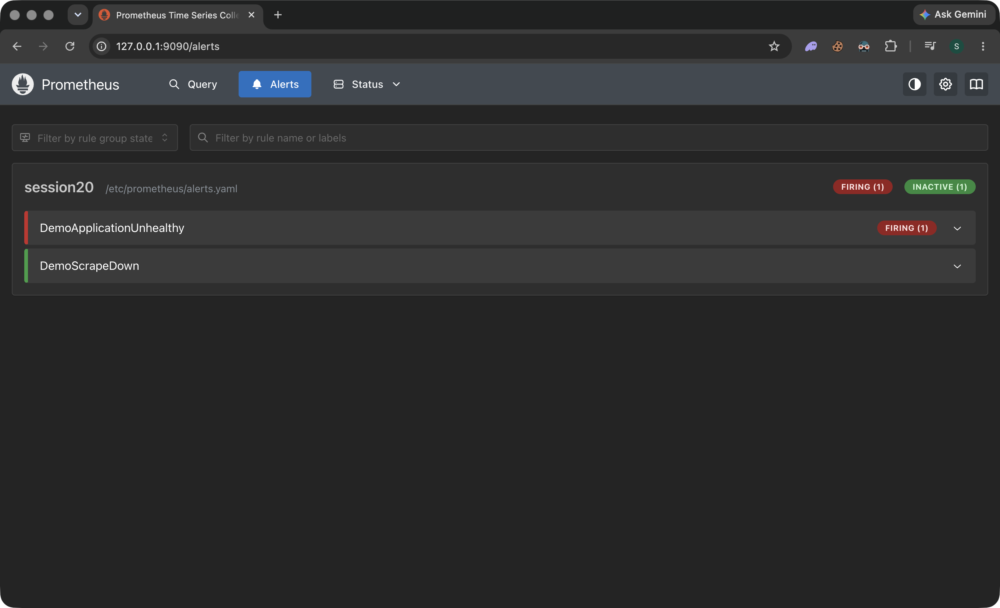

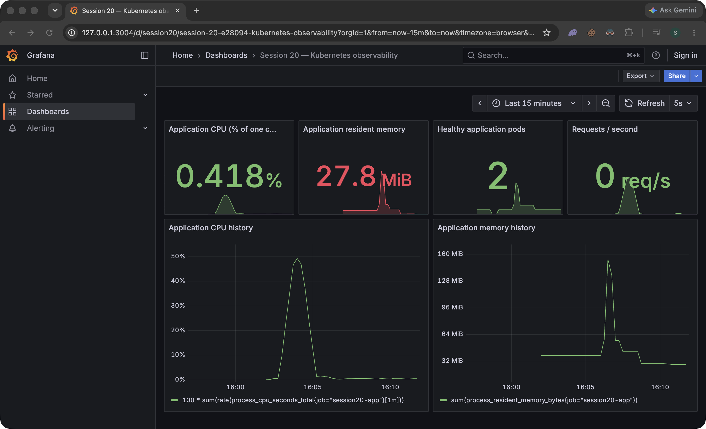

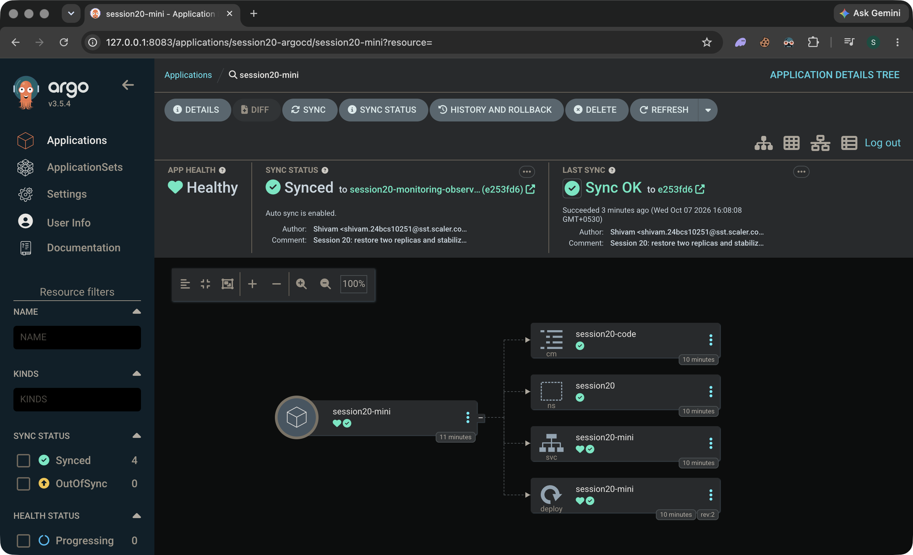

### Troubleshooting during implementation

The initial Grafana 13.2.3 setup experienced dashboard API timeouts and partially loaded panels while starting plugins/internal services. Disabling background plugin preinstallation helped startup, but the dashboard check still timed out. The final implementation uses the supplied teaching version, Grafana 12.1.1, with plugin preinstallation disabled; its dashboard API and all six panels were verified. Port 3000 was occupied by another local process, so the lab uses loopback port 3004. Port-forwards were restarted after their selected Pods changed during rollouts.

The first server-side dry-run was attempted before the namespace existed, which produced namespace-not-found errors for namespaced objects. After Argo CD created the namespace, the same dry-run passed for every workload manifest. These checks did not manually deploy the Git-managed app.

## Commands, output and screenshots

Terminal screenshots below show live commands and results. Screen capture runs in a separate window. Text transcripts preserve the visible output.

### Inspected folders and selected the session branch

The existing Session 20 teaching folders were inspected. Work uses its own branch and the existing local cluster.

```bash
pwd
ls -1
git branch --show-current
git log -1 --oneline
kubectl config current-context
kubectl get nodes
```

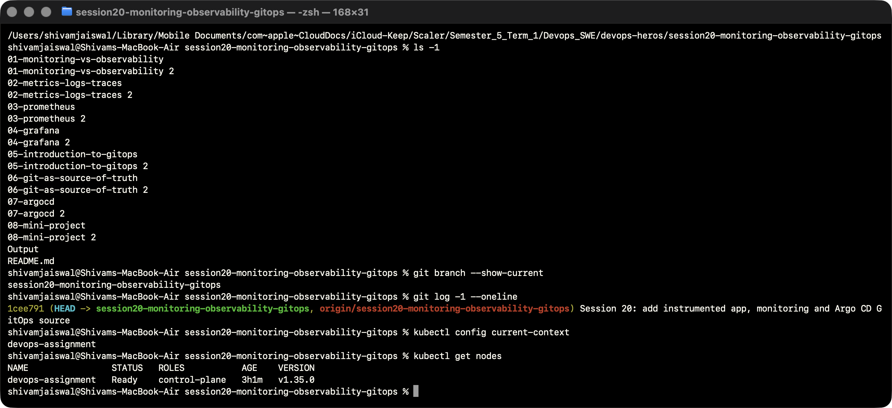

[Actual output](Output/logs/01-folder-and-branch.txt).

### Argo CD installed and project scoped

The Helm release and controller Pods are running; the AppProject and Application exist.

```bash
helm list -n session20-argocd
kubectl get pods -n session20-argocd
kubectl get appproject session20 -n session20-argocd
kubectl get application session20-mini -n session20-argocd
```

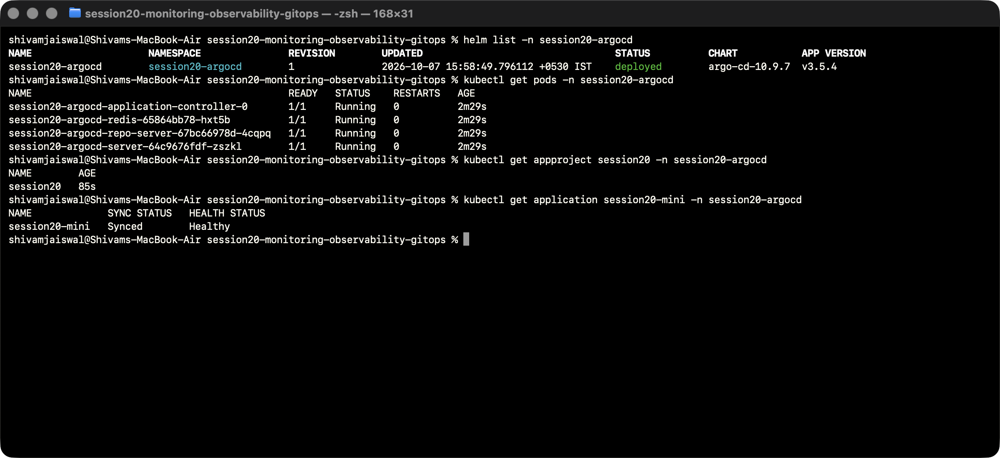

[Actual output](Output/logs/02-argocd-installed.txt).

### Initial Git deployment: two replicas, v1

Argo CD automatically synchronized Git revision 1cee791. Two real application Pods are Ready and the live manifest reports v1.

```bash
git log -1 --oneline
kubectl get application session20-mini -n session20-argocd
kubectl get deployment,pods,svc -n session20 -l app=session20-mini
kubectl get deploy session20-mini -n session20 -o jsonpath='{.spec.replicas}{" replicas; version "}{.spec.template.spec.containers[0].env[0].value}{"\n"}'
```

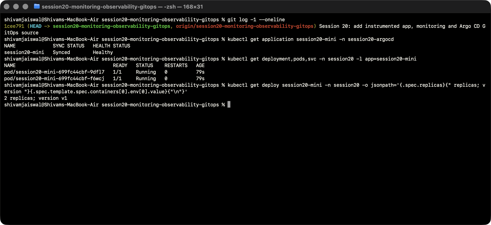

[Actual output](Output/logs/03-gitops-initial-sync.txt).

### Monitoring stack and valid Prometheus rules

Application, Prometheus and Grafana Pods are Running. Promtool checks the live scrape configuration and both alert rules.

```bash
kubectl get deployment,pods,svc -n session20
kubectl exec -n session20 deploy/session20-prometheus -- promtool check config /etc/prometheus/prometheus.yaml
```

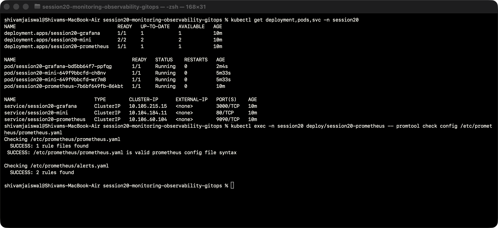

[Actual output](Output/logs/04-monitoring-stack.txt).

### HTTP health and correlated logs

A real /work request carries session20-request-001. The same ID appears in the app response and Kubernetes JSON request log.

```bash
curl -fsS http://127.0.0.1:8084/health; echo
curl -fsS -H "X-Trace-ID: session20-request-001" http://127.0.0.1:8084/work; echo
kubectl logs -l app=session20-mini -n session20 --tail=3 --prefix=true
```

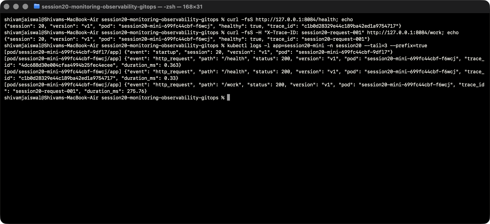

[Actual output](Output/logs/05-health-and-logs.txt).

### Real CPU, memory and scrape metrics

The bounded load generator made 325 real CPU-work requests over ninety seconds. Kubernetes top and Prometheus show actual utilization and successful scrapes of both Pods.

```bash
kubectl top pods -n session20
python3 08-mini-project/tools/query.py '100 * sum(rate(process_cpu_seconds_total{job="session20-app"}[1m]))'
python3 08-mini-project/tools/query.py 'sum(process_resident_memory_bytes{job="session20-app"})'
python3 08-mini-project/tools/query.py 'up{job="session20-app"}'
```

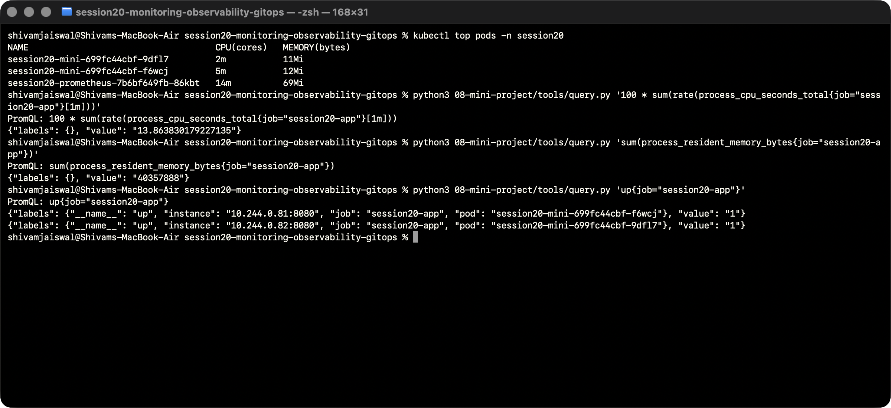

[Actual output](Output/logs/06-cpu-memory-metrics.txt).

### Failed application health and firing alert

The selected Pod returns HTTP 503; its health gauge becomes zero and DemoApplicationUnhealthy enters firing state after ten seconds.

```bash
curl -s -o /dev/null -w "HTTP health status: %{http_code}\n" http://127.0.0.1:8084/health
python3 08-mini-project/tools/query.py 'demo_dependency_healthy{job="session20-app"}'
python3 08-mini-project/tools/alerts.py
```

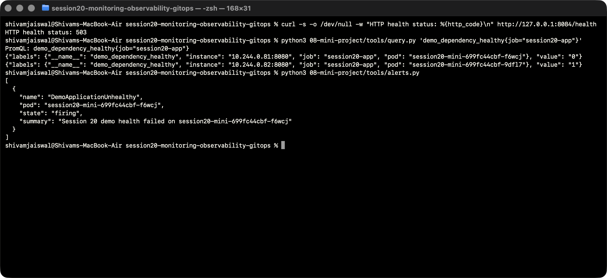

[Actual output](Output/logs/07-alert-firing.txt).

### Recovery and alert resolution

The recovery endpoint restores HTTP 200 and healthy gauges. The live Prometheus alerts API returns an empty list.

```bash
curl -fsS http://127.0.0.1:8084/demo/recover; echo
curl -s -o /dev/null -w "HTTP health status: %{http_code}\n" http://127.0.0.1:8084/health
python3 08-mini-project/tools/query.py 'demo_dependency_healthy{job="session20-app"}'
python3 08-mini-project/tools/alerts.py
```

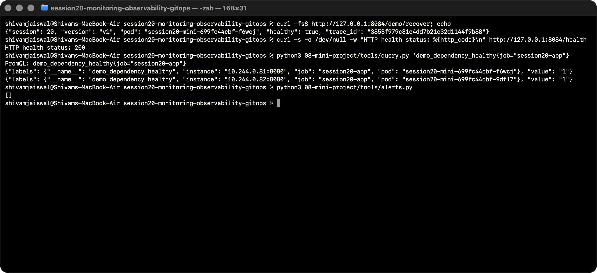

[Actual output](Output/logs/08-alert-recovered.txt).

### Git release: three replicas, v2

Commit 2c146f0 changed Git to three replicas and v2. It was pushed and automatically delivered by Argo CD; no direct apply of the Deployment was used.

```bash
git log -2 --oneline
kubectl get application session20-mini -n session20-argocd
kubectl get deployment,pods -n session20 -l app=session20-mini
kubectl get deploy session20-mini -n session20 -o jsonpath='{.spec.replicas}{" replicas; version "}{.spec.template.spec.containers[0].env[0].value}{"\n"}'
```

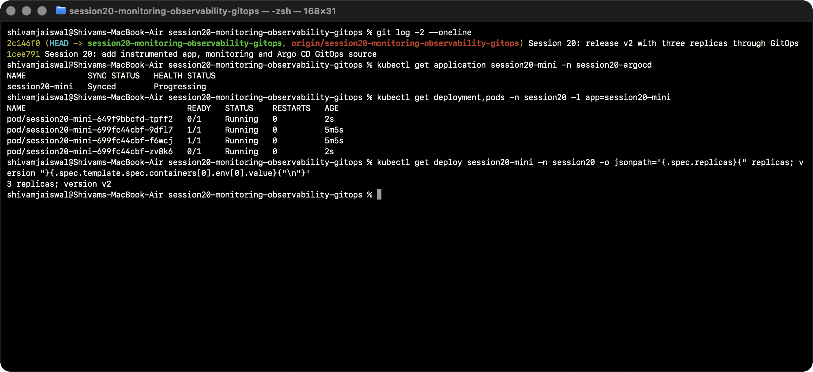

[Actual output](Output/logs/09-git-release-three.txt).

### Introduced manual replica drift

A manual scale changes the actual replica count to one, while the committed Deployment still declares three.

```bash
kubectl scale deployment session20-mini -n session20 --replicas=1
kubectl get deploy session20-mini -n session20 -o jsonpath='{.spec.replicas}{" actual replicas immediately after manual change\n"}'
git show HEAD:session20-monitoring-observability-gitops/08-mini-project/app/deployment.yaml | head -10
```

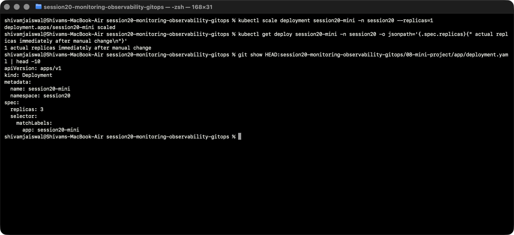

[Actual output](Output/logs/10-manual-drift.txt).

### Argo CD repaired replica drift

After self-heal, the actual replica count is three again, all app Pods are Ready and Argo CD is Synced/Healthy. Controller events record the reconciliation.

```bash
kubectl get deploy session20-mini -n session20 -o jsonpath='{.spec.replicas}{" actual replicas after self-heal\n"}'
kubectl get application session20-mini -n session20-argocd
kubectl get pods -n session20 -l app=session20-mini
kubectl get events -n session20-argocd --field-selector involvedObject.name=session20-mini --sort-by=.metadata.creationTimestamp | tail -6
```

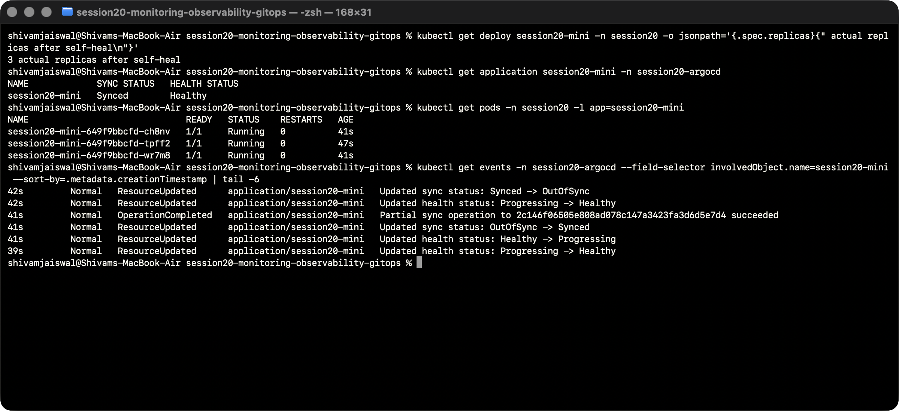

[Actual output](Output/logs/11-self-heal.txt).

### Final required state: two replicas, v2

Commit e253fd6 restores Git to two replicas. Argo CD synchronizes it and /health returns healthy v2.

```bash
git log -3 --oneline
kubectl get application session20-mini -n session20-argocd
kubectl get deployment session20-mini -n session20
kubectl get deploy session20-mini -n session20 -o jsonpath='{.spec.replicas}{" replicas; version "}{.spec.template.spec.containers[0].env[0].value}{"\n"}'
curl -fsS http://127.0.0.1:8084/health; echo
```

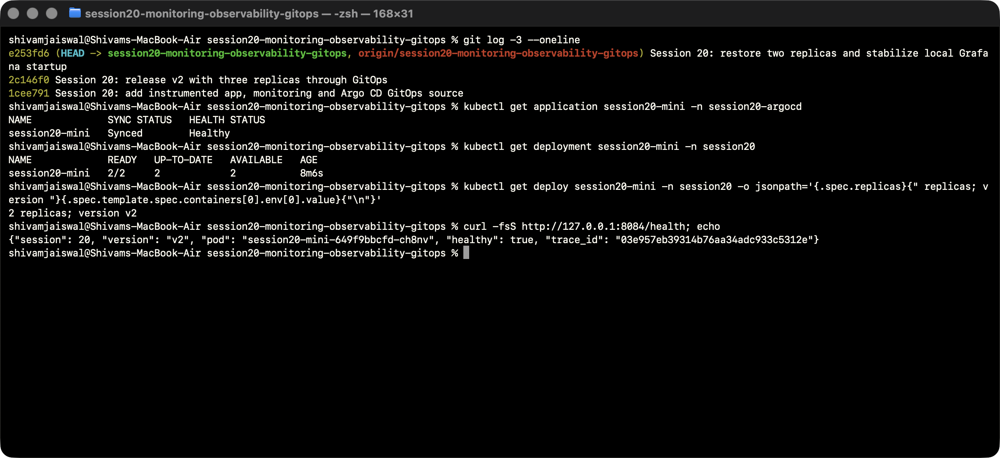

[Actual output](Output/logs/12-final-state.txt).

### Ten live verification checks

HTTP behavior, request/log correlation, real metrics, two scrape targets, resolved alerts, Grafana dashboard and Argo CD final desired/actual state pass.

```bash
python3 08-mini-project/tools/verify.py
```

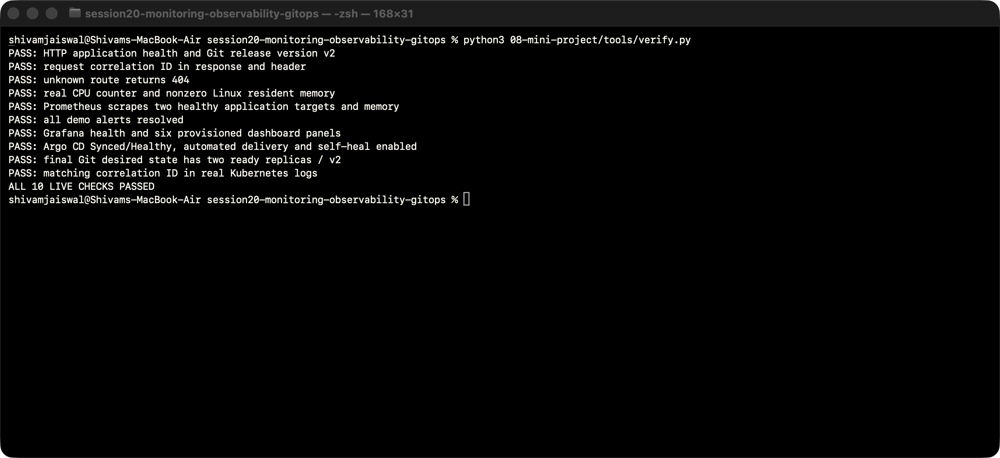

[Actual output](Output/logs/16-live-verification.txt).
