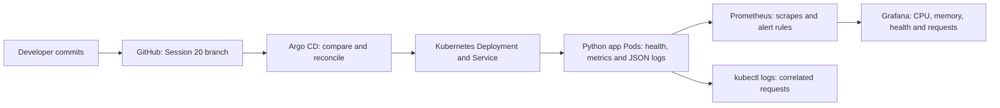

# Session 20 — Monitoring, observability and GitOps

This assignment uses the local `devops-assignment` Kubernetes cluster, Prometheus 3.15.0, Grafana 13.2.3 and Argo CD 3.5.4 (Helm chart 10.9.7). The supplied folders were inspected; [the mini-project](08-mini-project/README.md) was extended with an instrumented application, monitoring configuration and a real GitOps release workflow. No AWS resources are required.

## Assignment coverage

| Task | Implementation and evidence |
|---|---|
| Metrics | Prometheus discovers and scrapes each application Pod every five seconds. |
| CPU | Real process CPU seconds, converted with `100 * rate(...[1m])`; `kubectl top pods` provides Kubernetes CPU usage. |
| Memory | Current resident set size from Linux `/proc/self/statm`; Grafana shows the sum in bytes and Kubernetes top shows per-Pod usage. |
| Health | `/health` returns HTTP 200 or 503; `up` measures scrape availability and a separate gauge measures application dependency health. |
| Logs | Structured JSON requests with status, duration, version, Pod and a correlation ID; inspected with `kubectl logs`. |
| Alerts | A real Prometheus rule fires after ten seconds of failed demo health, then resolves after recovery. |
| Observability | Metrics, logs, traces, tools and Kubernetes investigation are documented below. |
| GitOps | Git branch is the source of truth; Argo CD automatically syncs commits, detects drift and self-heals. |
| Screenshots | Real Terminal and dashboard screenshots, with command transcripts, linked below. |

## Architecture

Argo CD watches only `08-mini-project/app/` on this branch, using the exact repository URL. Its Application is stored separately in `gitops/`, avoiding a self-referential workload directory. An AppProject restricts it to this repository and the `session20` namespace. The controller runs in `session20-argocd`. Monitoring is installed from separate manifests. Prometheus has namespace-scoped read-only Pod discovery permission. Services use ClusterIP and browser access uses loopback port-forwards.

## Monitoring and observability

Monitoring checks known health signals and thresholds: failed HTTP health, rising CPU, excessive memory or unavailable scrape targets. Observability lets us investigate an unexpected symptom by relating telemetry to the request and the system state. It is needed because a healthy container process can still return errors, and aggregate resource graphs alone cannot identify a specific slow dependency or failed request.

| Signal | Meaning and use | Common tools |
|---|---|---|
| Metrics | Numeric time series: counters for requests/CPU time, gauges for current memory/health, histograms for latency distributions. Show trends and support alerts. | Prometheus, Grafana, Kubernetes Metrics Server. |
| Logs | Timestamped events with context such as Pod, path, status and request ID. Explain what happened and support error investigation. | `kubectl logs`, Loki, Fluent Bit, Elasticsearch/OpenSearch. |
| Traces | Spans record timed operations and parent/child relationships within one request, linked by a trace ID across services. Identify where a distributed request spends time. | OpenTelemetry instrumentation/Collector, Jaeger, Grafana Tempo. |

The app's `X-Trace-ID` is a **log correlation ID**, not a distributed tracing implementation. This assignment demonstrates metrics and logs live and documents traces. A production trace setup would instrument server/dependency spans, propagate W3C `traceparent`, export through an OpenTelemetry Collector and inspect the trace in Jaeger or Tempo. No trace collection UI or exported spans are claimed here.

### Kubernetes investigation

Start with `kubectl get pods`, `kubectl describe pod`, readiness status and events. Use `kubectl top pods` for current CPU/memory (Metrics Server supplies this; it is not historical Prometheus storage). Inspect `kubectl logs` and `--previous` after a restart. Scrape application metrics for request/health signals; add kube-state-metrics for desired/ready replicas and node-exporter or kubelet/cAdvisor for node/container metrics in a larger deployment. Correlate traces and logs with namespace, Pod and request IDs. Keep Secrets and access tokens out of telemetry.

The dashboard CPU is **percent of one CPU core, summed across app processes**, not percent of node capacity or percent of container limits. Resident memory is current process RSS; `kubectl top` reports Kubernetes resource accounting, so the numbers need not be identical. `up=1` means `/metrics` was scraped successfully and does not prove `/health` is successful. The controlled failure keeps TCP probes ready while HTTP health fails, making this distinction visible.

### Alerts

`DemoApplicationUnhealthy` evaluates `demo_dependency_healthy == 0` and fires after ten seconds. `DemoScrapeDown` evaluates `up == 0` for fifteen seconds. The failure endpoint affects the single Pod selected by the app port-forward. Recovery restores its gauge and HTTP health, and Prometheus resolves the alert on the next evaluation. Alerts are evaluated and displayed in Prometheus; there is no external Alertmanager receiver or paging notification in this lab.

## GitOps concepts and workflow

GitOps stores the desired system configuration in version control. Git is the source of truth because changes, review history and rollback targets are recorded there. Declarative manifests describe the desired replica count, image, environment and Service rather than a sequence of manual cluster commands. A controller continuously compares desired Git state to actual Kubernetes state and reconciles differences.

Here the developer commits/pushes a manifest change, Argo CD fetches the new revision, detects OutOfSync, applies the manifests and waits for Kubernetes health. Automatic prune removes workload resources deleted from the watched Git path; self-heal repairs manual drift. Kubernetes supplies the Deployment rollout and readiness behavior; Argo CD supplies Git-based delivery and reconciliation. The controller checks this repository every thirty seconds in this classroom configuration.

The mini-project exercise starts at two replicas/v1, changes Git to three/v2, demonstrates a manual scale to one being repaired to three, then changes Git back to two while preserving v2. The final desired state matches the supplied two-replica requirement. README/evidence-only commits can update Argo CD's observed revision without changing the running workload.

## Reproduction and limits

[Mini-project setup, queries, failure/recovery, GitOps steps and cleanup](08-mini-project/README.md). The repository includes [application source](08-mini-project/application/app.py), [workload manifests](08-mini-project/app/deployment.yaml), [Argo CD configuration](08-mini-project/gitops/argocd-application.yaml), [Prometheus scrape/rules](08-mini-project/monitoring/config.yaml), and [Grafana dashboard](08-mini-project/monitoring/dashboards/dashboard.json).

This is a local classroom lab. Prometheus/Grafana use emptyDir storage, so restarting those Pods loses local history. Anonymous Grafana access is read-only and reachable through the local port-forward. Demo failure controls are convenience endpoints for this exercise. Workload code is mounted from a ConfigMap with a fixed Python image; production delivery should build a versioned image and use immutable digests. If changing mounted application code, roll the Deployment through a Git change so processes restart.

## Lessons learned

Application health and scrape health measure different things. Resource utilization must state its unit and scope. Metrics narrow down a symptom; logs connect it to a specific request, while traces would show the cross-service path. GitOps release evidence requires a pushed Git revision and an actual reconciled cluster, and manual changes are temporary when self-heal is enabled.

## References

[Prometheus alerting rules](https://prometheus.io/docs/prometheus/latest/configuration/alerting_rules/) · [Prometheus query functions](https://prometheus.io/docs/prometheus/latest/querying/functions/) · [Grafana dashboard provisioning](https://grafana.com/docs/grafana/latest/administration/provisioning/#dashboards) · [Argo CD automated sync and self-heal](https://argo-cd.readthedocs.io/en/stable/user-guide/auto_sync/) · [Kubernetes resource metrics](https://kubernetes.io/docs/tasks/debug/debug-cluster/resource-metrics-pipeline/) · [OpenTelemetry signals](https://opentelemetry.io/docs/concepts/signals/)
