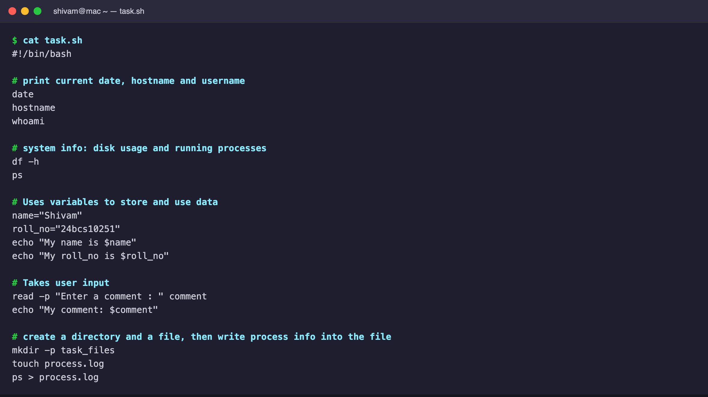
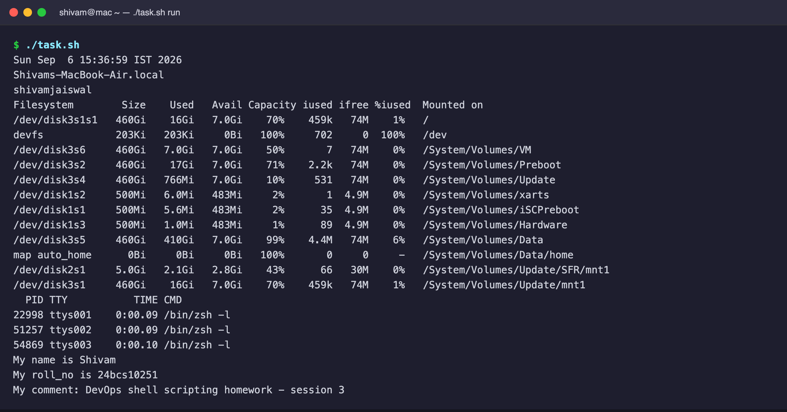
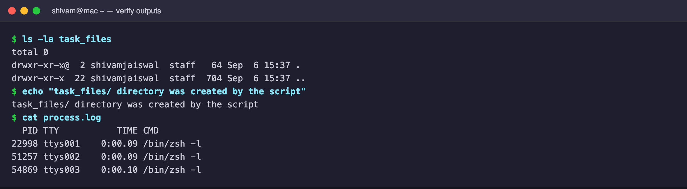

# Session 3 — Shell Scripting

`task.sh` prints the current date, hostname and user; shows disk usage and
running processes; uses variables; reads user input; and creates a directory
and a `process.log` file populated with `ps` output.

# task.sh content

# Output 1 — running the script

# Output 2 — verifying the created directory and process.log

