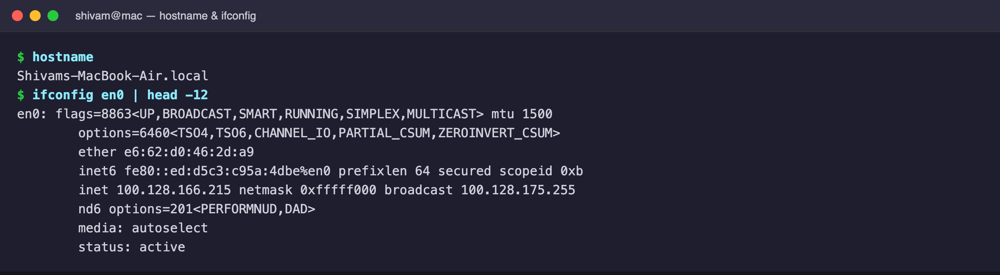
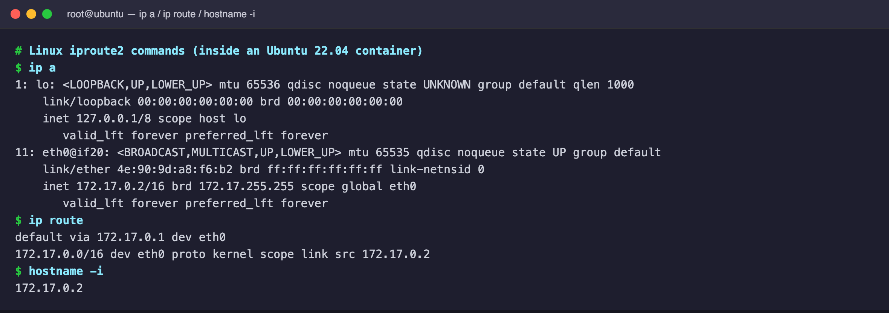
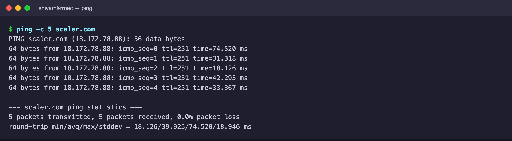
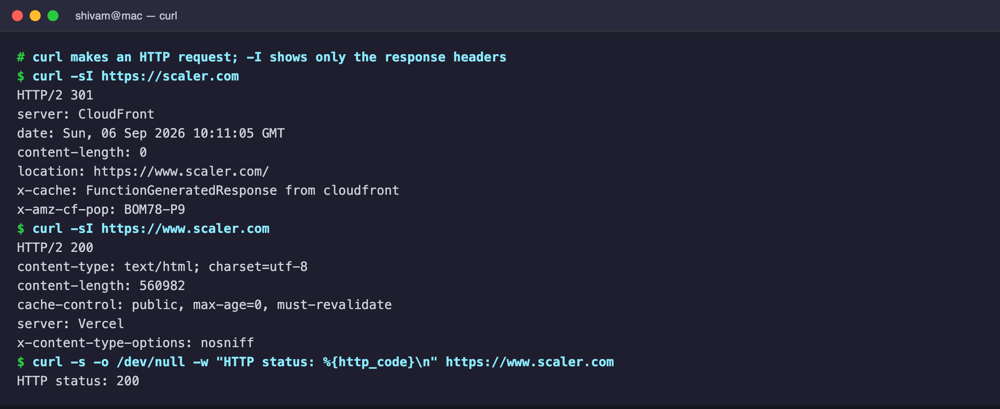
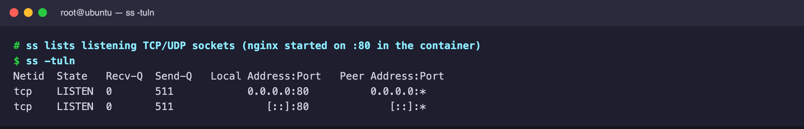
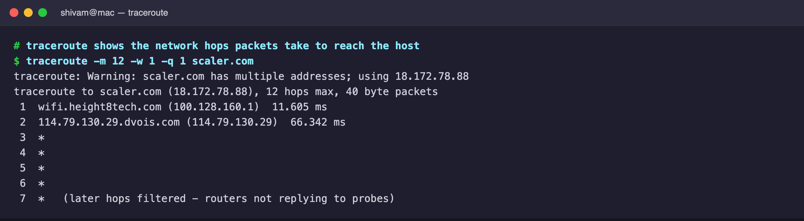

# Session 4 — Networking Commands and Outputs

Host-native commands were run on macOS; Linux-only tools (`ip`, `ss`,
`hostname -i`) were run inside an Ubuntu container.

**`hostname`** — shows the machine's hostname.
**`ifconfig`** — shows network interfaces, IP/MAC addresses and their status.

**`ip a`** — Linux equivalent of `ifconfig`: interfaces, IPs, MACs, state.
**`ip route`** — shows the routing table, including the default gateway.
**`hostname -i`** — shows the IP address associated with the hostname.

**`ping -c 5 scaler.com`** — sends 5 ICMP packets and measures response time.

**`curl -I scaler.com`** — shows only the HTTP response headers (here a 301
redirect to `www.scaler.com`, which then returns 200).

**`ss -tuln`** — lists listening TCP/UDP ports (nginx listening on `:80`).

**`traceroute scaler.com`** — shows the network hops packets pass through to
reach the host (intermediate routers that don't reply show as `*`).

