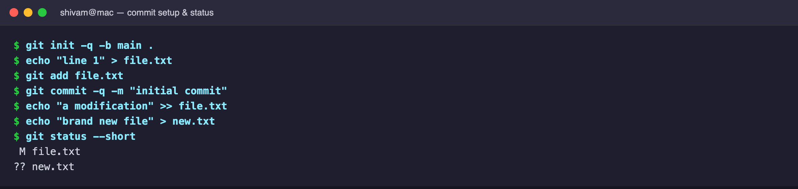
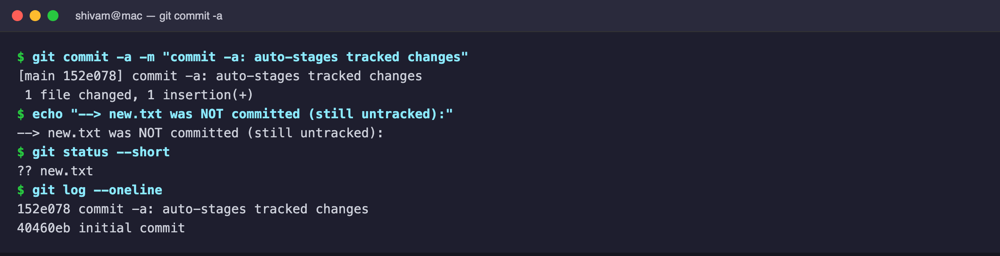
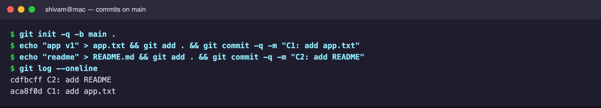
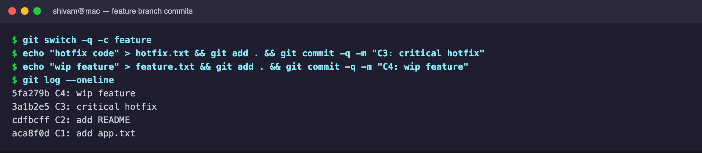
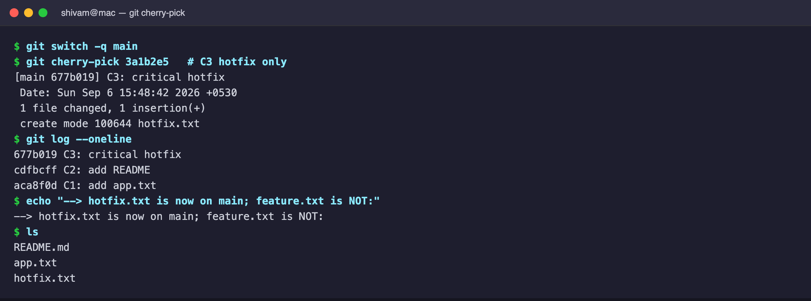

# Session 5 — Git & GitHub

# Task 1: `git commit -a` vs `git commit -m`

**`git commit -a -m`** — a shortcut that stages **every tracked file that
changed** and commits in one step. It saves a `git add` step, but it **never
picks up brand-new (untracked) files**.

**`git commit -m`** alone commits only what has been explicitly staged.

Setup — modify a tracked file and add a new untracked file:

`git commit -a` commits the modified `file.txt`, but `new.txt` stays untracked
(proof that `-a` ignores new files):

---

# Task 2: Git Cherry-Pick

`cherry-pick` copies **one specific commit's changes** onto the current branch
as a brand-new commit (different hash, same content/message) — unlike a merge,
which brings over the whole branch history.

Make a few commits on `main`:

Create a `feature` branch and add commits (C3 = a hotfix, C4 = WIP):

Cherry-pick only the C3 hotfix back onto `main` — note the **new hash**
(`677b019`) and that only `hotfix.txt` (not `feature.txt`) came across:

