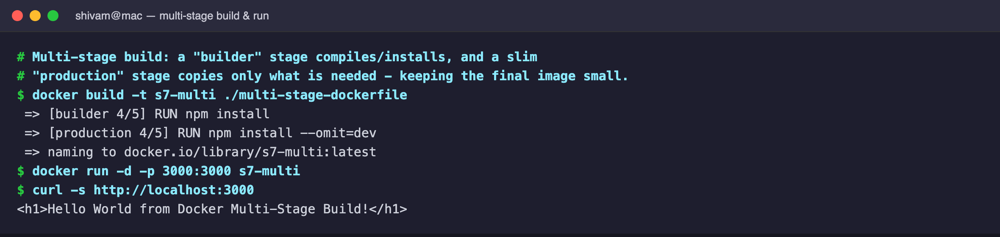
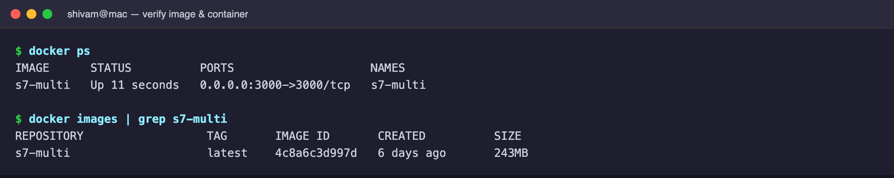
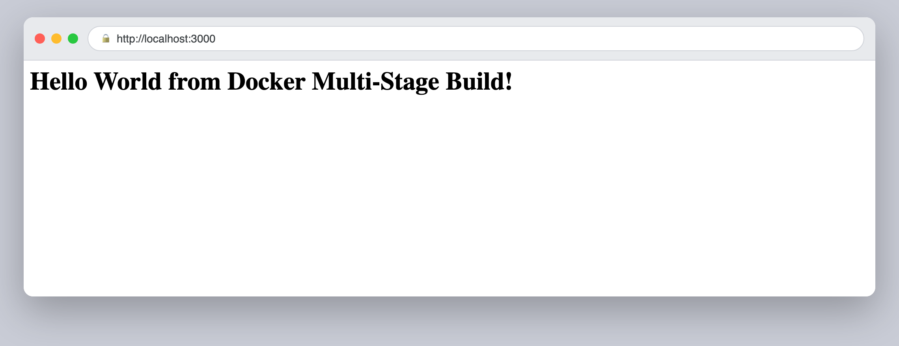
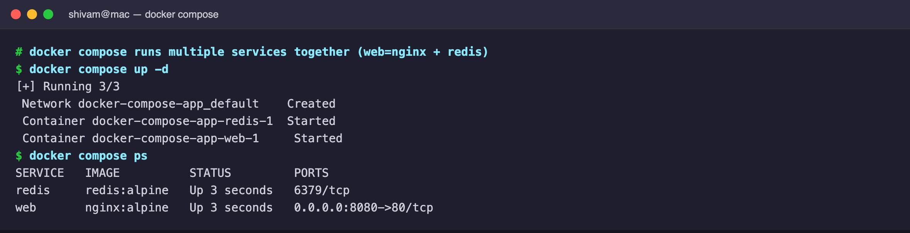
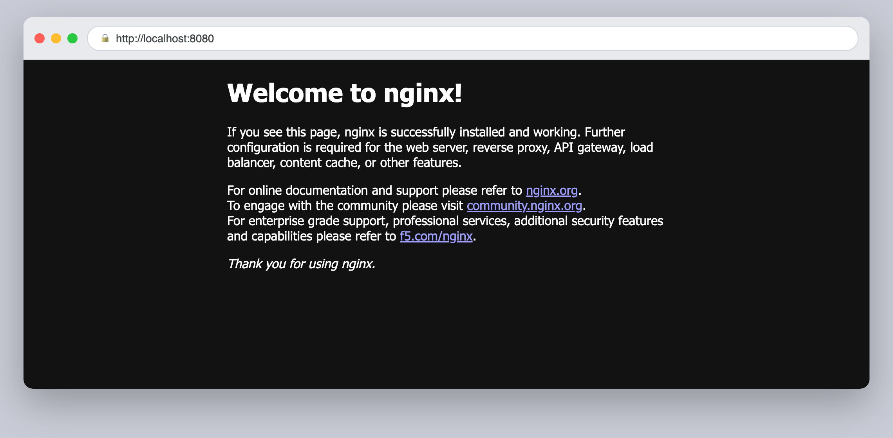

# Session 7 — Docker Images (multi-stage builds & compose)

## Multi-stage build

A multi-stage Dockerfile uses a **builder** stage to install/compile and a
separate slim **production** stage that copies only what is needed, keeping the
final image small and free of build-time cruft.

```dockerfile
# Stage 1: Build
FROM node:24-alpine AS builder
WORKDIR /app
COPY package*.json ./
RUN npm install
COPY . .

# Stage 2: Production
FROM node:24-alpine AS production
WORKDIR /app
COPY --from=builder /app/package*.json ./
RUN npm install --omit=dev
COPY --from=builder /app/server.js ./
EXPOSE 3000
CMD ["npm", "start"]
```

Build and run:



Verify the single production image and the running container:



The app served in the browser:



## Docker Compose (nginx + redis)

`docker compose` brings up multiple services together. Here `web` (nginx,
published on `:8080`) depends on a `redis` service.

```yaml
services:
  web:
    image: nginx:alpine
    ports:
      - "8080:80"
    depends_on:
      - redis
  redis:
    image: redis:alpine
```




