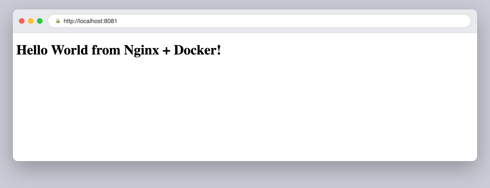
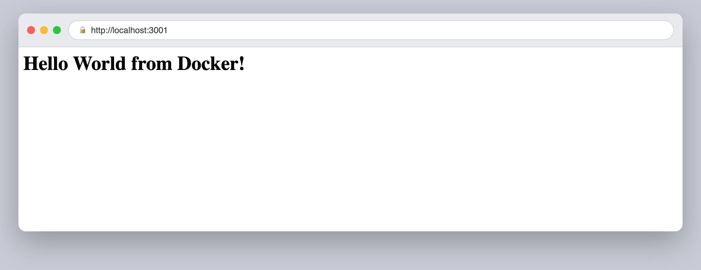
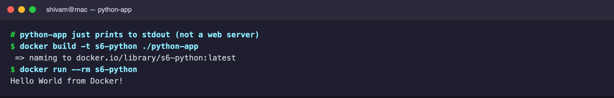
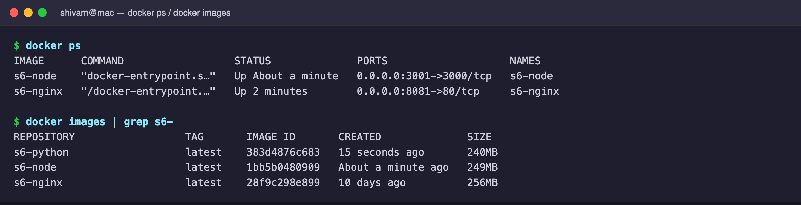

# Session 6 — Docker (build & run apps)

Each app was built with `docker build`, run with `docker run`, and verified in
the browser (web apps) or from container output.

## Nginx app

```dockerfile
FROM nginx:latest
COPY index.html /usr/share/nginx/html/index.html
EXPOSE 80
CMD ["nginx", "-g", "daemon off;"]
```

```bash
docker build -t s6-nginx ./nginx-web
docker run -d -p 8081:80 s6-nginx
```



## Node.js app

```dockerfile
FROM node:24-alpine
WORKDIR /app
COPY package*.json ./
RUN npm install
COPY . .
EXPOSE 3000
CMD ["npm", "start"]
```

```bash
docker build -t s6-node ./node-app
docker run -d -p 3001:3000 s6-node
```



## Python app

A minimal image that runs a Python script printing to stdout (not a web server).

```dockerfile
FROM python:3.11-slim
WORKDIR /app
COPY requirements.txt .
RUN pip install --no-cache-dir -r requirements.txt
COPY app.py .
CMD ["python", "app.py"]
```



## Running containers & images

`docker ps` shows the running web containers with their published ports, and
`docker images` shows the images that were built.


