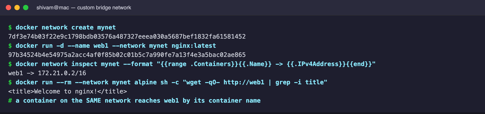
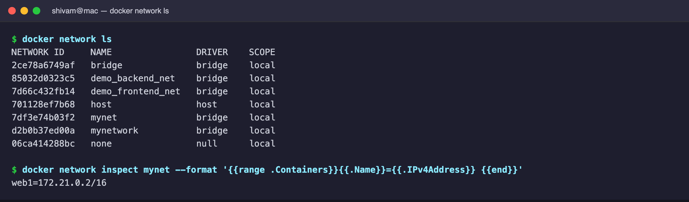
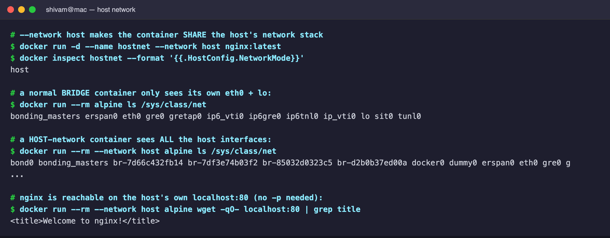
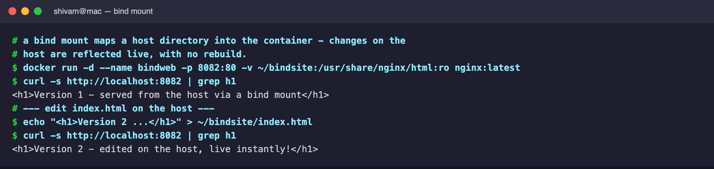
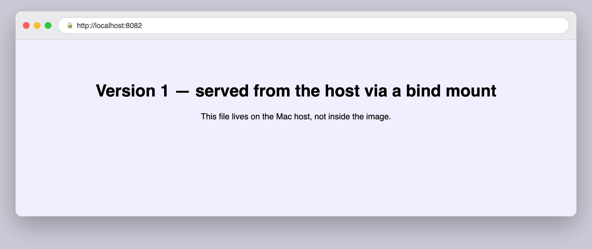
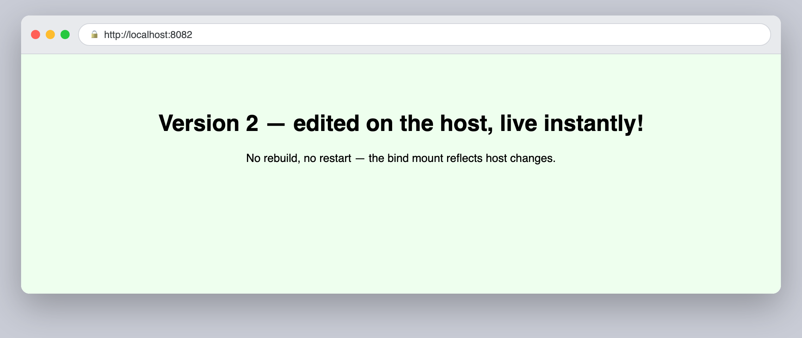

# Session 8 — Docker Networking & Volumes

Resources: <https://docs.docker.com/engine/network/drivers/>

# Task 1: Docker Container Networking

Create a **custom bridge network** and attach containers to it. Containers on
the same user-defined network can reach each other by **container name** (Docker
provides built-in DNS), which the default bridge does not do.

```bash
docker network create mynet
docker run -d --name web1 --network mynet nginx:latest
docker run --rm --network mynet alpine wget -qO- http://web1
```





# Task 2: Host Network

With `--network host` the container **shares the host's network stack** instead
of getting its own. A bridge container only sees its own `eth0`/`lo`; a host
container sees **all** the host interfaces (`docker0`, `br-*`, `bond0`, …) and
binds ports directly on the host with no `-p` mapping.

> Note: on Docker Desktop (macOS) the "host" is the Linux VM, so the service is
> reachable on the VM's `localhost:80` (shown below from a host-network
> container) rather than directly on the Mac. On native Linux it is on the
> machine's own `localhost`.



# Task 3: Bind Mount

A **bind mount** maps a host directory straight into the container
(`-v <host-dir>:<container-dir>`). Editing the file on the host is reflected
**live** in the running container — no rebuild, no restart.

```bash
docker run -d -p 8082:80 -v ~/bindsite:/usr/share/nginx/html:ro nginx:latest
```



Version 1 (as first served):



Version 2 (after editing `index.html` on the host — updates instantly):


