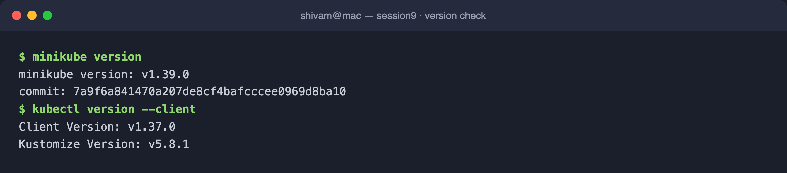
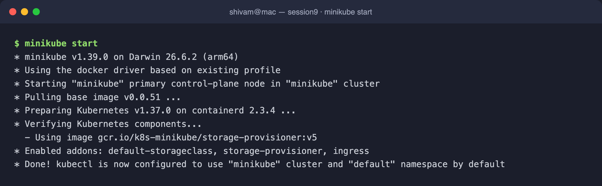
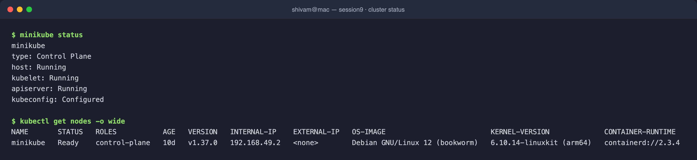
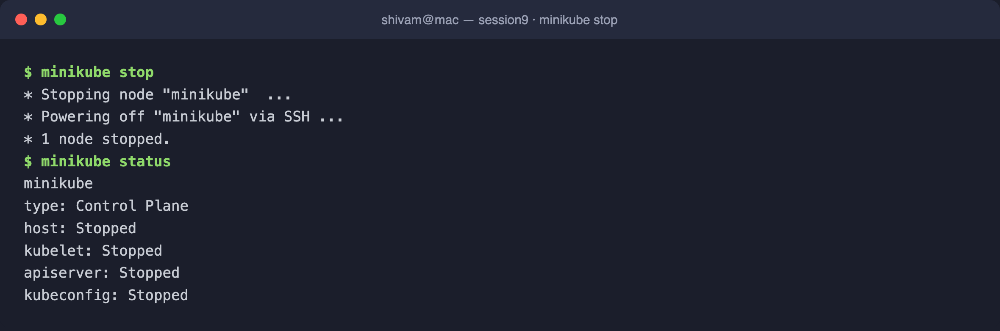

# Session 9: Kubernetes Fundamentals & Cluster Architecture

**Author:** Shivam
**Course:** SST DevOps & Cloud [SWE]
**Session:** 09 - Kubernetes Fundamentals
**Repository:** devops-heros / session9-k8s

---

## Task 1: Minikube & CLI Installation Verification

Verify that Minikube and the Kubernetes CLI (`kubectl`) are successfully installed on the local system.

**Commands:**

```bash
minikube version
kubectl version --client
```

**Output:**

```
minikube version: v1.39.0
commit: 7a9f6a841470a207de8cf4bafcccee0969d8ba10

Client Version: v1.37.0
Kustomize Version: v5.8.1
```

**Screenshot:**



---

## Task 2: Starting the Minikube Kubernetes Cluster

Initialize the local single-node Kubernetes cluster using the containerized (Docker) runtime environment.

**Command:**

```bash
minikube start
```

**Output:**

```
* minikube v1.39.0 on Darwin 26.6.2 (arm64)
* Using the docker driver based on existing profile
* Starting "minikube" primary control-plane node in "minikube" cluster
* Pulling base image v0.0.51 ...
* Preparing Kubernetes v1.37.0 on containerd 2.3.4 ...
* Verifying Kubernetes components...
  - Using image gcr.io/k8s-minikube/storage-provisioner:v5
* Enabled addons: default-storageclass, storage-provisioner, ingress
* Done! kubectl is now configured to use "minikube" cluster and "default" namespace by default
```

**Screenshot:**



---

## Task 3: Verifying Cluster Status & Node Health

Inspect the status of the local cluster control plane, kubelet, API server, and verify the node is in `Ready` state.

**Commands:**

```bash
minikube status
kubectl get nodes -o wide
```

**Output:**

```
minikube
type: Control Plane
host: Running
kubelet: Running
apiserver: Running
kubeconfig: Configured

NAME       STATUS   ROLES           AGE   VERSION   INTERNAL-IP    EXTERNAL-IP   OS-IMAGE                         KERNEL-VERSION             CONTAINER-RUNTIME
minikube   Ready    control-plane   10d   v1.37.0   192.168.49.2   <none>        Debian GNU/Linux 12 (bookworm)   6.10.14-linuxkit (arm64)   containerd://2.3.4
```

**Screenshot:**



---

## Task 4: Stopping the Minikube Cluster

Gracefully power down the Minikube cluster container to release system resources.

**Command:**

```bash
minikube stop
minikube status
```

**Output:**

```
* Stopping node "minikube"  ...
* Powering off "minikube" via SSH ...
* 1 node stopped.

minikube
type: Control Plane
host: Stopped
kubelet: Stopped
apiserver: Stopped
kubeconfig: Stopped
```

**Screenshot:**



---

## Task 5: Kubernetes Cluster Architecture & Component Analysis

A Kubernetes cluster is split into a **Control Plane** (the brain that decides *what* should run) and one or more **Worker Nodes** (the muscle that actually *runs* the workloads). Every action flows through the API server, and the desired state is continuously reconciled toward the actual state.

```
+-------------------------------------------------------------------------------+
|                               CONTROL PLANE (MASTER)                          |
|                                                                               |
|   +-------------------+       +--------------------+       +--------------+   |
|   |       etcd        |<----->|  kube-apiserver    |<----->|kube-scheduler|   |
|   | (State Database)  |       |    (Front Door)    |       +--------------+   |
|   +-------------------+       +---------+----------+                          |
|                                         |                                     |
|                                         v                                     |
|                             +------------------------+                        |
|                             | kube-controller-manager|                        |
|                             +------------------------+                        |
+-----------------------------------------+-------------------------------------+
                                          |
                                          v
+-------------------------------------------------------------------------------+
|                                 WORKER NODE                                    |
|                                                                               |
|   +------------+   +------------+   +----------------------------+            |
|   |  kubelet   |   | kube-proxy |   |  CRI (containerd runtime)  |            |
|   +------------+   +------------+   +----------------------------+            |
|         |                                     |                               |
|         v                                     v                               |
|                       +------------+  +------------+                          |
|                       |   Pod 1    |  |   Pod 2    |                          |
|                       | [Container]|  | [Container]|                          |
|                       +------------+  +------------+                          |
+-------------------------------------------------------------------------------+
```

### 1. Control Plane (Master Node) Components

- **`kube-apiserver` (The Front Door)** — the single entry point for all administrative and internal communication. Exposes the Kubernetes REST API; every request (`kubectl`, dashboards, controllers) authenticates and flows through it. No component talks to `etcd` directly except the API server.
- **`etcd` (The Brain / State Store)** — a distributed, consistent key-value store holding the entire cluster state, specs, secrets, and metadata. In Kubernetes everything is an API object whose declarative desired state is persisted here.
- **`kube-scheduler` (The Placement Engine)** — watches for newly created Pods with no assigned node and picks the optimal node based on resource requests, affinity/anti-affinity, taints, and tolerations.
- **`kube-controller-manager` (The Reconciliation Loop)** — runs control loops that drive **current state → desired state**. Includes the Node Controller (detects offline nodes), ReplicaSet Controller (maintains replica counts), and EndpointSlice/Service Controller (links Services to live Pod IPs).

### 2. Worker Node (Data Plane) Components

- **`kubelet` (The Node Agent)** — the primary agent on every node. Receives `PodSpec`s from the API server, tells the container runtime to pull images and start containers, and reports health/heartbeats back.
- **`kube-proxy` (The Network Router)** — maintains network rules (`iptables`/`IPVS`) so Services can route TCP/UDP traffic across pods, handling internal load balancing.
- **`Container Runtime (CRI)`** — the software that actually runs containers. Modern clusters use `containerd` or `CRI-O` (this cluster uses `containerd://2.3.4`).
- **`Pod` (Smallest Deployable Unit)** — one or more tightly coupled containers sharing the same network namespace (IP/port space) and storage volumes.

### How they interact

1. A user runs `kubectl apply` → request hits **kube-apiserver**.
2. The API server validates it and persists the desired state in **etcd**.
3. **kube-scheduler** notices an unscheduled Pod and binds it to a suitable node.
4. The target node's **kubelet** sees the assignment and instructs the **CRI** to start the container.
5. **kube-controller-manager** continuously checks that the actual state matches the desired state and self-heals any drift.
6. **kube-proxy** wires up networking so the Pod is reachable via its Service.

---

### Submission Notes

- All commands were executed on Minikube v1.39.0 (Docker driver) with Kubernetes v1.37.0.
- Terminal screenshots for each task are stored in [`./output/`](./output).
